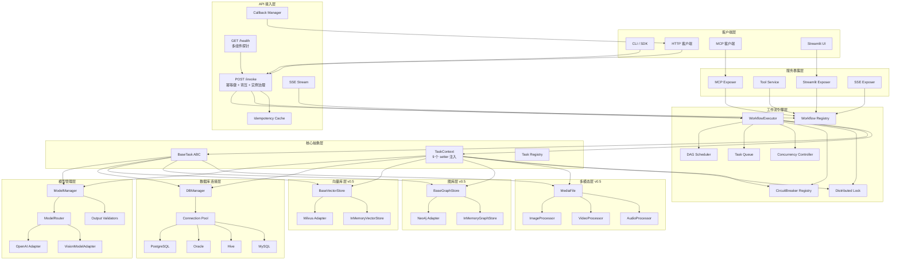
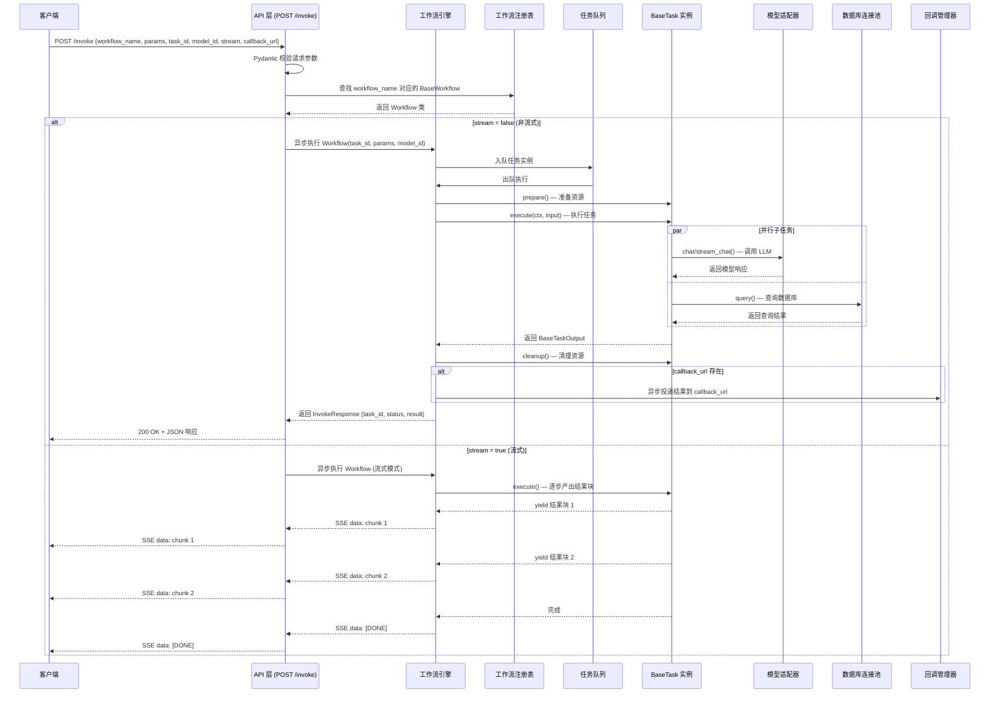
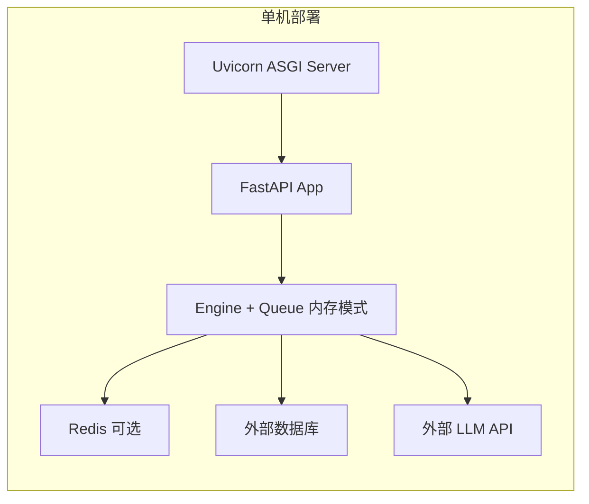
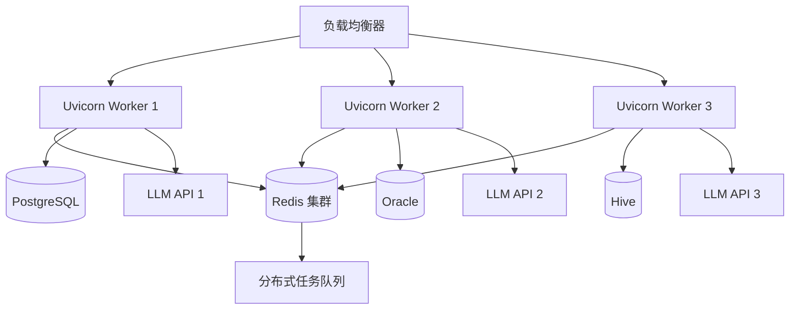

# icore 系统架构与设计总览

> **文档编号：** 01  
> **项目：** icore — 企业级 LLM 工作流编排平台  
> **版本：** 1.1（v0.5 同步更新）  
> **状态：** 基础设计文档（所有后续模块设计文档均以此为基础）

---

## 目录

1. [系统简介](#1-系统简介)
2. [设计哲学与核心原则](#2-设计哲学与核心原则)
3. [技术栈选型](#3-技术栈选型)
4. [系统架构图](#4-系统架构图)
5. [模块分解](#5-模块分解)
6. [数据流设计](#6-数据流设计)
7. [高层目录结构](#7-高层目录结构)
8. [部署模型](#8-部署模型)
9. [核心抽象层说明](#9-核心抽象层说明)
10. [非功能性约束](#10-非功能性约束)
11. [后续设计文档索引](#11-后续设计文档索引)

---

## 1. 系统简介

icore 是一个**企业级工作流能力平台**，核心目标是通过编码形式将大模型（LLM）驱动的任务编排成可复用、可调度的工作流。平台不提供可视化拖拽编辑器——工作流完全通过 Python 代码定义，这使得开发者能够利用编程语言的全部表达能力（条件分支、循环、异常处理、子流程嵌套）来实现复杂的业务逻辑。

### 1.1 平台能力概览

icore 覆盖以下能力域：

| 能力域 | 说明 |
|--------|------|
| **任务编排** | 通过 DAG（有向无环图）调度多个 Task，支持子工作流嵌套调用 |
| **多模型管理** | 配置多个 OpenAI 兼容模型，支持按任务类型自动路由；v0.5 起支持多模态视觉模型 |
| **数据库集成** | 统一连接 Oracle、PostgreSQL、Hive、MySQL 等异构数据源 |
| **向量数据库（v0.5）** | Milvus 适配器支持 RAG 检索增强、语义搜索、过滤表达式 |
| **图引擎（v0.5）** | Neo4j 适配器支持知识图谱构建、Cypher 查询、GraphRAG 多跳推理 |
| **多模态文件处理（v0.5）** | Image/Video/Audio 三类处理器，OCR、关键帧提取、ASR |
| **工程健壮性（v0.5）** | 统一异常分级、熔断器、模型降级链、分布式锁、幂等键、乐观锁 |
| **服务暴露** | 将工作流封装为 MCP 服务、工具服务、Streamlit 应用、SSE 接口 |
| **统一 API** | 仅暴露两个 HTTP 接口：健康检查（多组件探针）+ 主调用接口（含幂等键） |
| **高并发处理** | 基于 asyncio 的异步执行模型，任务队列、并发控制、背压机制（已接入 API） |

### 1.2 典型应用场景

以下场景均由平台的高度抽象能力支撑，开发者只需编写 Task 子类和 Workflow 定义即可实现：

- **实时流数据打标签：** 筛选从 Flink 传入 Kafka 的实时流数据，过大模型进行分类标注
- **关键词生成：** 从文本中提取/生成关键词
- **大文档摘要提取：** 分块 → 逐块摘要 → 合并归总
- **诈骗话术提取：** 从对话/文本中识别诈骗模式话术
- **实体关系提取：** 读取文档内容，抽取实体及其关系图谱
- **数据库查询 + 结果整理：** 查询数据库 → LLM 整理 → 结构化返回
- **周报生成：** 从数据库查询一周工作任务 → LLM 生成周报文本

> **设计要点：** 上述场景不是平台预置的固定功能，而是通过 icore 的抽象层（BaseTask / BaseWorkflow）由开发者按业务逻辑自行编排实现。平台提供的是**能力**，不是**业务逻辑**。

---

## 2. 设计哲学与核心原则

### 2.1 高内聚、低耦合

icore 的模块设计严格遵循高内聚低耦合原则：

- **高内聚：** 每个模块职责单一。`core` 模块只管任务抽象，`engine` 只管工作流调度，`db` 只管数据库连接，`models` 只管 LLM 适配。模块内部的变更不影响其他模块。
- **低耦合：** 模块间通过抽象基类和接口通信，不依赖具体实现。`engine` 调用 `core.BaseTask` 的抽象方法，不关心是文档摘要 Task 还是实体提取 Task。`db` 通过 `BaseConnector` 接口提供服务，不关心底层是 PostgreSQL 还是 Hive。

### 2.2 抽象基类优先

系统中的每个核心概念都有对应的抽象基类（ABC），具体实现通过继承扩展：

| 抽象基类 | 职责 | 具体实现示例 |
|----------|------|-------------|
| `BaseTask` | 定义任务执行接口 | 文档摘要任务、实体提取任务、DB查询任务 |
| `BaseWorkflow` | 定义工作流执行接口 | 串行工作流、DAG 工作流、子工作流嵌套 |
| `BaseConnector` | 定义数据库连接接口 | PostgreSQL、Oracle、Hive 适配器 |
| `BaseModelAdapter` | 定义 LLM 调用接口 | OpenAI 兼容适配器 |
| `BaseServiceExposer` | 定义服务暴露接口 | MCP、Tool、Streamlit、SSE 适配器 |

### 2.3 插件 / 适配器模式

所有可扩展点采用适配器模式。新增一种数据库、一种 LLM 模型、一种服务暴露协议，只需编写对应的适配器类并注册，无需修改核心代码。这符合开闭原则（Open-Closed Principle）——对扩展开放，对修改关闭。

### 2.4 依赖注入

icore 使用依赖注入管理运行时依赖。Task 执行时通过 `TaskContext` 注入模型适配器、数据库连接、任务元数据等，而非在 Task 内部硬编码获取。这使得 Task 可测试、可复用、可替换依赖。

```python
# 依赖注入示意（伪代码）
class MyTask(BaseTask):
    async def execute(self, ctx: TaskContext, inp: MyTaskInput) -> MyTaskOutput:
        model = ctx.get_model_adapter()  # 注入的模型适配器
        db = ctx.get_db("main_db")       # 注入的数据库连接
        result = await model.chat(inp.text)
        return MyTaskOutput(result=result)
```

### 2.5 声明式输入输出

每个 Task 都有一个强类型的输入类和输出类（继承自 Pydantic BaseModel）。这确保了：

- **编译时类型检查**（通过 Python type hints + Pydantic 校验）
- **自动文档生成**（Swagger / OpenAPI schema）
- **工作流间数据传递的安全性**（上游 Task 输出类型与下游 Task 输入类型匹配校验）
- **API 层的参数自动校验**

---

## 3. 技术栈选型

| 层面 | 技术 | 选型理由 |
|------|------|---------|
| **Web 框架** | FastAPI | 原生异步、自动 Swagger/OpenAPI 文档、Pydantic 原生集成 |
| **异步运行时** | asyncio + uvicorn | 高并发 I/O 密集型场景（LLM API 调用、DB 查询均为 I/O 密集） |
| **数据校验** | Pydantic v2 | Rust 核心、高性能、类型安全、与 FastAPI 无缝集成 |
| **关系型数据库驱动** | asyncpg / aiomysql / oracledb / pyhive | 原生异步驱动适配器模式（PostgreSQL / MySQL / Oracle / Hive），轻量、无 ORM 抽象层开销 |
| **向量数据库驱动（v0.5）** | pymilvus（懒导入） | Milvus 向量库，ANN 检索、过滤表达式；驱动未安装时模块仍可 import |
| **图数据库驱动（v0.5）** | neo4j（懒导入） | Neo4j 异步 driver、Cypher 参数化查询、连接池；懒导入保证可 import |
| **多模态处理（v0.5）** | Pillow / ffmpeg / pydub（懒导入） | 图片 OCR、视频关键帧、音频 ASR；按需安装，不强制依赖 |
| **HTTP 客户端** | httpx | 异步、支持 HTTP/2、连接池、流式响应 |
| **任务队列（可选）** | Redis + 自研轻量队列 | 进程内内存队列为主，Redis 作为分布式可选后端 |
| **分布式锁（v0.5）** | Redis SET NX + Lua | token 机制防误解锁；单进程降级为 asyncio.Lock |
| **配置管理** | Pydantic Settings | 环境变量 / YAML 双源配置、类型安全 |
| **日志** | 标准库 `logging` | 零依赖、与 asyncio 兼容、通过 `dictConfig` 实现结构化配置 |
| **容器化** | Docker + docker-compose | 标准化部署、环境隔离 |
| **可观测性（v0.6）** | Prometheus + OpenTelemetry（懒导入） | 自定义指标、分布式追踪、`/metrics` 端点；详见 [docs/13](13-v0.6-implementation.md) |
| **对象存储（v0.6）** | minio（懒导入） | S3 兼容、预签名 URL、客户端直传、分片上传 |
| **配置热加载（v0.6）** | watchdog（懒导入、可选） | 文件监听；未安装时自动降级为 polling observer |
| **消息队列（v0.6）** | aiokafka / aio-pika（懒导入） | Kafka / RabbitMQ 触发器、事件驱动工作流 |

### 3.1 为什么选择全异步架构

LLM 工作流的核心瓶颈是 **I/O 等待**——等待模型 API 响应、等待数据库查询返回、等待回调投递。在同步模型中，一个请求会阻塞一个线程，高并发下线程上下文切换开销巨大。全异步架构（asyncio）用单线程事件循环处理大量 I/O 等待，内存占用低、吞吐量高，天然适合 icore 的场景。

---

## 4. 系统架构图

### 4.1 系统架构总图



### 4.2 层次说明

系统分为五层，自上而下：

1. **客户端层：** 外部调用方（HTTP 客户端、CLI、MCP 客户端、Streamlit 界面）
2. **API 接入层：** 仅两个 HTTP 端点（健康检查 + 主调用接口），加上 SSE 流式输出和回调管理
3. **工作流引擎层：** DAG 调度器、工作流注册表、任务队列、并发控制器——负责工作流的编排和执行
4. **核心抽象层：** BaseTask 抽象基类、TaskContext 依赖注入容器、Task 注册表——所有具体任务的根基
5. **基础设施层：** 模型管理（多模型 + 自动路由）、数据库连接（多数据源 + 连接池）、服务暴露（MCP / Tool / Streamlit / SSE）

---

## 5. 模块分解

### 5.1 模块职责矩阵

| 模块 | 包路径 | 职责 | 核心抽象类 | 后续设计文档 |
|------|--------|------|-----------|-------------|
| **core** | `icore.core` | 任务抽象基类、输入输出模型、任务上下文、注册表 | `BaseTask` | 02-task-abstraction.md |
| **engine** | `icore.engine` | 工作流引擎、DAG 调度、执行器、注册表、状态机 | `BaseWorkflow` | 04-workflow-engine.md |
| **db** | `icore.db` | 数据库连接池、多数据源适配器、统一查询接口、乐观锁 | `BaseConnector` | 03-database-layer.md |
| **models** | `icore.models` | LLM 模型适配器、多模型管理、自动路由、视觉模型、输出校验 | `BaseModelAdapter` | 05-model-management.md |
| **vectorstore**（v0.5） | `icore.vectorstore` | 向量库抽象、Milvus 适配器、内存实现 | `BaseVectorStore` | 11-v0.5-enhancement.md §3 |
| **graphstore**（v0.5） | `icore.graphstore` | 图库抽象、Neo4j 适配器、内存实现 | `BaseGraphStore` | 11-v0.5-enhancement.md §4 |
| **media**（v0.5） | `icore.media` | 多模态文件抽象、Image/Video/Audio 处理器 | `BaseMediaProcessor` | 11-v0.5-enhancement.md §5 |
| **api** | `icore.api` | FastAPI 应用、Schema、SSE、回调、幂等缓存、全局异常中间件 | — | 06-api-layer.md |
| **services** | `icore.services` | MCP / Tool / Streamlit / SSE 服务暴露适配器 | `BaseServiceExposer` | 08-service-exposure.md |
| **workflows** | `icore.workflows` | 具体工作流实现（示例 + 业务工作流） | — | 09-examples.md |
| **config** | `icore.config` | 全局配置管理（环境变量 / YAML） | — | 10-directory-structure.md |
| **concurrency** | `icore.engine` (内嵌) | 任务队列、实例管理、并发控制、熔断器、分布式锁 | — | 07-concurrency.md |
| **exceptions**（v0.5） | `icore.exceptions` | 统一异常分级体系（`ICoreError` 基类 + 业务/系统异常） | `ICoreError` | 11-v0.5-enhancement.md §7.1 |

### 5.2 模块依赖关系

模块依赖严格遵循单向依赖原则，不允许循环依赖：

```
api ──────────┐
              ▼
services ──→ engine ──→ core
              │           │
              ├──→ models ─┘
              ├──→ db ─────┘
              ├──→ vectorstore (v0.5)
              ├──→ graphstore (v0.5)
              ├──→ media (v0.5)
              └──→ concurrency (engine 内嵌：lock / circuit_breaker / idempotency)
```

- `core` 是最底层，不依赖任何其他 icore 模块
- `db` 和 `models` 依赖 `core`（任务输入输出模型）
- `vectorstore` / `graphstore` / `media` 仅依赖 `icore.exceptions`，互不依赖
- `engine` 依赖 `core`、`db`、`models`、`vectorstore`、`graphstore`、`media`（通过 TaskContext 注入）
- `api` 和 `services` 依赖 `engine`
- `workflows` 依赖 `core` 和 `engine`（用于实现具体业务）
- `exceptions` 是横切关注点，被所有模块依赖

---

## 6. 数据流设计

### 6.1 主调用数据流

以下是一个完整的 HTTP 调用数据流，从客户端发起请求到结果返回：



### 6.2 数据流关键节点说明

1. **请求校验：** API 层使用 Pydantic v2 对入参进行校验。`workflow_name` 必须存在于注册表中，`params` 必须匹配工作流定义的输入 Schema，`task_id` 用于标识本次任务实例。
2. **工作流查找：** 通过 `WorkflowRegistry` 按名称查找对应的工作流类。
3. **任务入队：** 创建任务实例后入队，由任务队列按优先级调度执行。
4. **任务执行：** `WorkflowExecutor` 按 DAG 拓扑序执行各 Task。每个 Task 通过 `TaskContext` 获取模型适配器和数据库连接（依赖注入）。
5. **结果投递：** 若提供了 `callback_url`，执行完成后异步将结果 POST 到回调地址。否则直接在响应中返回。
6. **流式返回：** 若 `stream=true`，通过 SSE 逐步返回结果块，适用于 LLM 逐 token 生成的场景。

---

## 7. 高层目录结构

```
icore/
├── icore/                         # 主包
│   ├── __init__.py               # 包初始化，导出版本号
│   ├── config.py                 # 全局配置管理 (Pydantic Settings)
│   ├── bootstrap.py              # 生产应用引导（v0.5 含 9 个 builder）
│   ├── exceptions.py             # v0.5: 统一异常分级体系
│   ├── core/                     # 核心抽象层
│   │   ├── __init__.py
│   │   ├── base_task.py          # BaseTask 抽象基类
│   │   ├── models.py             # BaseTaskInput / BaseTaskOutput (Pydantic)
│   │   ├── task_context.py       # TaskContext (依赖注入容器，v0.5 含 9 个 setter)
│   │   └── registry.py           # TaskRegistry (任务注册表)
│   ├── engine/                   # 工作流引擎层
│   │   ├── __init__.py
│   │   ├── base_workflow.py      # BaseWorkflow 抽象基类
│   │   ├── dag.py                # DAG 有向无环图
│   │   ├── executor.py           # WorkflowExecutor 执行器
│   │   ├── registry.py           # WorkflowRegistry 注册表
│   │   ├── states.py             # 状态枚举
│   │   ├── task_queue.py         # 任务队列 (内存 / Redis)
│   │   ├── instance_manager.py   # 任务实例管理器
│   │   ├── concurrency_control.py # 并发控制器
│   │   ├── circuit_breaker.py    # v0.5: 熔断器（CLOSED/OPEN/HALF_OPEN）
│   │   └── lock.py               # v0.5: 分布式锁（Redis / Memory）
│   ├── db/                       # 数据库连接层
│   │   ├── __init__.py
│   │   ├── base_connector.py     # BaseConnector 抽象基类（v0.5 含乐观锁）
│   │   ├── connection_pool.py    # 异步连接池
│   │   ├── manager.py            # DBManager 多数据源管理
│   │   └── adapters/             # 数据库适配器
│   │       ├── __init__.py
│   │       ├── postgresql.py     # PostgreSQL 适配器
│   │       ├── mysql.py          # MySQL 适配器
│   │       ├── oracle.py         # Oracle 适配器
│   │       └── hive.py           # Hive 适配器
│   ├── models/                   # 模型管理层
│   │   ├── __init__.py
│   │   ├── base_adapter.py       # BaseModelAdapter 抽象基类（v0.5 含 supports_vision）
│   │   ├── openai_adapter.py     # OpenAI 兼容适配器
│   │   ├── vision_adapter.py     # v0.5: 多模态视觉模型适配器
│   │   ├── manager.py            # ModelManager 多模型管理（v0.5 含熔断/降级链）
│   │   ├── router.py             # ModelRouter 自动路由
│   │   ├── validators.py         # v0.5: 模型输出校验（JSON / 非空）
│   │   └── config.py             # 模型配置 Pydantic 模型
│   ├── vectorstore/              # v0.5: 向量数据库层
│   │   └── __init__.py           # BaseVectorStore + MilvusAdapter + InMemoryVectorStore
│   ├── graphstore/               # v0.5: 图数据库层
│   │   └── __init__.py           # BaseGraphStore + Neo4jAdapter + InMemoryGraphStore
│   ├── media/                    # v0.5: 多模态文件处理层
│   │   └── __init__.py           # MediaFile + Image/Video/AudioProcessor + Registry
│   ├── api/                      # API 接入层
│   │   ├── __init__.py
│   │   ├── main.py               # FastAPI 应用 (2 个端点，v0.5 含幂等键/异常中间件)
│   │   ├── schemas.py            # 请求/响应 Pydantic 模型（v0.5 含 idempotency_key）
│   │   ├── callback.py           # CallbackManager 回调管理
│   │   ├── streaming.py          # SSE 流式响应处理
│   │   └── idempotency.py        # v0.5: 幂等键缓存（内存 / Redis）
│   ├── services/                 # 服务暴露层
│   │   ├── __init__.py
│   │   ├── base_exposer.py       # BaseServiceExposer 抽象基类
│   │   ├── mcp_server.py         # MCP 服务适配器
│   │   ├── tool_service.py       # Tool 服务适配器
│   │   ├── streamlit_app.py      # Streamlit 适配器
│   │   └── sse_adapter.py        # SSE 适配器
│   └── workflows/                # 工作流实现
│       ├── __init__.py
│       └── examples/             # 示例工作流
│           ├── __init__.py
│           ├── document_summary.py
│           ├── entity_extraction.py
│           ├── weekly_report.py
│           ├── rag_qa.py         # v0.5: RAG 问答
│           ├── knowledge_graph.py # v0.5: 知识图谱
│           └── multimodal.py     # v0.5: 多模态（图片描述 / OCR 摘要）
├── docs/                         # 设计文档
│   ├── 01-architecture-overview.md
│   ├── 02-task-abstraction.md
│   ├── 03-database-layer.md
│   ├── 04-workflow-engine.md
│   ├── 05-model-management.md
│   ├── 06-api-layer.md
│   ├── 07-concurrency.md
│   ├── 08-service-exposure.md
│   ├── 09-examples.md
│   ├── 10-directory-structure.md
│   └── 11-v0.5-enhancement.md    # v0.5: 增强设计
├── tests/                        # 测试（521 passed + 2 skipped）
├── config/                       # 配置文件目录 (YAML)
│   ├── models.yaml               # 模型配置
│   └── databases.yaml            # 数据库配置
├── README.md
├── requirements.txt
└── Dockerfile
```

---

## 8. 部署模型

### 8.1 单机部署

适用于开发环境和中小规模生产环境：



- Uvicorn 作为 ASGI 服务器，多 worker 模式利用多核 CPU
- 任务队列使用进程内内存模式（默认），Redis 作为可选分布式后端
- 数据库和 LLM API 均为外部服务，icore 通过连接池和 HTTP 客户端访问

### 8.2 分布式部署

适用于大规模生产环境，需要水平扩展：



- 多个 Uvicorn 实例通过负载均衡器分发请求
- Redis 集群作为分布式任务队列和共享状态存储
- 各 Worker 共享数据库连接池和 LLM 模型配置
- 模型路由器在多 LLM API 间做负载均衡和故障转移

### 8.3 容器化部署

使用 Docker + docker-compose 标准化部署：

- **icore-app：** 主应用容器，运行 Uvicorn + FastAPI
- **redis：** 任务队列后端（可选）
- 外部数据库和 LLM API 通过网络访问
- 配置通过环境变量注入（12-Factor App 规范）

---

## 9. 核心抽象层说明

### 9.1 抽象基类体系

icore 的九个核心抽象基类构成系统的骨架（v0.4 五个 + v0.5 新增四个）：

```mermaid
classDiagram
    class BaseTask {
        <<abstract>>
        +name: str
        +description: str
        +input_model: Type~BaseTaskInput~
        +output_model: Type~BaseTaskOutput~
        +prepare(ctx) void
        +execute(ctx, input) output
        +validate(input) bool
        +cleanup(ctx) void
    }

    class BaseWorkflow {
        <<abstract>>
        +name: str
        +description: str
        +define() DAG
        +execute(ctx, input) output
        +validate() bool
    }

    class BaseConnector {
        <<abstract>>
        +async connect() void
        +async disconnect() void
        +async execute(sql, params) result
        +async query(sql, params) rows
        +async execute_with_version(sql, params, expected_version) int
        +async close() void
    }

    class BaseModelAdapter {
        <<abstract>>
        +async chat(messages) response
        +async stream_chat(messages) AsyncIterator
        +async embed(texts) vectors
        +supports_vision: bool
        +supports_audio: bool
        +async chat_with_media(prompt, media_files) response
    }

    class BaseServiceExposer {
        <<abstract>>
        +expose(workflow) service
        +list_services() list
        +call_service(name, params) result
    }

    class BaseVectorStore {
        <<abstract>> v0.5
        +async insert(collection, docs) ids
        +async search(collection, vec, top_k) docs
        +async delete(collection, ids) int
        +async create_collection(name, dim) void
        +async drop_collection(name) void
        +async health_check() bool
    }

    class BaseGraphStore {
        <<abstract>> v0.5
        +async upsert_nodes(nodes) ids
        +async upsert_edges(edges) void
        +async query(cypher, params) rows
        +async get_subgraph(node_ids, depth) dict
        +async delete_nodes(ids) int
        +async health_check() bool
    }

    class BaseMediaProcessor {
        <<abstract>> v0.5
        +async extract_metadata(file) dict
        +async transcode(file, target_format) MediaFile
        +async generate_thumbnail(file, size) MediaFile
    }

    class BaseDistributedLock {
        <<abstract>> v0.5
        +async acquire(key, ttl, blocking) bool
        +async release(key) void
        +async lock(key, ttl) AsyncContextManager
    }

    BaseTask <|-- DocumentSummaryTask
    BaseTask <|-- EntityExtractionTask
    BaseWorkflow <|-- DocumentSummaryWorkflow
    BaseConnector <|-- PostgreSQLConnector
    BaseConnector <|-- OracleConnector
    BaseConnector <|-- HiveConnector
    BaseConnector <|-- MySQLConnector
    BaseModelAdapter <|-- OpenAICompatibleAdapter
    BaseModelAdapter <|-- VisionModelAdapter
    BaseServiceExposer <|-- MCPServiceExposer
    BaseServiceExposer <|-- StreamlitExposer
    BaseServiceExposer <|-- SSEExposer
    BaseServiceExposer <|-- ToolServiceExposer
    BaseVectorStore <|-- MilvusAdapter
    BaseVectorStore <|-- InMemoryVectorStore
    BaseGraphStore <|-- Neo4jAdapter
    BaseGraphStore <|-- InMemoryGraphStore
    BaseMediaProcessor <|-- ImageProcessor
    BaseMediaProcessor <|-- VideoProcessor
    BaseMediaProcessor <|-- AudioProcessor
    BaseDistributedLock <|-- RedisLock
    BaseDistributedLock <|-- MemoryLock
```



### 9.2 注册表模式

icore 使用三个注册表管理运行时组件：

1. **TaskRegistry：** 注册和查找 Task 类。Task 在定义时通过装饰器或显式调用注册，工作流通过名称引用 Task。
2. **WorkflowRegistry：** 注册和查找 Workflow 类。API 层通过 `workflow_name` 从注册表查找对应工作流。
3. **ModelManager：** 注册和查找模型适配器。支持按 `model_id` 精确选择，也支持按任务特征自动路由。

### 9.3 上下文注入（TaskContext）

`TaskContext` 是依赖注入的核心容器，在 Task 执行时由引擎创建并传入：

| 字段 / 方法 | 类型 | 说明 |
|------|------|------|
| `task_id` | `str` | 任务实例 ID，用于追踪和分布式追踪 |
| `workflow_id` | `str` | 工作流实例 ID |
| `model_id` | `str \| None` | 指定的模型 ID（None 则自动路由） |
| `callback_url` | `str \| None` | 结果回调地址 |
| `stream` | `bool` | 是否流式返回 |
| `metadata` | `dict` | 附加元数据 |
| `get_model_adapter()` | 方法 | 获取模型适配器实例 |
| `get_db(name)` | 方法 | 获取数据库连接（pool-backed 句柄） |
| `get_vectorstore()` | 方法（v0.5） | 获取 `BaseVectorStore` 实例 |
| `get_graphstore()` | 方法（v0.5） | 获取 `BaseGraphStore` 实例 |
| `get_media_processor()` | 方法（v0.5） | 获取 `MediaProcessorRegistry` 实例 |
| `get_lock()` | 方法（v0.5） | 获取 `BaseDistributedLock` 实例 |
| `get_circuit_breaker()` | 方法（v0.5） | 获取 `CircuitBreakerRegistry` 实例 |

每个 v0.5 新增的 getter 都配套一个 `has_*()` 探测方法，工作流可据此判断是否需要该组件。
所有 setter 都使用官方 `set_*` 方法（基于 `object.__setattr__`），禁止 Task 越过 setter 直接注入。

Task 不直接实例化依赖，而是从 Context 获取——这使得 Task 可替换底层实现、可单元测试（mock 注入）。

---

## 10. 非功能性约束

### 10.1 性能要求

- **单节点吞吐：** 目标 1000+ 并发请求（I/O 等待为主场景）
- **任务延迟：** 非 LLM 调用的编排开销 < 50ms
- **LLM 调用：** 透传底层模型 API 延迟，平台自身不引入额外瓶颈

### 10.2 可靠性要求

- **任务幂等：** 相同 `task_id` 的重复调用不会产生副作用（由实例管理器去重）；v0.5 起支持 `idempotency_key` 缓存 24 小时
- **故障隔离：** 单个 Task 失败不影响其他独立工作流的执行
- **优雅降级：** 模型 API 不可用时自动切换到 fallback 模型（v0.5：`call_with_fallback()` 降级链）
- **熔断保护（v0.5）：** 每个模型适配器一个 `CircuitBreaker`，连续失败达阈值即熔断，半开试探恢复
- **超时控制：** 每个 Task 可配置超时时间，防止无限等待
- **背压机制（v0.5）：** `ConcurrencyController.is_backpressure()` 接入 API，过载直接返回 HTTP 503
- **分布式锁（v0.5）：** `RedisLock` / `MemoryLock` 保证并发写操作的原子性
- **统一异常分级（v0.5）：** `ICoreError` 基类携带 `code` / `http_status` / `retryable`，全局中间件结构化返回

### 10.3 可观测性要求

- **结构化日志：** 每个请求/任务携带 trace_id，贯穿全链路
- **指标暴露：** 任务执行时长、队列深度、并发数、模型调用次数等指标
- **健康检查（v0.5 增强）：** `GET /health` 并发探针 model / db / vectorstore / graphstore，聚合 `healthy` / `degraded` 状态

### 10.4 安全要求

- **输入校验：** 所有 API 入参通过 Pydantic 强类型校验，拒绝非法输入
- **SQL 注入防护：** 数据库查询使用参数化查询，禁止字符串拼接 SQL
- **API 密钥管理：** 模型 API 密钥通过环境变量注入，不硬编码
- **回调安全：** 回调地址使用 HTTPS，携带签名验证

---

## 11. 后续设计文档索引

本文档是 icore 平台的基础架构设计，后续各模块的详细设计文档如下：

| 文档 | 模块 | 核心内容 | 依赖 |
|------|------|---------|------|
| `02-task-abstraction.md` | 核心抽象层 | BaseTask、输入输出模型、TaskContext、TaskRegistry | 本文档 |
| `03-database-layer.md` | 数据库连接层 | BaseConnector、连接池、多数据源适配器 | 本文档 |
| `04-workflow-engine.md` | 工作流引擎 | BaseWorkflow、DAG 调度、WorkflowExecutor、状态管理 | 02 |
| `05-model-management.md` | 模型管理 | BaseModelAdapter、多模型管理、自动路由 | 02 |
| `06-api-layer.md` | API 接入层 | 两个端点设计、SSE、回调、Swagger | 04, 05 |
| `07-concurrency.md` | 并发处理 | 任务队列、实例管理、并发控制、背压 | 04 |
| `08-service-exposure.md` | 服务暴露 | MCP、Tool、Streamlit、SSE 适配器 | 06 |
| `09-examples.md` | 示例工作流 | 文档摘要、实体提取、周报生成 | 02, 04 |
| `10-directory-structure.md` | 目录结构 & README | 完整目录树、README、requirements.txt | 全部 |
| `11-v0.5-enhancement.md`（v0.5） | v0.5 增强设计 | 向量库 / 图谱 / 多模态 / 健壮性增强方案 | 02–10 |

---

> **本文档为 icore 平台的基础设计文档，定义了技术栈、模块分解、架构层次和核心设计原则。所有后续模块设计文档应遵循本文档定义的架构约束和设计哲学。**
