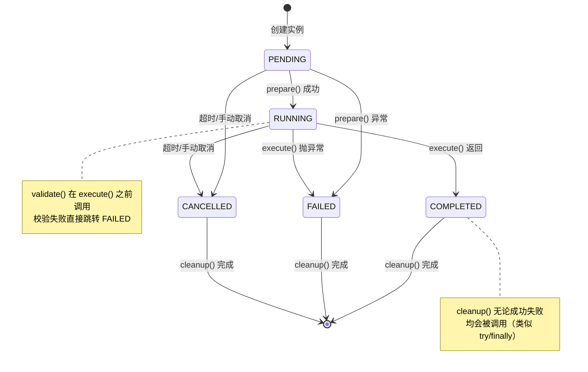
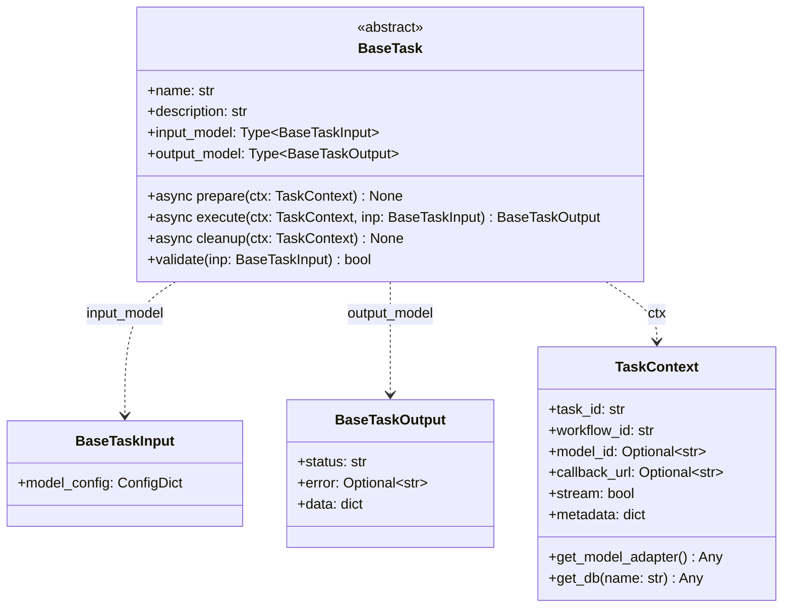
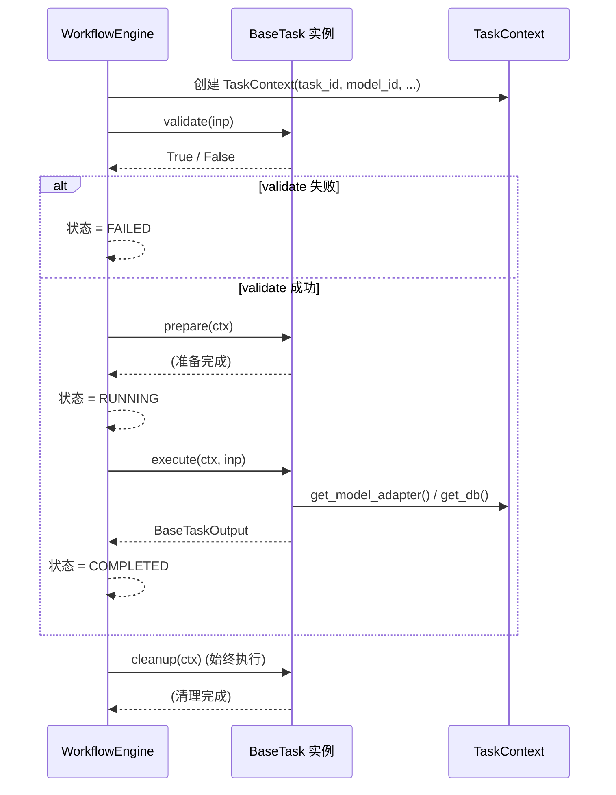

# icore 核心任务抽象层设计

> **文档编号：** 02  
> **项目：** icore - 企业级 LLM 工作流编排平台  
> **版本：** 1.0  
> **状态：** 核心设计文档  
> **依赖：** [01-architecture-overview.md](01-architecture-overview.md)

---

## 目录

1. [设计目标与概述](#1-设计目标与概述)
2. [任务生命周期状态机](#2-任务生命周期状态机)
3. [BaseTask 抽象基类设计](#3-basetask-抽象基类设计)
4. [类型化输入输出模型](#4-类型化输入输出模型)
5. [TaskContext 依赖注入容器](#5-taskcontext-依赖注入容器)
6. [TaskRegistry 任务注册表](#6-taskregistry-任务注册表)
7. [自定义 Task 开发模式](#7-自定义-task-开发模式)
8. [与后续模块的集成关系](#8-与后续模块的集成关系)

---

## 1. 设计目标与概述

### 1.1 设计目标

核心任务抽象层（`icore.core`）是整个 icore 平台的基石。它定义了所有任务执行的最小契约--`BaseTask` 抽象基类，以及配套的输入输出模型、任务上下文和注册表机制。

设计目标如下：

- **统一契约：** 无论任务调用 LLM 做文本摘要、查询数据库返回结果，还是从 Kafka 流中打标签，所有任务都遵循相同的 `prepare -> execute -> cleanup` 生命周期，拥有类型化的输入输出。
- **强类型保证：** 每个 Task 都有自己的输入类和输出类（继承 Pydantic BaseModel），编译时类型检查 + 运行时自动校验，消除"传错参数"类 bug。
- **依赖注入：** Task 不直接实例化模型适配器或数据库连接，而是通过 `TaskContext` 获取--实现可测试、可替换依赖。
- **注册发现：** Task 通过装饰器或显式调用注册到 `TaskRegistry`，工作流引擎通过名称查找 Task 类。
- **零外部依赖：** `core` 模块只依赖 Pydantic 和 Python 标准库，不依赖 FastAPI、asyncpg 等其他框架/驱动，确保它是纯粹的抽象层。

### 1.2 核心组件概览

| 组件 | 文件 | 职责 |
|------|------|------|
| `BaseTask` | `base_task.py` | 任务抽象基类，定义执行契约 |
| `BaseTaskInput` / `BaseTaskOutput` | `models.py` | 输入输出基类模型（Pydantic v2） |
| `TaskContext` | `task_context.py` | 依赖注入容器，持有运行时依赖 |
| `TaskRegistry` | `registry.py` | 任务注册表 + 装饰器 |

### 1.3 模块依赖

`icore.core` 是最底层模块，不依赖任何其他 icore 模块：

```
core (Pydantic + stdlib only)
  ↑
  ├── engine (workflow engine, depends on core)
  ├── models (LLM adapters, depends on core)
  ├── db (database layer, independent of core for connectors)
  └── workflows (concrete implementations, depend on core + engine)
```

---

## 2. 任务生命周期状态机

### 2.1 状态定义

每个 Task 实例在执行过程中经历以下状态：

| 状态 | 说明 |
|------|------|
| `PENDING` | 任务实例已创建，等待执行 |
| `RUNNING` | 任务正在执行（`execute()` 调用中） |
| `COMPLETED` | 任务成功完成，输出已产出 |
| `FAILED` | 任务执行失败（异常或校验失败） |
| `CANCELLED` | 任务被外部取消（超时或手动终止） |

### 2.2 状态流转图



### 2.3 状态流转规则

1. **`PENDING -> RUNNING`：** 引擎调用 `prepare()` 成功后，状态转为 `RUNNING`。若 `prepare()` 抛异常，直接转为 `FAILED`。
2. **`PENDING/RUNNING -> CANCELLED`：** 超时或外部取消信号到达时，状态转为 `CANCELLED`。注意：取消是异步操作，引擎通过 `asyncio.CancelledError` 中断执行。
3. **`RUNNING -> COMPLETED`：** `execute()` 正常返回 `BaseTaskOutput`，状态转为 `COMPLETED`。
4. **`RUNNING -> FAILED`：** `execute()` 抛出任何异常，状态转为 `FAILED`，异常信息记录到 `BaseTaskOutput.error` 字段。
5. **`cleanup()` 始终执行：** 无论任务是 `COMPLETED`、`FAILED` 还是 `CANCELLED`，引擎都会调用 `cleanup()`（类似 `try/finally` 模式），确保资源释放。

### 2.4 状态枚举实现

状态使用 Python `enum.Enum` 定义（位于 `icore/engine/states.py`，US-004 实现），`core` 模块通过字符串常量引用状态值，避免循环依赖：

```python
# 在 core 层使用字符串常量，避免依赖 engine.states
TASK_STATE_PENDING = "PENDING"
TASK_STATE_RUNNING = "RUNNING"
TASK_STATE_COMPLETED = "COMPLETED"
TASK_STATE_FAILED = "FAILED"
TASK_STATE_CANCELLED = "CANCELLED"
```

---

## 3. BaseTask 抽象基类设计

### 3.1 设计思路

`BaseTask` 定义了所有任务的执行契约。它采用模板方法模式的变体：固定生命周期（`prepare -> execute -> cleanup`），但每个步骤的具体实现由子类决定。

核心设计决策：

1. **异步优先：** 所有 I/O 方法（`prepare`、`execute`、`cleanup`）都是 `async` 方法。LLM 调用和 DB 查询天然是 I/O 密集型操作，异步能最大化吞吐量。
2. **类级元数据：** `name`、`description`、`input_model`、`output_model` 是类属性，在子类定义时声明，而非运行时设置。这使注册表和文档生成可以在类加载时获取元信息。
3. **`validate()` 非抽象：** 提供默认实现（利用 `input_model` 做 Pydantic 校验），子类可覆盖但不强制。大部分场景默认校验已足够。
4. **`cleanup()` 非抽象：** 提供空实现（`pass`），子类按需覆盖。没有资源需要清理的 Task 不需要写空方法。

### 3.2 类图



### 3.3 BaseTask 方法职责

| 方法 | 类型 | 职责 | 何时调用 |
|------|------|------|---------|
| `prepare(ctx)` | 抽象异步 | 初始化资源：获取连接、预热缓存、加载配置 | `execute()` 之前 |
| `execute(ctx, inp)` | 抽象异步 | 核心业务逻辑：调用 LLM、查询 DB、处理数据 | `prepare()` 之后 |
| `cleanup(ctx)` | 非抽象异步 | 释放资源：关闭连接、清理临时文件（默认空实现，按需覆盖） | 始终调用（finally） |
| `validate(inp)` | 非抽象同步 | 校验输入是否合法 | `execute()` 之前 |

### 3.4 执行序列



---

## 4. 类型化输入输出模型

### 4.1 设计理念：每个 Task 都有传入的类

用户的核心需求之一是"每个 task 都会有一个传入的类"。这是 icore 的类型安全基石：

- **`BaseTaskInput`** 是所有输入的基类，继承 Pydantic `BaseModel`。它配置了 `extra="allow"`，允许子类自由添加业务字段。
- **`BaseTaskOutput`** 是所有输出的基类，包含 `status`、`error`、`data` 三个标准字段，确保输出格式统一。

每个具体 Task 定义自己的输入输出类：

```python
class SummaryTaskInput(BaseTaskInput):
    document: str = Field(description="待摘要的文档文本")
    max_length: int = Field(default=500, description="摘要最大长度")

class SummaryTaskOutput(BaseTaskOutput):
    pass  # 摘要结果放在 data["summary"] 中
```

### 4.2 输入模型设计

`BaseTaskInput` 的设计要点：

| 配置 | 值 | 理由 |
|------|------|------|
| `extra` | `"allow"` | 允许子类添加业务字段，也允许 API 层传入额外参数 |
| `arbitrary_types_allowed` | `True` | 允许字段使用非 Pydantic 原生类型（如自定义对象） |
| `use_enum_values` | `True` | 枚举字段自动转为值，方便 JSON 序列化（含纯 `Enum` 字段的输入可被持久化层 `json.dumps` 无兜底序列化） |
| `validate_assignment` | `True` | 构造后对字段赋值会重新校验，非法值抛 `ValidationError` 而非静默接受 |

子类通过添加 `Field` 来定义自己的输入字段，Pydantic 自动处理类型校验、默认值、描述等。

#### 4.2.1 枚举字段契约（ICORE-ISSUE-001，重要）

`use_enum_values=True` 意味着：**枚举字段在输入实例上的类型是 `.value`（`str` / `int`），不是枚举成员**。这是静默的类型契约变更：

```python
class MyInput(BaseTaskInput):
    policy: Policy = Policy.A

inp = MyInput(policy=Policy.B)
inp.policy is Policy.B    # False  ← 静默失效，无任何告警
inp.policy == Policy.B    # True   ← str/int 基枚举的值比较仍成立
```

消费方两种正确写法（在默认契约下）：

- **值比较**：`if inp.policy == Policy.B:`
- **归一化**：`if Policy(inp.policy) is Policy.B:`（推荐，zGo 采用的模式，两态兼容）

需要按枚举身份（`is`）分支时，声明输入类时显式开启 `strict_enums`：

```python
class MyInput(BaseTaskInput, strict_enums=True):
    policy: Policy = Policy.A

MyInput(policy=Policy.B).policy is Policy.B   # True
```

`strict_enums` 只作用于声明该开关的类本身；基类与兄弟类保持默认降级行为。注意事项：

- 启用后推荐使用 `StrEnum` / `IntEnum`（Python 3.10 及以下用 `(str, Enum)` 混入），因为纯 `Enum` 成员不可直接 `json.dumps`（持久化层无 `default=` 兜底），需要 `model_dump(mode="json")` 或自定义序列化；
- 引擎从 dict 构造输入（`input_model(**task_input)`）时，strict 模式会把值自动还原为枚举成员；
- `validate_assignment=True` 在两种模式下均拦截非法赋值。

其余配置项语义（见 `BaseTaskInput` docstring）：

- `extra="allow"`：构造时传入的未知字段被保留为属性（不报错），API 层可透传额外元数据；
- `arbitrary_types_allowed=True`：允许非 Pydantic 原生类型字段（仅赋值、不校验）。

### 4.3 输出模型设计

`BaseTaskOutput` 强制包含三个字段：

| 字段 | 类型 | 说明 |
|------|------|------|
| `status` | `str` | `"success"` 或 `"error"`，快速判断执行结果 |
| `error` | `str \| None` | 失败时的错误信息，成功时为 `None` |
| `data` | `dict[str, Any]` | 业务数据，结构由具体 Task 定义 |

统一输出格式的好处：

- 工作流引擎可以统一处理成功/失败逻辑，不需要知道具体 Task 的输出结构。
- API 层可以统一序列化输出，前端可以统一判断 `status` 字段决定如何展示。
- 子工作流接收上游输出时，可以通过 `data` 字段获取需要的参数。

### 4.4 流式输出支持

对于流式场景（`stream=True`），Task 的 `execute()` 返回 `AsyncGenerator`，逐块产出结果。这不需要额外的模型--流式数据块同样是 `BaseTaskOutput` 的实例，只是 `data` 中包含增量内容：

```python
# 流式 Task 的 execute 返回 AsyncGenerator
async def execute(self, ctx, inp):
    model = ctx.get_model_adapter()
    async for chunk in model.stream_chat(inp.messages):
        yield BaseTaskOutput(
            status="success",
            data={"delta": chunk}
        )
```

---

## 5. TaskContext 依赖注入容器

### 5.1 设计目标

`TaskContext` 是依赖注入的核心容器。它在 Task 执行前由引擎创建，携带该次执行所需的全部运行时信息：

- 任务标识：`task_id`（实例 ID）、`workflow_id`
- 模型配置：`model_id`（指定模型或 None 自动路由）
- 回调配置：`callback_url`（结果回调地址）
- 流式控制：`stream`（是否流式返回）
- 附加元数据：`metadata`（透传的自定义参数）

### 5.2 依赖获取方法

`TaskContext` 提供两个核心方法获取运行时依赖：

| 方法 | 返回 | 说明 |
|------|------|------|
| `get_model_adapter()` | 模型适配器实例 | 根据 `model_id` 获取，None 时自动路由 |
| `get_db(name)` | 数据库连接器实例 | 根据名称获取指定数据库连接 |

> **重要说明：** 这两个方法在当前阶段返回占位/Protocol 声明。实际的 `ModelManager` 和 `DBManager` 在后续故事（US-003、US-005）中实现。`TaskContext` 通过 `TYPE_CHECKING` 导入类型，运行时使用鸭子类型（duck typing），不产生循环依赖。

### 5.3 TaskContext 的不可变性

`TaskContext` 使用 Pydantic 模型，默认配置 `frozen=False`（允许在执行过程中写入 `metadata`）。但 `task_id`、`workflow_id` 等核心标识不应被修改--这由使用约定保证，而非强制冻结，因为执行过程中可能需要向 `metadata` 写入中间状态。

### 5.4 创建方式

```python
ctx = TaskContext(
    task_id="task-instance-001",
    workflow_id="wf-instance-001",
    model_id="gpt-4o",          # None = auto route
    callback_url="https://api.example.com/callback",
    stream=False,
    metadata={"trace_id": "abc-123", "user_id": "u001"},
)
```

引擎在创建 `TaskContext` 时注入 `model_manager` 和 `db_manager` 的引用（通过私有属性），`get_model_adapter()` 和 `get_db()` 内部使用这些引用来获取实际依赖。

---

## 6. TaskRegistry 任务注册表

### 6.1 设计目标

`TaskRegistry` 是任务类的注册和查找中心：

- **注册：** Task 类在模块加载时注册（通过装饰器或显式调用）
- **查找：** 工作流引擎通过名称查找 Task 类
- **列举：** API 层可列出所有已注册的 Task（用于 Swagger 文档生成）

### 6.2 线程安全

注册表使用 `threading.RLock` 保护，确保多线程并发注册和查找时不会出现竞态条件。虽然 icore 主要是异步架构，但 Python 的 GIL 不保护复合操作（如 `dict` 的检查-写入），因此仍需显式加锁。

### 6.3 装饰器注册模式

提供 `@register_task(name)` 装饰器，实现声明式注册：

```python
@register_task("document_summary")
class DocumentSummaryTask(BaseTask):
    name = "document_summary"
    description = "Large document summarization task"
    input_model = SummaryTaskInput
    output_model = SummaryTaskOutput
    ...
```

装饰器在类定义时执行，自动将类注册到全局默认 `TaskRegistry` 实例中。也支持显式注册：

```python
TaskRegistry.default().register("custom_name", MyTask)
```

### 6.4 注册表接口

| 方法 | 签名 | 说明 |
|------|------|------|
| `register` | `(name: str, task_cls: type[BaseTask]) -> None` | 注册 Task 类 |
| `get` | `(name: str) -> type[BaseTask]` | 按名称获取 Task 类，不存在则抛 `KeyError` |
| `list_tasks` | `() -> list[str]` | 列出所有已注册 Task 名称 |
| `contains` | `(name: str) -> bool` | 检查 Task 是否已注册 |
| `unregister` | `(name: str) -> None` | 注销 Task（测试用） |

---

## 7. 自定义 Task 开发模式

### 7.1 开发步骤

开发一个自定义 Task 需要以下步骤：

1. **定义输入类：** 继承 `BaseTaskInput`，添加业务字段
2. **定义输出类：** 继承 `BaseTaskOutput`（可直接使用基类或扩展）
3. **实现 Task 类：** 继承 `BaseTask`，实现 `prepare`、`execute`、`cleanup`
4. **注册 Task：** 使用 `@register_task("name")` 装饰器或显式注册

### 7.2 完整示例

以下是一个"文本分类打标签"Task 的完整实现示例：

```python
from __future__ import annotations
from typing import Any
from pydantic import Field
from icore.core.base_task import BaseTask
from icore.core.models import BaseTaskInput, BaseTaskOutput
from icore.core.task_context import TaskContext
from icore.core.registry import register_task


class TextClassificationInput(BaseTaskInput):
    """Input model for text classification task."""
    text: str = Field(description="Text to classify")
    labels: list[str] = Field(
        default_factory=list,
        description="Candidate labels for classification",
    )
    model_id: str | None = Field(
        default=None,
        description="Override model ID (None = use context's model)",
    )


@register_task("text_classification")
class TextClassificationTask(BaseTask):
    """Classify text into predefined categories using LLM."""

    name = "text_classification"
    description = "Classify text into predefined categories"
    input_model = TextClassificationInput
    output_model = BaseTaskOutput

    async def prepare(self, ctx: TaskContext) -> None:
        """Validate that at least one label is provided."""
        # prepare is called before execute; can pre-validate context
        pass

    async def execute(
        self, ctx: TaskContext, inp: TextClassificationInput
    ) -> BaseTaskOutput:
        """Execute the classification."""
        model = ctx.get_model_adapter()

        prompt = f"Classify the following text into one of: {', '.join(inp.labels)}\n\nText: {inp.text}"
        response = await model.chat(
            messages=[{"role": "user", "content": prompt}],
            model_id=inp.model_id or ctx.model_id,
        )

        return BaseTaskOutput(
            status="success",
            data={
                "label": response["content"].strip(),
                "text": inp.text,
            },
        )

    async def cleanup(self, ctx: TaskContext) -> None:
        """No resources to clean up. This override is optional -
        the base class provides a default no-op implementation.
        """
        pass
```

### 7.3 关键模式总结

| 模式 | 说明 |
|------|------|
| 输入类继承 | `MyTaskInput(BaseTaskInput)` -- 每个任务有自己的输入类 |
| 输出类继承 | `MyTaskOutput(BaseTaskOutput)` 或直接使用基类 |
| 模型获取 | `ctx.get_model_adapter()` -- 依赖注入，不直接 import |
| 数据库获取 | `ctx.get_db("main")` -- 依赖注入，不直接 import |
| 注册 | `@register_task("name")` -- 声明式注册 |
| 异步执行 | 所有 I/O 方法都是 `async` |

---

## 8. 与后续模块的集成关系

### 8.1 与工作流引擎（US-004）的集成

工作流引擎（`WorkflowExecutor`）是 `BaseTask` 的主要消费者：

1. 引擎创建 `TaskContext`，注入 `model_manager` 和 `db_manager` 引用
2. 引擎按 DAG 拓扑序调用各 Task 的 `prepare -> execute -> cleanup`
3. 引擎管理 Task 实例的生命周期状态（PENDING/RUNNING/COMPLETED/FAILED/CANCELLED）
4. 上游 Task 的 `BaseTaskOutput.data` 传递给下游 Task 的 `BaseTaskInput`

### 8.2 与模型管理（US-005）的集成

`TaskContext.get_model_adapter()` 内部调用 `ModelManager`：

- 若 `ctx.model_id` 不为 None：精确获取指定模型
- 若 `ctx.model_id` 为 None：通过 `ModelRouter` 自动路由

`ModelManager` 和 `ModelRouter` 在 US-005 实现，`TaskContext` 通过鸭子类型接口解耦。

### 8.3 与数据库层（US-003）的集成

`TaskContext.get_db(name)` 内部调用 `DBManager`：

- 按名称获取指定的数据库连接器（`BaseConnector` 实例）
- 连接器从连接池获取连接，执行查询后归还

`DBManager` 和 `BaseConnector` 在 US-003 实现，`TaskContext` 同样通过鸭子类型解耦。

### 8.4 与 API 层（US-006）的集成

API 层接收 HTTP 请求后：

1. 解析 `workflow_name` 和 `params`
2. 将 `params` 序列化为对应 Task 的 `input_model` 实例（Pydantic 自动校验）
3. 创建 `TaskContext`（从请求中提取 `task_id`、`model_id`、`callback_url`、`stream`）
4. 调用引擎执行
5. 将 `BaseTaskOutput` 序列化为 JSON 响应

---

## 附录：模块文件清单

| 文件 | 行数 | 核心内容 |
|------|------|---------|
| `icore/core/__init__.py` | ~30 | 包初始化，导出关键类 |
| `icore/core/models.py` | ~60 | BaseTaskInput、BaseTaskOutput |
| `icore/core/task_context.py` | ~120 | TaskContext 依赖注入容器 |
| `icore/core/base_task.py` | ~100 | BaseTask 抽象基类 |
| `icore/core/registry.py` | ~100 | TaskRegistry + 装饰器 |

---

> **本文档定义了 icore 平台的核心任务抽象层设计。所有后续模块设计文档（工作流引擎、模型管理、API 层等）均基于本文档定义的 `BaseTask`、`BaseTaskInput`、`BaseTaskOutput`、`TaskContext` 和 `TaskRegistry`。**
