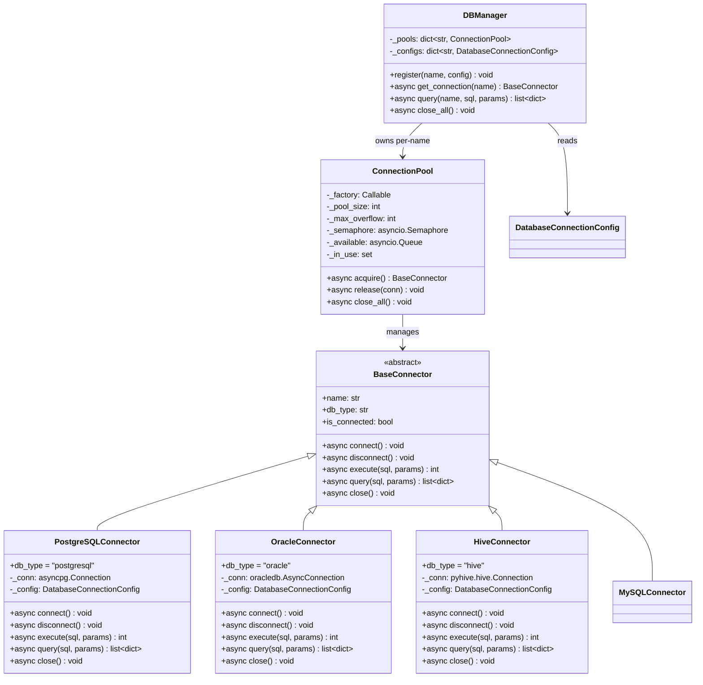
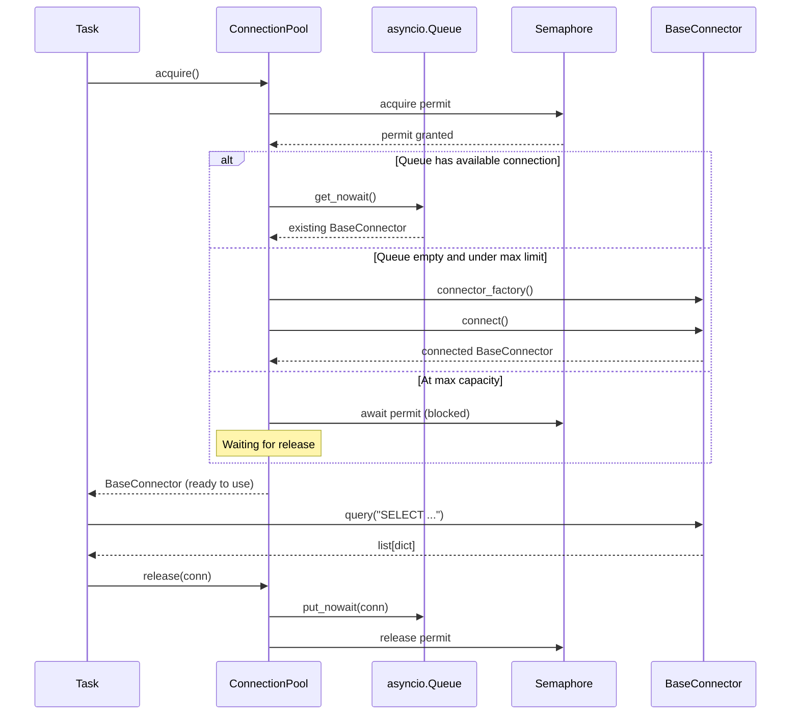
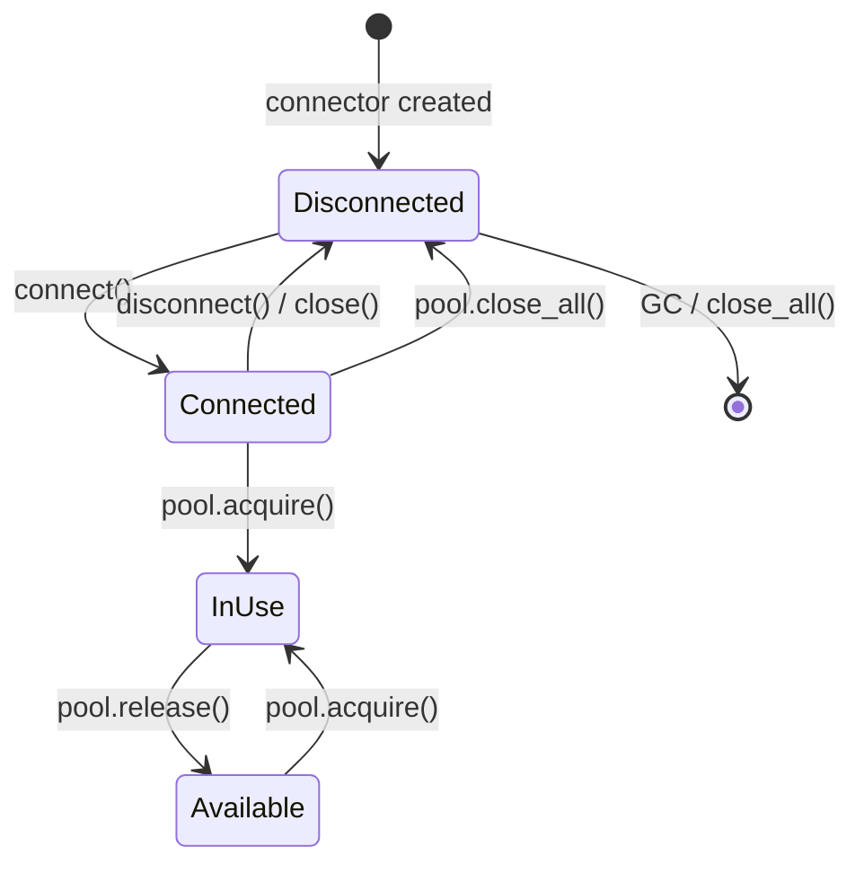

# icore 数据库连接层设计

> **文档编号：** 03  
> **项目：** icore - 企业级 LLM 工作流编排平台  
> **版本：** 1.0  
> **状态：** 模块设计文档  
> **依赖：** [01-architecture-overview.md](01-architecture-overview.md)

---

## 目录

1. [设计目标与概述](#1-设计目标与概述)
2. [统一抽象设计](#2-统一抽象设计)
3. [类图：BaseConnector 与适配器层级](#3-类图baseconnector-与适配器层级)
4. [异步连接池架构](#4-异步连接池架构)
5. [适配器模式设计](#5-适配器模式设计)
6. [查询接口与结果格式化](#6-查询接口与结果格式化)
7. [DBManager 多数据源管理](#7-dbmanager-多数据源管理)
8. [连接生命周期管理](#8-连接生命周期管理)
9. [Task 中如何使用数据库层](#9-task-中如何使用数据库层)
10. [配置方式](#10-配置方式)
11. [错误处理与重试策略](#11-错误处理与重试策略)
12. [后续扩展](#12-后续扩展)

---

## 1. 设计目标与概述

### 1.1 设计目标

icore 平台需要连接多种异构数据库（Oracle、PostgreSQL、Hive、MySQL 等），供工作流中的 Task 使用。数据库连接层的设计目标是：

1. **统一接口：** 无论底层是 PostgreSQL、Oracle 还是 Hive，上层 Task 代码使用完全相同的 `BaseConnector` 接口进行查询，实现"一套代码，多库通吃"。
2. **异步优先：** 所有数据库操作均为 `async` 方法，与 icore 的 asyncio 全异步架构一致，避免阻塞事件循环。
3. **连接池复用：** 通过异步连接池管理连接，避免频繁创建/销毁连接的开销，控制最大连接数防止数据库被打满。
4. **适配器扩展：** 新增数据库类型只需编写一个适配器类并注册，无需修改核心代码（开闭原则）。
5. **类型安全：** 使用 Python type hints 和 Pydantic 模型对查询结果进行强类型约束。
6. **多数据源管理：** 支持同时配置和连接多个不同名称的数据库（如 `main_db`、`warehouse`、`logs`），Task 按名称获取对应连接。

### 1.2 设计哲学

本层遵循 icore 架构文档（01）中定义的核心设计原则：

- **高内聚：** 数据库连接层只负责连接管理、查询执行和结果格式化，不涉及业务逻辑。
- **低耦合：** 通过 `BaseConnector` 抽象基类与上层隔离，上层（Task / TaskContext）只依赖抽象接口，不依赖具体适配器实现。
- **依赖注入：** Task 通过 `TaskContext.get_db(name)` 获取连接，而非自行创建。
- **适配器模式：** 每种数据库类型对应一个适配器子类，实现 `BaseConnector` 定义的方法。

---

## 2. 统一抽象设计

### 2.1 BaseConnector 抽象基类

`BaseConnector` 是所有数据库连接器的抽象基类，定义了统一的异步操作接口：

```python
class BaseConnector(abc.ABC):
    """Abstract base class for all database connectors."""

    # --- 属性（子类必须设置）---
    name: str          # 连接名称（逻辑标识，如 "main_db"）
    db_type: str       # 数据库类型（如 "postgresql", "oracle", "hive"）

    # --- 抽象方法（子类必须实现）---
    async def connect(self) -> None: ...
    async def disconnect(self) -> None: ...
    async def execute(self, sql: str, params: tuple | None = None) -> int: ...
    async def query(self, sql: str, params: tuple | None = None) -> list[dict[str, Any]]: ...
    async def close(self) -> None: ...

    # --- 非抽象属性 ---
    @property
    def is_connected(self) -> bool: ...
```

### 2.2 方法职责说明

| 方法 | 职责 | 返回值 |
|------|------|--------|
| `connect()` | 建立数据库连接（异步），初始化底层连接对象 | `None` |
| `disconnect()` | 断开数据库连接，释放底层资源 | `None` |
| `execute(sql, params)` | 执行非查询 SQL（INSERT/UPDATE/DELETE/DDL），使用参数化查询防注入 | 受影响行数 `int` |
| `query(sql, params)` | 执行查询 SQL，返回结构化结果 | `list[dict[str, Any]]`，每行一个 dict |
| `close()` | 关闭连接（等同于 disconnect，语义上表示连接池回收时的清理） | `None` |

### 2.3 关键设计决策

1. **`query()` 返回 `list[dict]`：** 每行结果为一个字典（列名 -> 值），而非原生 tuple / Row 对象。这样上层代码不依赖具体驱动的行类型，实现解耦。对于 Hive 等返回大数据量的场景，后续可扩展为 `AsyncIterator[dict]` 流式返回。

2. **`execute()` 返回 `int`：** 仅返回受影响行数，简洁且通用。对于需要获取自增 ID 的场景，子类可通过 `extra_params` 或额外方法扩展。

3. **`close()` vs `disconnect()`：** `disconnect()` 是物理断开连接（销毁底层连接）。`close()` 是逻辑关闭，语义上是"连接池回收"的钩子--默认调用 `disconnect()`，但子类可覆盖以实现更精细的清理逻辑（如归还连接而非真正断开）。

4. **参数化查询：** `params` 参数强制使用参数化绑定，从接口层面防止 SQL 注入。所有适配器必须使用底层驱动支持的参数化机制。

---

## 3. 类图：BaseConnector 与适配器层级



### 3.1 层级关系说明

- `BaseConnector` 是抽象基类，定义统一接口。
- `PostgreSQLConnector`、`OracleConnector`、`HiveConnector` 是三个具体适配器，分别封装各自驱动的连接细节。
- `ConnectionPool` 持有一个 `BaseConnector` 工厂函数，管理连接的创建、复用和回收。
- `DBManager` 为每个命名连接维护一个 `ConnectionPool`，是上层访问数据库的统一入口。

---

## 4. 异步连接池架构

### 4.1 设计思路

数据库连接的创建和销毁是昂贵的操作（TCP 握手、认证、会话初始化）。连接池通过预创建并复用连接来减少开销，同时限制最大连接数保护数据库。

icore 的连接池设计基于 `asyncio.Semaphore` 控制并发数，`asyncio.Queue` 管理可用连接。

### 4.2 ConnectionPool 类

```python
class ConnectionPool:
    def __init__(
        self,
        connector_factory: Callable[[], BaseConnector],
        pool_size: int = 10,
        max_overflow: int = 20,
    ): ...

    async def acquire(self) -> BaseConnector: ...
    async def release(self, conn: BaseConnector) -> None: ...
    async def close_all(self) -> None: ...

    # Async context manager for pool lifecycle
    async def __aenter__(self) -> ConnectionPool: ...
    async def __aexit__(self, *args) -> None: ...
```

### 4.3 连接池工作流程



### 4.4 关键设计点

1. **Semaphore 控制并发：** `pool_size + max_overflow` 为信号量初始值，超出则 acquire 阻塞等待，实现背压。

2. **惰性创建：** 连接不是在池初始化时全部创建，而是在首次 `acquire()` 时按需创建。这避免了启动时的连接风暴。

3. **连接复用：** `release()` 将连接放回可用队列而非关闭，后续 `acquire()` 优先复用已有连接。

4. **健康检查（可选）：** `acquire()` 时可检测连接是否存活，失效则丢弃并创建新连接。

5. **优雅关闭：** `close_all()` 逐个关闭所有连接，包括使用中的（等待释放后关闭）。

---

## 5. 适配器模式设计

### 5.1 适配器职责

每个适配器类负责：

1. 封装特定数据库驱动的连接逻辑（DSN 构建、认证方式、连接参数）。
2. 将 `BaseConnector` 的统一接口翻译为驱动特定的 API 调用。
3. 将驱动返回的原生结果对象转换为统一的 `list[dict]` 格式。
4. 处理驱动特定的异常并转为统一异常类型。

### 5.2 适配器实现示例（PostgreSQL）

```python
class PostgreSQLConnector(BaseConnector):
    db_type = "postgresql"

    def __init__(self, config: DatabaseConnectionConfig):
        self._config = config
        self._conn: asyncpg.Connection | None = None

    @property
    def name(self) -> str:
        return self._config.database  # or custom name

    @property
    def is_connected(self) -> bool:
        return self._conn is not None and not self._conn.is_closed()

    async def connect(self) -> None:
        import asyncpg
        self._conn = await asyncpg.connect(
            host=self._config.host,
            port=self._config.port,
            user=self._config.username,
            password=self._config.password,
            database=self._config.database,
        )

    async def query(self, sql: str, params: tuple | None = None) -> list[dict]:
        rows = await self._conn.fetch(sql, *params)
        return [dict(row) for row in rows]

    async def execute(self, sql: str, params: tuple | None = None) -> int:
        result = await self._conn.execute(sql, *params)
        return int(result.split()[-1])  # parse affected rows
```

### 5.3 各数据库适配器说明

| 适配器 | 驱动 | db_type | 特殊处理 |
|--------|------|---------|---------|
| `PostgreSQLConnector` | `asyncpg` | `postgresql` | 原生异步驱动；`fetch()` 返回 Record 对象，转 dict |
| `OracleConnector` | `oracledb` (async) | `oracle` | 异步模式；需处理 Oracle DSN 格式和 NLS 参数 |
| `HiveConnector` | `pyhive` / `thrift` | `hive` | pyhive 本身同步，通过 `run_in_executor` 包装为异步；Hive 查询延迟高，需配合更长超时 |
| `MySQLConnector` | `aiomysql` | `mysql` | 原生异步驱动；使用 `DictCursor` 直接返回 dict 格式 |

### 5.4 驱动导入策略

适配器中实际数据库驱动的导入采用**延迟导入**策略：在 `connect()` 方法内部 `import`，而非模块顶部。这样：

1. 不安装驱动也能 `import icore.db`（不会 `ImportError`）。
2. 只有真正连接该数据库时才需要对应驱动。
3. 骨架代码中驱动导入放在 `TYPE_CHECKING` 块以获得类型提示。

---

## 6. 查询接口与结果格式化

### 6.1 查询结果格式

所有适配器的 `query()` 方法统一返回 `list[dict[str, Any]]`：

```python
# PostgreSQL 查询结果示例
[
    {"id": 1, "name": "Alice", "department": "Engineering"},
    {"id": 2, "name": "Bob", "department": "Sales"},
]
```

- **key** 为列名（字符串）
- **value** 为列值（可能是 `int`, `float`, `str`, `datetime`, `bytes`, `None` 等）
- 空结果返回 `[]`（空列表）

### 6.2 QueryResult 模型（可选增强）

对于需要额外元数据的场景（如分页、执行时间），可使用 `QueryResult` 模型封装：

```python
class QueryResult(BaseModel):
    rows: list[dict[str, Any]]          # 查询结果行
    row_count: int                       # 结果行数
    columns: list[str]                   # 列名列表
    execution_time_ms: float             # 执行耗时（毫秒）
    affected_rows: int | None = None     # 受影响行数（execute 场景）
```

### 6.3 参数化查询

所有查询均支持参数化绑定，参数以 `tuple` 传入：

```python
# 正确：参数化查询（防注入）
await conn.query("SELECT * FROM users WHERE id = $1", (user_id,))

# 错误：字符串拼接（禁止）
await conn.query(f"SELECT * FROM users WHERE id = {user_id}")  # NEVER DO THIS
```

不同驱动的参数占位符不同（asyncpg 用 `$1`，oracledb 用 `:1`，pyhive 用 `%s`），适配器负责在内部转换。

---

## 7. DBManager 多数据源管理

### 7.1 设计职责

`DBManager` 是数据库连接层的顶层管理器，负责：

1. **注册连接配置：** 接收多个命名数据库配置（`DatabaseConnectionConfig`），存储配置但惰性创建连接池。
2. **按名称获取连接：** `get_connection(name)` 返回一个 `BaseConnector` 实例（从对应连接池中 acquire）。
3. **便捷查询：** `query(name, sql, params)` 一行完成"获取连接 -> 查询 -> 释放"流程。
4. **生命周期管理：** `close_all()` 关闭所有连接池。

### 7.2 DBManager 接口

```python
class DBManager:
    def register(self, name: str, config: DatabaseConnectionConfig) -> None: ...
    async def get_connection(self, name: str) -> BaseConnector: ...
    async def query(self, name: str, sql: str, params: tuple | None = None) -> list[dict]: ...
    async def close_all(self) -> None: ...
```

### 7.3 连接池惰性创建

`DBManager` 在 `register()` 时只存储配置，不创建连接池。首次 `get_connection()` 时才创建对应连接池。这避免了启动时连接所有数据库的开销。

### 7.4 适配器工厂

`DBManager` 内部维护一个 `db_type -> connector_class` 的映射，根据配置中的 `db_type` 字段选择适配器类：

```python
_ADAPTER_MAP: dict[str, type[BaseConnector]] = {
    "postgresql": PostgreSQLConnector,
    "oracle": OracleConnector,
    "hive": HiveConnector,
}
```

新增数据库类型只需注册新的适配器类到此映射。

---

## 8. 连接生命周期管理

### 8.1 连接状态流转



### 8.2 连接回收策略

连接池支持以下回收策略（通过 `DatabaseConnectionConfig.pool_recycle` 配置）：

1. **定时回收：** 超过 `pool_recycle` 秒的空闲连接在 `acquire()` 时被检测并替换。
2. **健康检查：** `acquire()` 时执行简单 ping 查询（如 `SELECT 1`），失败则丢弃创建新连接。
3. **最大生命周期：** 每个连接有最大生命周期，超过后强制重建。

### 8.3 连接泄漏防护

`DBManager.get_connection()` 推荐配合 `async with` 使用，确保连接始终被释放：

```python
# 推荐用法
async with db_manager.connection_ctx("main_db") as conn:
    rows = await conn.query("SELECT * FROM users")
# conn 自动释放回池

# 也可手动管理
conn = await db_manager.get_connection("main_db")
try:
    rows = await conn.query("SELECT * FROM users")
finally:
    await db_manager.release_connection("main_db", conn)
```

---

## 9. Task 中如何使用数据库层

### 9.1 通过 TaskContext 获取连接

架构文档（01）中定义 `TaskContext.get_db(name)` 方法返回 `BaseConnector` 实例。Task 通过依赖注入获取数据库连接：

```python
class WeeklyReportTask(BaseTask):
    """Query weekly tasks from DB and prepare data for LLM."""

    async def execute(self, ctx: TaskContext, inp: WeeklyReportInput) -> WeeklyReportOutput:
        # Get DB connection via dependency injection
        db = ctx.get_db("main_db")

        # Execute parameterized query
        rows = await db.query(
            "SELECT * FROM tasks WHERE created_at >= $1 AND created_at < $2",
            (inp.week_start, inp.week_end),
        )

        # Pass results to LLM for report generation
        model = ctx.get_model_adapter()
        report = await model.chat(
            messages=[
                {"role": "system", "content": "Generate a weekly report from the following tasks..."},
                {"role": "user", "content": str(rows)},
            ],
        )

        return WeeklyReportOutput(report=report)
```

### 9.2 使用流程

1. **配置阶段：** 在 `config/databases.yaml` 或环境变量中配置各数据源连接信息。
2. **初始化阶段：** `DBManager` 从 `Settings.database.connections` 加载所有命名连接配置。
3. **运行时：** Task 通过 `TaskContext.get_db(name)` 获取连接，执行查询，连接池自动管理复用和回收。
4. **关闭阶段：** 应用关闭时 `DBManager.close_all()` 清理所有连接池。

---

## 10. 配置方式

### 10.1 YAML 配置示例（config/databases.yaml）

```yaml
default_connection: main_db
connections:
  main_db:
    db_type: postgresql
    host: 192.168.1.100
    port: 5432
    username: icore_user
    password: secret
    database: icore_main
    pool_size: 10
    max_overflow: 20
    pool_recycle: 3600

  warehouse:
    db_type: hive
    host: 192.168.1.200
    port: 10000
    username: hive_user
    database: warehouse
    pool_size: 5
    max_overflow: 10
    extra_params:
      auth_mechanism: PLAIN

  legacy_erp:
    db_type: oracle
    host: 192.168.1.300
    port: 1521
    username: erp_reader
    password: secret
    database: ERPPROD
    pool_size: 5
    max_overflow: 5
    extra_params:
      service_name: ERPPROD
```

### 10.2 环境变量配置示例

```bash
# .env
ICORE_DB_DEFAULT_CONNECTION=main_db
ICORE_DB_CONNECTIONS__main_db__db_type=postgresql
ICORE_DB_CONNECTIONS__main_db__host=192.168.1.100
ICORE_DB_CONNECTIONS__main_db__port=5432
```

### 10.3 代码中注册连接

```python
from icore.config import DatabaseConnectionConfig
from icore.db.manager import DBManager

mgr = DBManager()
mgr.register("analytics", DatabaseConnectionConfig(
    db_type="postgresql",
    host="analytics.internal",
    port=5432,
    username="reader",
    password="secret",
    database="analytics",
))
```

---

## 11. 错误处理与重试策略

### 11.1 异常体系

```python
class DatabaseError(Exception):
    """Base exception for all database-related errors."""

class ConnectionError(DatabaseError):
    """Failed to connect to the database."""

class QueryError(DatabaseError):
    """Query execution failed."""

class PoolExhaustedError(DatabaseError):
    """Connection pool exhausted (no available connections)."""
```

### 11.2 重试策略

连接池的 `acquire()` 在连接创建失败时可选重试：

1. **连接失败重试：** 最多 `max_retries` 次（默认 3），指数退避。
2. **查询失败重试：** 适配器层面可配置查询重试，适用于网络抖动场景。
3. **断线重连：** 检测到连接断开时自动重建。

### 11.3 超时控制

- **连接超时：** `connect()` 设置超时，防止网络不通时无限等待。
- **查询超时：** `query()` / `execute()` 设置超时，防止慢查询阻塞。
- **池等待超时：** `acquire()` 设置等待可用连接的超时，超时抛出 `PoolExhaustedError`。

---

## 12. 后续扩展

### 12.1 流式查询

对于 Hive 等返回大数据量的场景，可扩展 `BaseConnector` 增加 `stream_query()` 方法，返回 `AsyncIterator[dict]`：

```python
async def stream_query(self, sql: str, params: tuple | None = None) -> AsyncIterator[dict[str, Any]]:
    """Stream query results row by row."""
    ...
```

### 12.2 事务支持

扩展 `BaseConnector` 增加事务接口：

```python
async def begin_transaction(self) -> None: ...
async def commit(self) -> None: ...
async def rollback(self) -> None: ...
```

### 12.3 连接池监控

暴露连接池运行指标（当前连接数、空闲连接数、等待队列长度等），供健康检查接口使用。

### 12.4 读写分离

`DBManager` 支持注册主从连接，自动路由读查询到从库、写操作到主库。

### 12.5 更多适配器

按需扩展 MySQL、ClickHouse、Doris、Trino 等适配器，只需继承 `BaseConnector` 并注册到适配器映射表。

---

> **本文档定义了 icore 数据库连接层的完整设计。所有适配器必须实现 `BaseConnector` 定义的接口，通过 `DBManager` 统一管理。Task 通过 `TaskContext.get_db()` 获取连接，实现依赖注入和解耦。**
