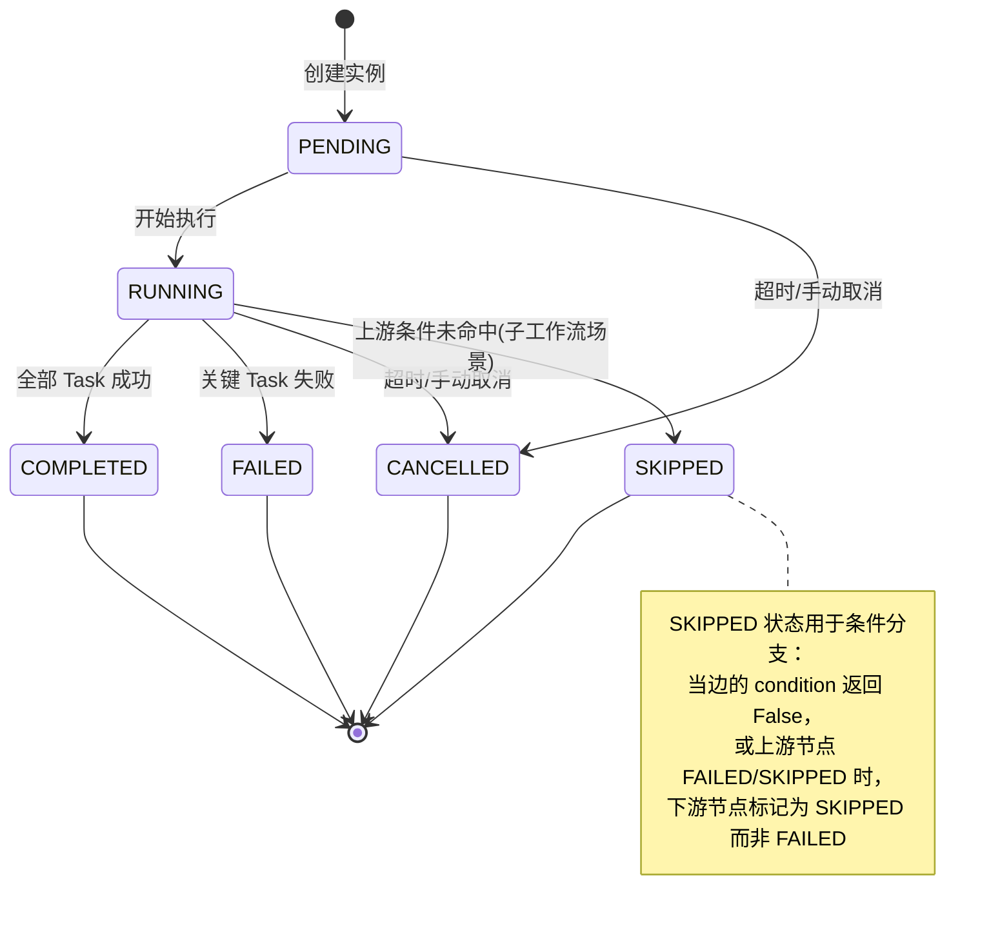
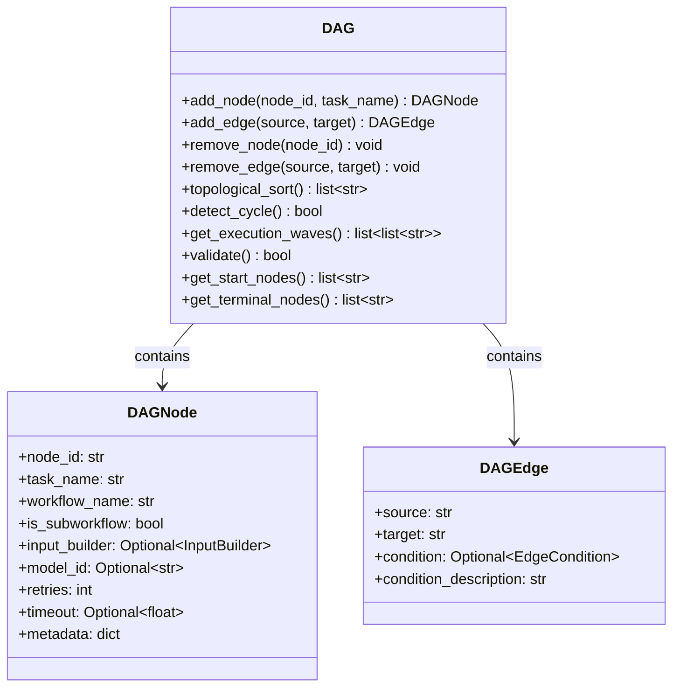
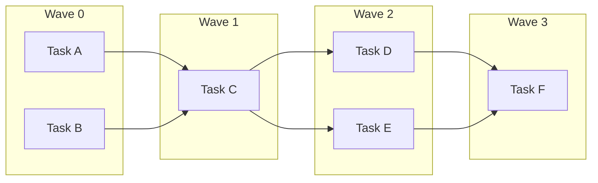
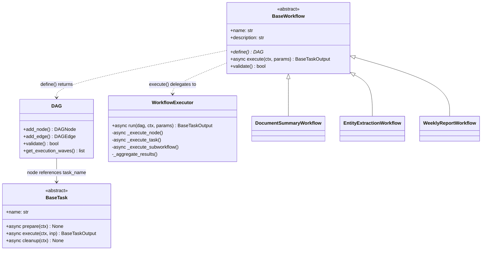
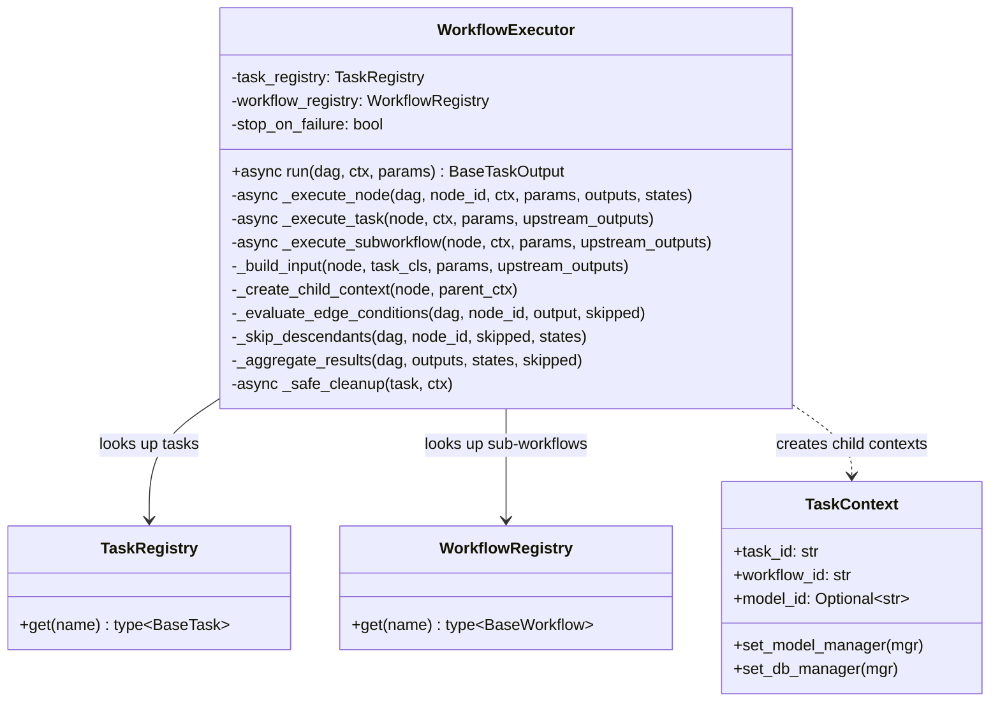
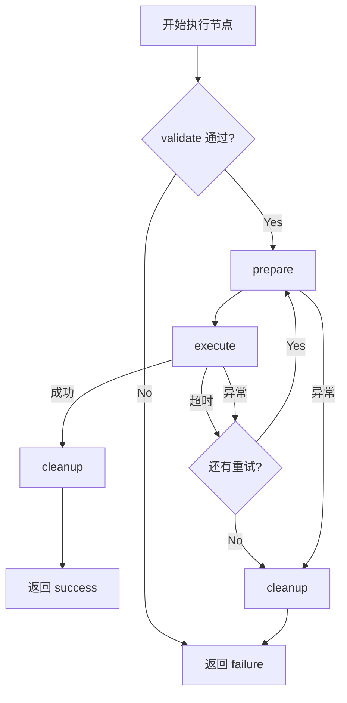
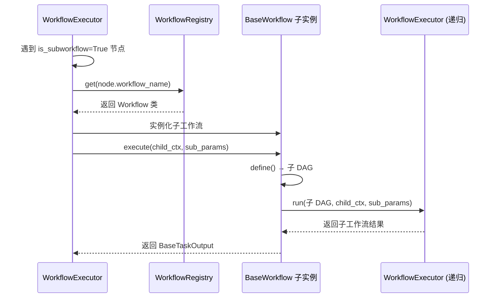
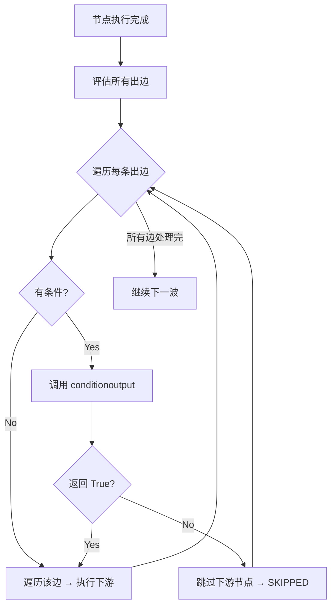
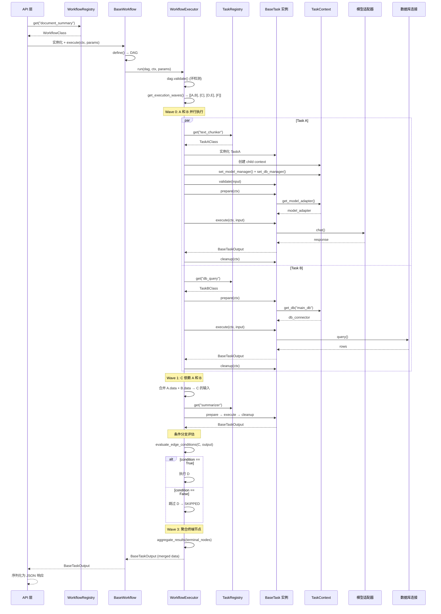

# icore 工作流引擎设计

> **文档编号：** 04  
> **项目：** icore - 企业级 LLM 工作流编排平台  
> **版本：** 1.0  
> **状态：** 核心设计文档  
> **依赖：** [01-architecture-overview.md](01-architecture-overview.md), [02-task-abstraction.md](02-task-abstraction.md)

---

## 目录

1. [设计目标与概述](#1-设计目标与概述)
2. [核心概念与术语](#2-核心概念与术语)
3. [状态机设计](#3-状态机设计)
4. [DAG 有向无环图](#4-dag-有向无环图)
5. [BaseWorkflow 抽象基类](#5-baseworkflow-抽象基类)
6. [WorkflowExecutor 执行器](#6-workflowexecutor-执行器)
7. [WorkflowRegistry 注册表](#7-workflowregistry-注册表)
8. [子工作流调度](#8-子工作流调度)
9. [条件分支](#9-条件分支)
10. [工作流执行完整流程](#10-工作流执行完整流程)
11. [与后续模块的集成关系](#11-与后续模块的集成关系)

---

## 1. 设计目标与概述

### 1.1 设计目标

工作流引擎（`icore.engine`）是 icore 平台的调度核心。它负责将多个 Task 按照预定义的依赖关系编排成可执行的 DAG（有向无环图），并管理整个执行过程的生命周期、数据传递、条件分支和子工作流嵌套。

设计目标如下：

- **DAG 驱动调度：** 工作流以 DAG 形式定义任务依赖，引擎按拓扑序自动调度，同一层级的独立任务可并行执行。
- **子工作流嵌套：** 一个工作流的节点可以是另一个已注册的工作流，实现层级化编排。
- **条件分支：** 边可携带条件谓词，运行时根据上游 Task 输出决定是否执行下游节点。
- **统一状态管理：** Task 和 Workflow 共享一致的状态机（PENDING → RUNNING → COMPLETED/FAILED/CANCELLED/SKIPPED）。
- **数据自动流转：** 上游 Task 的输出可自动合并为下游 Task 的输入，也支持自定义输入构建器。
- **失败隔离：** 单个 Task 失败只影响其下游分支，独立分支继续执行。
- **无状态执行器：** `WorkflowExecutor` 不保存执行间状态，可在多协程间安全复用。

### 1.2 核心组件概览

| 组件 | 文件 | 职责 |
|------|------|------|
| `TaskState` / `WorkflowState` | `states.py` | 任务与工作流的生命周期状态枚举 |
| `DAG` / `DAGNode` / `DAGEdge` | `dag.py` | 有向无环图数据结构（节点、边、拓扑排序、环检测） |
| `BaseWorkflow` | `base_workflow.py` | 工作流抽象基类，定义 `define()` → DAG 契约 |
| `WorkflowExecutor` | `executor.py` | 运行时执行器，按 DAG 调度任务 |
| `WorkflowRegistry` | `registry.py` | 工作流注册表 + 装饰器 |

### 1.3 模块依赖

```
engine
  ├── depends on → core (BaseTask, TaskContext, BaseTaskInput, BaseTaskOutput, TaskRegistry)
  ├── depends on → (future) models.manager.ModelManager (via TaskContext injection)
  ├── depends on → (future) db.manager.DBManager (via TaskContext injection)
  └── depended on by → api (API layer calls executor)
                       services (exposers call registry)
                       workflows (concrete workflows extend BaseWorkflow)
```

`engine` 通过 `TaskContext` 间接访问 `ModelManager` 和 `DBManager`，不直接 import 它们，避免循环依赖。

---

## 2. 核心概念与术语

### 2.1 概念对照表

| 概念 | 说明 |
|------|------|
| **Workflow（工作流）** | 由一个或多个 Task 组成的 DAG 执行单元，继承 `BaseWorkflow` |
| **Task（任务）** | 最小执行单元，继承 `BaseTask`，有独立的输入/输出类 |
| **DAG（有向无环图）** | 描述 Task 间依赖关系的数据结构，节点 = Task，边 = 依赖 |
| **Node（节点）** | DAG 中的一个执行单元，可以是普通 Task 节点或子工作流节点 |
| **Edge（边）** | DAG 中的一条有向边，表示 "source 完成后才能执行 target" |
| **Wave（执行波）** | 拓扑排序中同层级的节点集合，可并行执行 |
| **Task Instance（任务实例）** | 一次具体的 Task 执行，用 `task_id` 标识 |
| **Workflow Instance（工作流实例）** | 一次具体的工作流执行，用 `workflow_id` 标识 |
| **Sub-workflow（子工作流）** | DAG 节点指向另一个已注册的工作流，实现嵌套调用 |
| **Conditional Branch（条件分支）** | 边携带条件谓词，运行时决定是否遍历 |
| **Input Builder（输入构建器）** | 自定义函数，从工作流参数和上游输出构建 Task 输入 |

### 2.2 Task 与 Workflow 的关系

```
工作流 = DAG(Task₁ → Task₂ → Task₃)
                  ↘ Task₄ (条件分支)
```

- 一个 Workflow 包含 1 到 N 个 Task
- Task 之间通过 DAG 边定义执行顺序和数据流向
- Workflow 本身也可以作为另一个 Workflow 的节点（子工作流）
- `task_id` 是任务**实例**的标识，仅用于追踪和去重，不影响工作流定义

---

## 3. 状态机设计

### 3.1 TaskState 枚举

```python
class TaskState(str, Enum):
    PENDING = "PENDING"       # 已创建，等待执行
    RUNNING = "RUNNING"       # 正在执行
    COMPLETED = "COMPLETED"   # 成功完成
    FAILED = "FAILED"         # 执行失败
    CANCELLED = "CANCELLED"   # 被取消（超时或外部信号）
    SKIPPED = "SKIPPED"       # 被跳过（条件分支未命中或上游失败）
```

### 3.2 WorkflowState 枚举

```python
class WorkflowState(str, Enum):
    PENDING = "PENDING"
    RUNNING = "RUNNING"
    COMPLETED = "COMPLETED"
    FAILED = "FAILED"
    CANCELLED = "CANCELLED"
    SKIPPED = "SKIPPED"
```

### 3.3 状态流转图



### 3.4 状态属性

每个状态枚举提供两个便捷属性：

| 属性 | 类型 | 说明 |
|------|------|------|
| `is_terminal` | `bool` | 是否终态（COMPLETED/FAILED/CANCELLED/SKIPPED） |
| `is_success` | `bool` | 是否成功（仅 COMPLETED） |

---

## 4. DAG 有向无环图

### 4.1 设计思路

DAG 是工作流引擎的核心数据结构。它描述了：
- **哪些 Task 组成工作流**（节点）
- **Task 的执行顺序**（边 = 依赖）
- **数据如何在 Task 间流转**（输入构建器）
- **哪些分支应该执行**（条件边）
- **哪些节点委托给子工作流**（`is_subworkflow` 标记）

### 4.2 DAGNode 节点



| 字段 | 类型 | 说明 |
|------|------|------|
| `node_id` | `str` | 节点在 DAG 内的唯一标识 |
| `task_name` | `str` | 已注册的 Task 名称（TaskRegistry 查找） |
| `workflow_name` | `str` | 已注册的工作流名称（子工作流节点使用） |
| `is_subworkflow` | `bool` | 是否为子工作流节点 |
| `input_builder` | `Callable \| None` | 自定义输入构建函数 |
| `model_id` | `str \| None` | 节点级模型覆盖（None = 用工作流级配置） |
| `retries` | `int` | 失败重试次数（默认 0） |
| `timeout` | `float \| None` | 节点级超时秒数 |
| `metadata` | `dict` | 扩展元数据 |

### 4.3 DAGEdge 边

边定义了执行依赖：`source` 完成后才能执行 `target`。如果 `condition` 不为 None，则只有当 `condition(source_output)` 返回 True 时才遍历该边。

| 字段 | 类型 | 说明 |
|------|------|------|
| `source` | `str` | 前驱节点 ID |
| `target` | `str` | 后继节点 ID |
| `condition` | `Callable \| None` | 条件谓词（None = 无条件） |
| `condition_description` | `str` | 条件的人类可读描述 |

### 4.4 拓扑排序与执行波

DAG 使用 Kahn 算法进行拓扑排序，并支持"执行波"（Execution Waves）计算：



- **Wave 0：** A 和 B 无前驱，可并行执行
- **Wave 1：** C 依赖 A 和 B，A/B 完成后执行
- **Wave 2：** D 和 E 依赖 C，C 完成后可并行
- **Wave 3：** F 依赖 D 和 E

执行器在每个 Wave 内使用 `asyncio.gather` 并行执行所有节点，最大化吞吐量。

### 4.5 环检测

DAG 在 `validate()` 时自动检测环。使用 DFS 颜色标记法（WHITE/GRAY/BLACK）：
- GRAY 节点再次被访问 → 发现环
- 检测到环时抛出 `DAGValidationError`，附带环上的节点路径

### 4.6 类型别名

```python
# 输入构建器：从工作流参数和上游输出构建 Task 输入
InputBuilder = Callable[[dict[str, Any], dict[str, BaseTaskOutput]], BaseTaskInput]

# 边条件：根据上游输出决定是否遍历该边
EdgeCondition = Callable[[BaseTaskOutput], bool]
```

---

## 5. BaseWorkflow 抽象基类

### 5.1 设计思路

`BaseWorkflow` 使用模板方法模式：
- `define()` 是抽象方法，子类必须实现，负责构建 DAG
- `execute()` 有默认实现，委托给 `WorkflowExecutor`
- `validate()` 有默认实现，调用 `define()` 后验证 DAG 结构

### 5.2 类图



### 5.3 方法定义

| 方法 | 类型 | 职责 |
|------|------|------|
| `define()` | 抽象同步 | 构建 DAG（添加节点、边、条件） |
| `execute(ctx, params)` | 非抽象异步 | 委托给 `WorkflowExecutor.run()` |
| `validate()` | 非抽象同步 | 构建 DAG 并调用 `dag.validate()` |

### 5.4 开发模式

```python
@register_workflow("document_summary")
class DocumentSummaryWorkflow(BaseWorkflow):
    name = "document_summary"
    description = "Summarize a large document via chunking"

    def define(self) -> DAG:
        dag = DAG()
        dag.add_node("chunk", task_name="text_chunker")
        dag.add_node("summarize", task_name="summarizer",
                     input_builder=lambda params, upstream:
                         SummaryInput(chunks=upstream["chunk"].data["chunks"]))
        dag.add_node("merge", task_name="merger")
        dag.add_edge("chunk", "summarize")
        dag.add_edge("summarize", "merge")
        return dag
```

---

## 6. WorkflowExecutor 执行器

### 6.1 设计思路

`WorkflowExecutor` 是无状态的运行时执行器，负责：

1. **验证 DAG**（环检测、结构完整性）
2. **计算执行波**（拓扑排序分组）
3. **按波执行**（每波内 `asyncio.gather` 并行）
4. **构建任务输入**（输入构建器或自动合并）
5. **管理生命周期**（validate → prepare → execute → cleanup）
6. **处理条件分支**（边条件评估 → 跳过未命中节点）
7. **处理失败传播**（失败节点的下游全部标记为 SKIPPED）
8. **调用子工作流**（`is_subworkflow=True` 的节点委托给 WorkflowRegistry）
9. **重试与超时**（节点级 `retries` 和 `timeout` 配置）
10. **聚合结果**（从终端节点收集输出）

### 6.2 执行器架构



### 6.3 依赖注入传递

执行器在创建子 `TaskContext` 时，从父上下文继承 `ModelManager` 和 `DBManager` 引用：

```python
child = TaskContext(
    task_id=f"{parent_ctx.task_id}:{node.node_id}",
    workflow_id=parent_ctx.workflow_id,
    model_id=node.model_id or parent_ctx.model_id,
    callback_url=parent_ctx.callback_url,
    stream=parent_ctx.stream,
    metadata=dict(parent_ctx.metadata),
)
child.set_model_manager(parent_ctx._model_manager)
child.set_db_manager(parent_ctx._db_manager)
```

这确保了每个 Task 都能通过 `ctx.get_model_adapter()` 和 `ctx.get_db(name)` 获取运行时依赖。

### 6.4 输入构建策略

| 策略 | 触发条件 | 行为 |
|------|---------|------|
| **自定义构建器** | `node.input_builder` 不为 None | 调用 `input_builder(params, upstream_outputs)` 返回输入实例 |
| **自动合并** | `node.input_builder` 为 None | 合并工作流参数 + 上游输出 data → 构造 `task_cls.input_model(**merged)` |

自动合并规则：
1. 以工作流参数为基础层
2. 逐个合并上游成功输出的 `data` 字典（后覆盖前）
3. 用合并后的字典构造 Task 的 `input_model`

### 6.5 失败处理与重试



- 节点级 `retries` 控制重试次数（默认 0 = 不重试）
- 节点级 `timeout` 控制单次执行超时（None = 不超时）
- `cleanup()` 始终执行（即使 execute 失败），通过 `_safe_cleanup` 包装，异常被记录但不传播
- 重试时重新执行 `validate → prepare → execute`（不重新创建 Task 实例）

### 6.6 结果聚合策略

`WorkflowExecutionResult.get_terminal_output()` 的返回结构**按终端节点数量不对称**，调用方需据此分支处理：

| 场景 | 返回结构 | `output.data` 形态 |
|------|---------|--------------------|
| **单终端节点成功** | 直接返回该节点的 `BaseTaskOutput`（原样，不重新包装） | 该节点 task 自己的 `data` dict，例如 `{"summary": "..."}`，**无** `results` 包装 |
| **单终端节点失败** | 同上，原样返回该节点的 `BaseTaskOutput` | 该节点 task 自己的 `data` dict，`status="error"`、`error` 已设置 |
| **多终端节点全部成功** | 新建 `BaseTaskOutput.success(results=merged_data)` | `{"results": {node_id_1: <data_1>, node_id_2: <data_2>, ...}}`，每个 value 为该节点的 `data` |
| **多终端节点部分失败** | 新建 `BaseTaskOutput.failure("One or more terminal nodes failed", results=merged_data)` | 同上形态 `{"results": {...}}`，**包含所有 active 节点**（成功与失败一并合入），整体 `status="error"` |
| **无 active 终端节点**（全部被 skip 或无输出） | `BaseTaskOutput.failure(...)` | 空 dict（无 `results` 键），`error` 描述原因 |

> ⚠️ **调用方注意**：
> - 单终端与多终端的 `output.data` 结构不同，统一处理时建议先判断 `len(terminal_nodes)` 或检查 `data` 中是否含 `results` 键。
> - 多终端部分失败时，失败节点的信息只体现在其 `data` 内（由各自 task 决定），整体只标记为 failure，不单独维护 `_partial_failures` 列表。

---

## 7. WorkflowRegistry 注册表

### 7.1 设计思路

`WorkflowRegistry` 与 `TaskRegistry` 设计一致，提供线程安全的工作流注册和查找：

- **注册：** 通过 `@register_workflow("name")` 装饰器或显式调用
- **查找：** API 层通过 `workflow_name` 查找工作流类
- **子工作流查找：** 执行器通过 `node.workflow_name` 查找子工作流类
- **列举：** Swagger 文档生成时可列出所有已注册工作流

### 7.2 接口

| 方法 | 签名 | 说明 |
|------|------|------|
| `register` | `(name, workflow_cls) -> None` | 注册工作流类 |
| `get` | `(name) -> type[BaseWorkflow]` | 按名称查找（不存在抛 KeyError） |
| `list_workflows` | `() -> list[str]` | 列出所有已注册名称 |
| `contains` | `(name) -> bool` | 检查是否已注册 |
| `unregister` | `(name) -> None` | 注销（测试用） |

### 7.3 装饰器模式

```python
@register_workflow("document_summary")
class DocumentSummaryWorkflow(BaseWorkflow):
    name = "document_summary"
    ...
```

装饰器在类定义时执行，自动注册到全局默认 `WorkflowRegistry` 实例。若类的 `name` 属性为空，装饰器会用注册名填充。

---

## 8. 子工作流调度

### 8.1 子工作流节点

DAG 节点可以设置为子工作流节点（`is_subworkflow=True`），执行时委托给另一个已注册的工作流：

```python
dag.add_node(
    "sub_analysis",
    workflow_name="entity_extraction",  # 指向已注册的工作流
    is_subworkflow=True,
)
```

### 8.2 执行流程



### 8.3 参数传递

子工作流的参数由上游输出和原始工作流参数合并而来：

```python
sub_params = self._merge_upstream_data(params, upstream_outputs)
```

子工作流接收合并后的参数，其内部的 `define()` 方法可以用这些参数构建子 DAG。

### 8.4 层级化编排示例

```
主工作流: weekly_report
├── query_tasks (Task: 数据库查询)
├── analyze (子工作流: entity_extraction)
│   ├── extract_entities (Task)
│   ├── normalize (Task)
│   └── format (Task)
└── generate_report (Task: LLM 生成周报)
```

主工作流的 DAG 中，`analyze` 节点是一个子工作流节点，指向 `entity_extraction` 工作流。执行器在遇到该节点时，递归调用子工作流的执行。

---

## 9. 条件分支

### 9.1 条件边

DAG 的边可以携带条件谓词（`EdgeCondition`），实现运行时条件分支：

```python
dag.add_node("classify", task_name="text_classifier")
dag.add_node("route_spam", task_name="spam_handler")
dag.add_node("route_normal", task_name="normal_handler")

dag.add_edge("classify", "route_spam",
             condition=lambda out: out.data.get("label") == "spam",
             condition_description="Route to spam handler if classified as spam")

dag.add_edge("classify", "route_normal",
             condition=lambda out: out.data.get("label") == "normal",
             condition_description="Route to normal handler otherwise")
```

### 9.2 条件评估流程



### 9.3 跳过传播（v0.6.x 更新，ICORE-ISSUE-002：支持菱形分支汇合）

跳过判定在每波执行前对未预标记的节点进行（`_should_skip_node`）：

**节点执行**：至少一条入边"激活"（前驱已完成，且该边无条件或条件为 True）。

**节点跳过（AND-join 截断）**：没有任何激活入边——所有前驱都被跳过，或所有已完成前驱的入边条件均为 False。

| 场景 | 行为 |
|------|------|
| 线性链上条件为 False | 该节点 `SKIPPED`，其唯一后继因"所有前驱被跳过"继续级联 `SKIPPED`（与旧语义兼容） |
| 菱形：互补条件只选中一支 | 未选中分支 `SKIPPED`；**汇合节点照常执行**，只从已执行分支收集输入（被跳过分支不贡献输出） |
| 菱形：两支都被选中 | 汇合节点收到全部两个上游输出 |
| 所有分支都未选中 | 汇合节点 `SKIPPED`（无输入路径），级联到终端 → `No terminal nodes produced output` |
| 某分支节点 `FAILED` | 该失败节点的全部传递后继（含汇合）被 `_mark_downstream_skipped` 预标记 `SKIPPED`，**即使另一分支成功也不掩盖错误** |

```text
             ┌── cond A ──→ node_a ──┐
node_start ──┤                        ├──→ join ──→ end
             └── cond B ──→ node_b ──┘
```

- `cond A=True, cond B=False` → `node_a`、`join`、`end` 执行；`join` 的上游输入只有 `node_a`
- `cond A=cond B=False` → `node_a`/`node_b`/`join`/`end` 全部 `SKIPPED`

### 9.4 条件异常处理

如果条件谓词抛出异常，执行器捕获异常并视为条件不满足（`should_traverse = False`），记录警告日志但不中断工作流执行。

---

## 10. 工作流执行完整流程

### 10.1 完整执行序列图



### 10.2 数据流转示例

以"文档摘要"工作流为例，展示数据如何在 Task 间流转：

```
输入参数: {document: "...(长文本)...", max_length: 500}

Wave 0:
  chunk Task:
    输入: {document: "...(长文本)..."}
    输出: data = {chunks: ["片段1", "片段2", "片段3"]}

Wave 1:
  summarize Task (input_builder):
    输入: SummaryInput(chunks=["片段1", "片段2", "片段3"])
    输出: data = {summaries: ["摘要1", "摘要2", "摘要3"]}

Wave 2:
  merge Task (auto-merge):
    输入: {summaries: ["摘要1", "摘要2", "摘要3"], max_length: 500}
    输出: data = {summary: "合并后的最终摘要"}

最终输出: BaseTaskOutput(status="success", data={summary: "..."})
```

### 10.3 并行执行模型

执行器使用 `asyncio.gather` 在每个 Wave 内并行执行所有活跃节点：

```python
coroutines = [
    self._execute_node(dag, node_id, ctx, params, outputs, states)
    for node_id in active_nodes
]
results = await asyncio.gather(*coroutines, return_exceptions=True)
```

- `return_exceptions=True` 确保一个节点失败不会中断其他节点
- 失败节点的异常被捕获并转换为 `BaseTaskOutput.failure()`
- 失败节点的下游通过 `_skip_descendants` 递归跳过

---

## 11. 与后续模块的集成关系

### 11.1 与 API 层（US-006）的集成

API 层是工作流引擎的主要消费者：

1. API 接收 `POST /invoke` 请求，解析 `workflow_name` 和 `params`
2. 从 `WorkflowRegistry` 查找工作流类
3. 创建顶层 `TaskContext`（注入 `ModelManager` 和 `DBManager`）
4. 调用 `workflow.execute(ctx, params)`
5. 返回 `BaseTaskOutput` 的 JSON 序列化

### 11.2 与并发处理（US-007）的集成

并发控制层将在执行器外层包装：
- 任务队列：在入队前检查并发限制和背压
- 实例管理器：追踪 `task_id` 对应的执行状态
- 并发控制器：使用信号量限制每工作流并发数

执行器本身是无状态的，并发控制由外层负责。

### 11.3 与模型管理（US-005）的集成

执行器创建子 `TaskContext` 时，从父上下文继承 `ModelManager` 引用：
- 节点级 `model_id` 覆盖工作流级配置
- `model_id=None` 时由 `ModelRouter` 自动路由

### 11.4 与数据库层（US-003）的集成

执行器创建子 `TaskContext` 时，从父上下文继承 `DBManager` 引用：
- Task 通过 `ctx.get_db("name")` 获取数据库连接器
- 连接器从连接池获取连接，执行查询后自动归还

### 11.5 与服务暴露层（US-008）的集成

服务暴露层将工作流封装为不同协议的服务：
- MCP 服务：将每个注册工作流暴露为 MCP Tool
- Tool 服务：将工作流封装为可调用函数
- Streamlit 应用：为工作流生成交互界面
- SSE 接口：将流式工作流暴露为 SSE 端点

所有暴露方式都通过 `WorkflowRegistry` 查找工作流，通过 `WorkflowExecutor` 执行。

### 11.6 与示例工作流（US-009）的集成

示例工作流展示如何使用引擎：
- 文档摘要：多 Task 串行 + 输入构建器
- 实体提取：多 Task + 子工作流
- 周报生成：数据库查询 Task + LLM 生成 Task

### 11.7 v0.6 工程增强组件集成

v0.6 在工作流引擎中新增 9 个工程增强组件（详见 [docs/13-v0.6-implementation.md](13-v0.6-implementation.md)）：

| 组件 | 文件 | 与执行器的关系 |
|------|------|----------------|
| Agent 协作 | `engine/agent.py` | `DAGNode(is_agent=True, agent_config=...)`，由 `AgentNodeExecutor` 在节点执行时驱动 REACT/SUPERVISOR/SWARM 循环，复用 `WorkflowExecutor` 执行 available_tasks |
| 退避策略 | `engine/backoff.py` | `_retry_async` 在节点失败时按策略重试（CONSTANT/LINEAR/EXPONENTIAL/EXPONENTIAL_JITTER） |
| 死信队列 | `engine/dead_letter_queue.py` | 重试耗尽后入队，可 replay 重新执行 |
| Saga 补偿 | `engine/saga.py` | `SagaWorkflow` 基类，节点失败时按反向顺序执行 compensate 函数 |
| 全链路背压 | `engine/backpressure.py` | `BackpressureCoordinator` 守护每个外部依赖并发；执行器在调用 LLM/Milvus/Neo4j 前后 acquire/release |
| 配置热加载 | `engine/hot_reload.py` | `HotReloadCoordinator` 监听 `models.yaml` 变化，重载 `ModelManager`（不影响 in-flight 执行） |
| 优雅降级 | `engine/graceful_degradation.py` | `GracefulDegradationCoordinator` 主备 provider 切换；执行器通过 `coord.get(name)` 拿当前可用 provider |
| objectstore 传递 | - | `WorkflowExecutor` 创建子上下文时检查 `parent_ctx.has_objectstore()` 并传递（详见 [AGENTS.md §4.7](../AGENTS.md)） |
| 持久化 | `icore/persistence/` | 每完成一个节点写入 `task_executions` + checkpoint，支持断点续跑 |

---

## 附录：模块文件清单

| 文件 | 核心内容 |
|------|---------|
| `icore/engine/__init__.py` | 包初始化，导出所有引擎组件（含 v0.6 弹性 / Agent / 治理组件） |
| `icore/engine/states.py` | `TaskState`、`WorkflowState` 枚举（含 SKIPPED） |
| `icore/engine/dag.py` | `DAG`、`DAGNode`（含 `is_agent`/`agent_config`，v0.6）、`DAGEdge`、环检测、拓扑排序、执行波 |
| `icore/engine/base_workflow.py` | `BaseWorkflow` 抽象基类（define/execute/validate） |
| `icore/engine/executor.py` | `WorkflowExecutor` 运行时执行器（v0.6 起传递 objectstore 到子上下文） |
| `icore/engine/registry.py` | `WorkflowRegistry` + `register_workflow` 装饰器 |
| `icore/engine/agent.py`（v0.6） | `AgentNodeExecutor` + `AgentConfig` + `AgentMode`（REACT/SUPERVISOR/SWARM） |
| `icore/engine/backoff.py`（v0.6） | `BackoffStrategy` 4 种策略 + `retry_with_backoff` |
| `icore/engine/dead_letter_queue.py`（v0.6） | `DeadLetterQueue` + `InMemoryDLQBackend` / `PostgresDLQBackend` |
| `icore/engine/saga.py`（v0.6） | `SagaWorkflow` + `SagaStep` 补偿事务 |
| `icore/engine/backpressure.py`（v0.6） | `BackpressureCoordinator` 全链路背压 |
| `icore/engine/hot_reload.py`（v0.6） | `HotReloadCoordinator` 配置热加载（watchdog/polling） |
| `icore/engine/graceful_degradation.py`（v0.6） | `GracefulDegradationCoordinator` 优雅降级 |

---

> **本文档定义了 icore 平台的工作流引擎设计，包括 DAG 调度、执行器、状态机、子工作流嵌套和条件分支。所有后续模块（API 层、并发处理、服务暴露、示例工作流）均基于本文档定义的 `BaseWorkflow`、`WorkflowExecutor` 和 `WorkflowRegistry` 进行集成。v0.6 在此基础上扩展了 Agent 协作、结构化弹性、全链路背压、配置热加载与优雅降级。**
