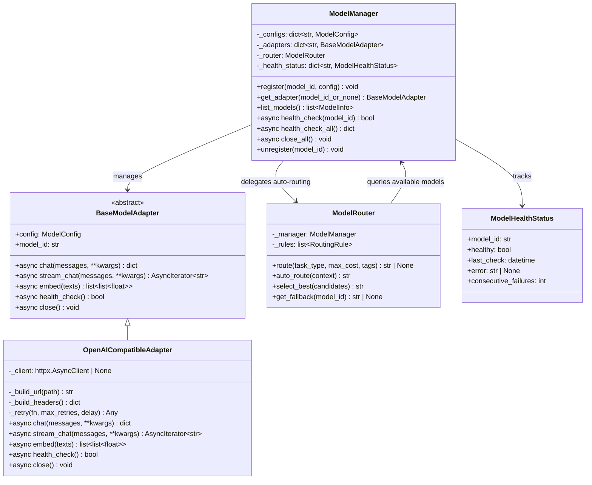
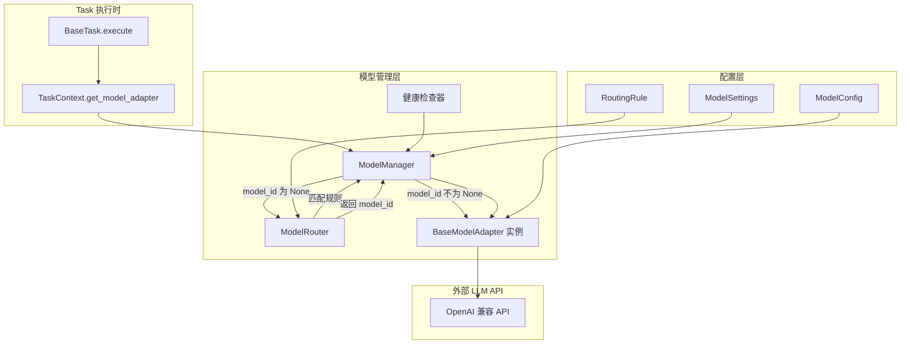
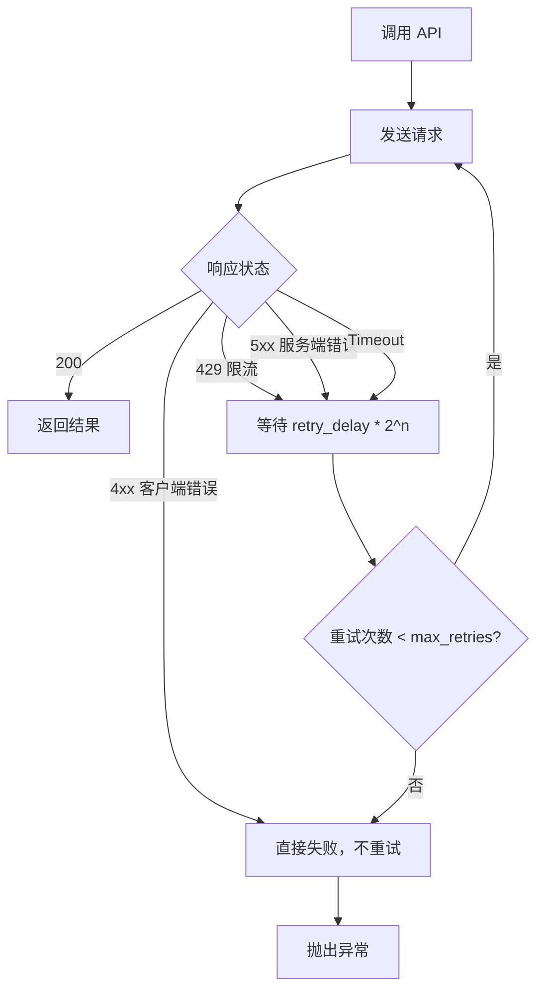
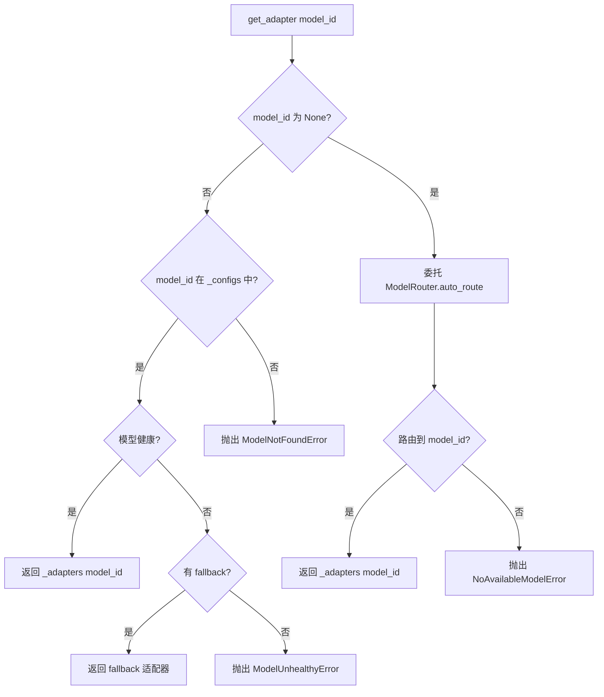
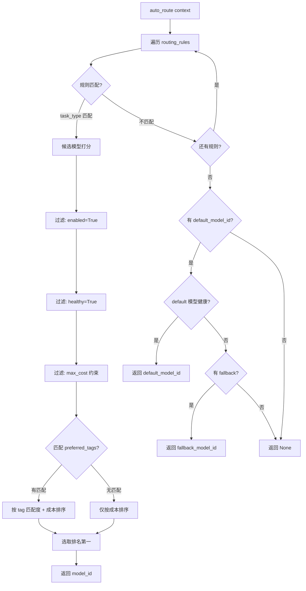
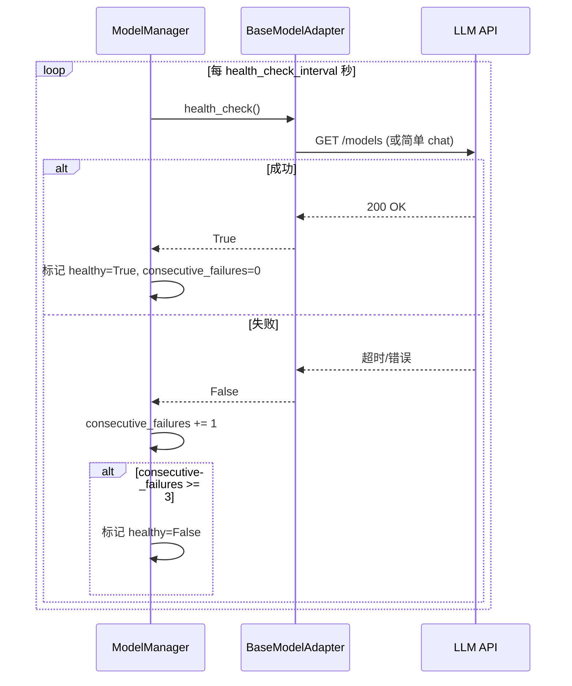
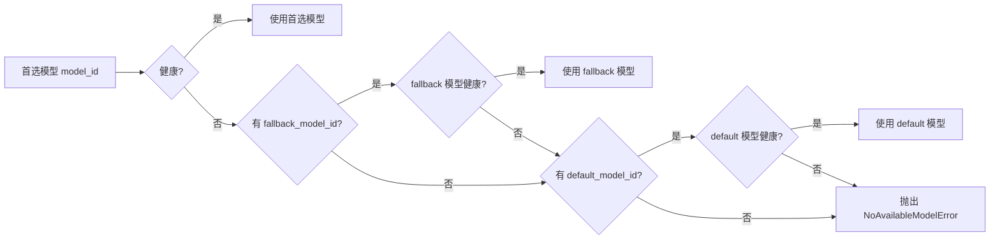

# icore 模型管理与自动路由设计

> **文档编号：** 05  
> **项目：** icore - 企业级 LLM 工作流编排平台  
> **版本：** 1.0  
> **状态：** 详细设计文档  
> **依赖：** [01-architecture-overview.md](01-architecture-overview.md)、[02-task-abstraction.md](02-task-abstraction.md)

---

## 目录

1. [设计目标与概述](#1-设计目标与概述)
2. [模块架构与类图](#2-模块架构与类图)
3. [BaseModelAdapter 抽象基类](#3-basemodeladapter-抽象基类)
4. [OpenAI 兼容适配器](#4-openai-兼容适配器)
5. [ModelManager 多模型管理](#5-modelmanager-多模型管理)
6. [ModelRouter 自动路由](#6-modelrouter-自动路由)
7. [模型健康检查机制](#7-模型健康检查机制)
8. [故障转移与降级策略](#8-故障转移与降级策略)
9. [负载均衡策略](#9-负载均衡策略)
10. [配置管理](#10-配置管理)
11. [与 TaskContext 的集成](#11-与-taskcontext-的集成)
12. [文件清单](#12-文件清单)

---

## 1. 设计目标与概述

### 1.1 设计目标

模型管理层（`icore.models`）是 icore 平台的 LLM 基础设施层，负责管理多个大语言模型的连接、调用、路由和监控。其核心设计目标：

- **多模型统一管理：** 在一个平台上配置多个 OpenAI 兼容模型（如 GPT-4o、DeepSeek、通义千问等），通过统一的 `chat()` / `stream_chat()` / `embed()` 接口调用，屏蔽不同模型 API 的差异。
- **自动路由：** 当任务未指定模型（`model_id=None`）时，`ModelRouter` 根据任务类型、成本约束、标签偏好等条件自动选择最合适的模型。
- **故障转移：** 当首选模型不可用（超时、限流、服务宕机）时，自动切换到 fallback 模型，保证工作流不中断。
- **负载均衡：** 在多个等效模型间分发请求，避免单一模型过载。
- **健康检查：** 后台周期性检测模型连通性，剔除不健康模型，恢复后自动纳入。
- **成本感知：** 路由决策考虑模型成本（按 1k token 计价），支持"最便宜可用"路由策略。

### 1.2 核心组件概览

| 组件 | 文件 | 职责 |
|------|------|------|
| `BaseModelAdapter` | `base_adapter.py` | LLM 调用抽象基类，定义 chat/stream_chat/embed 契约 |
| `OpenAICompatibleAdapter` | `openai_adapter.py` | OpenAI 兼容 API 适配器（httpx 异步调用） |
| `ModelManager` | `manager.py` | 多模型注册、查找、健康检查、适配器缓存 |
| `ModelRouter` | `router.py` | 自动路由引擎，按规则选择最优模型 |
| `config.py` | `config.py` | 配置再导出模块（ModelConfig/RoutingRule/ModelSettings 从 icore.config 导入） |

### 1.3 模块依赖

```
core (BaseTask, TaskContext)
  ↑
  ├── models (BaseModelAdapter, ModelManager, ModelRouter)
  │     ↑
  │     └── engine (WorkflowExecutor 注入 ModelManager 到 TaskContext)
```

`models` 模块依赖 `core`（类型引用）和 `config`（配置定义），不依赖 `engine` 或 `api`。

---

## 2. 模块架构与类图

### 2.1 类继承关系



### 2.2 模块交互总览



---

## 3. BaseModelAdapter 抽象基类

### 3.1 设计原则

`BaseModelAdapter` 定义了所有 LLM 调用的统一契约。任何新的模型供应商接入只需实现三个核心方法：

| 方法 | 说明 | 返回类型 |
|------|------|---------|
| `chat()` | 同步对话补全（非流式） | `dict`（含 content, usage, model 等字段） |
| `stream_chat()` | 流式对话补全 | `AsyncIterator[str]`（逐 token 产出；v0.6.x 起支持 `on_usage` 回调透出精确用量） |
| `embed()` | 文本向量化 | `list[list[float]]` |

此外，适配器还应实现：
- `health_check()`：轻量级连通性测试
- `close()`：释放底层 HTTP 客户端等资源

### 3.2 接口定义

```python
class BaseModelAdapter(abc.ABC):
    """Abstract base class for LLM model adapters."""

    def __init__(self, config: ModelConfig) -> None:
        self.config = config
        self.model_id = config.model_id

    @abc.abstractmethod
    async def chat(self, messages: list[dict[str, str]], **kwargs) -> dict:
        ...

    @abc.abstractmethod
    def stream_chat(
        self,
        messages: list[dict[str, str]],
        *,
        on_usage=None,   # v0.6.x (ICORE-ISSUE-003)：流结束后回调一次
        **kwargs,
    ) -> AsyncIterator[str]:
        ...

    @abc.abstractmethod
    async def embed(self, texts: list[str]) -> list[list[float]]:
        ...

    @abc.abstractmethod
    async def health_check(self) -> bool:
        ...

    @abc.abstractmethod
    async def close(self) -> None:
        ...
```

### 3.3 统一返回格式

`chat()` 方法返回统一的字典格式，屏蔽不同 API 的响应差异：

```python
{
    "content": "模型生成的文本",
    "role": "assistant",
    "model": "gpt-4o",
    "usage": {
        "prompt_tokens": 100,
        "completion_tokens": 50,
        "total_tokens": 150,
        "prompt_cache_hit_tokens": 80,
        "prompt_cache_miss_tokens": 20,
    },
    "finish_reason": "stop",
    "raw": { ... }  # 原始 API 响应（可选，用于调试）
}
```

> **上下文缓存 token（v0.6.x）：** `usage.prompt_cache_hit_tokens` 与
> `prompt_cache_miss_tokens` 来自提供方（如 DeepSeek）返回的上下文缓存
> 命中/未命中 token 数。多轮对话中，请求前缀（如固定的 system prompt）
> 命中服务端上下文缓存时，命中的输入 token 按更低的缓存价计费，从而
> 显著降低长对话的成本。这两个字段仅在提供方返回时非零，未命中或
> 不支持缓存时为 0；适配器同时将它们记录到
> `icore_model_prompt_cache_hit_tokens_total` /
> `icore_model_prompt_cache_miss_tokens_total` 指标以便观测。

---

## 4. OpenAI 兼容适配器

### 4.1 设计说明

`OpenAICompatibleAdapter` 是 `BaseModelAdapter` 的默认实现，兼容所有遵循 OpenAI API 规范的模型服务（包括 vLLM、Ollama、LM Studio 等自部署模型）。

**关键设计决策：**

- **httpx 异步客户端：** 使用 `httpx.AsyncClient` 进行异步 HTTP 调用，支持连接池复用。
- **延迟导入 httpx：** httpx 在 `chat()` / `stream_chat()` 首次调用时才导入（lazy import），确保模块可在未安装 httpx 的环境中被导入。
- **重试机制：** 使用 `ModelConfig.max_retries` 和 `retry_delay` 进行指数退避重试。
- **流式解析：** 解析 SSE 格式的 `data:` 行，提取 `delta.content` 逐 token 产出。

### 4.2 重试策略



### 4.3 流式响应处理

OpenAI SSE 流式格式如下：

```
data: {"choices":[{"delta":{"content":"Hello"}}]}
data: {"choices":[{"delta":{"content":" world"}}]}
data: [DONE]
```

适配器解析每一行 `data:` 前缀，提取 JSON 中的 `delta.content`，以 `AsyncIterator[str]` 形式逐 token 产出。

### 4.4 流式 usage 透出（v0.6.x，ICORE-ISSUE-003）

`stream_chat()` 支持精确用量记账（此前流式路径完全拿不到 usage，消费方只能估算）：

```python
usage_box: dict = {}

async for token in adapter.stream_chat(
    messages, on_usage=lambda u: usage_box.update(u)
):
    print(token, end="")

# 流被完整消费后，usage_box 含该次调用的精确用量
usage_box["prompt_tokens"]            # 100
usage_box["prompt_cache_hit_tokens"]   # 80（DeepSeek 等提供方扩展字段）
```

机制与契约：

- **请求侧**：流式 payload 默认附加 `stream_options={"include_usage": True}`（OpenAI 兼容协议；调用方显式传 `stream_options` 可覆盖关闭）。
- **响应侧**：provider 在流末尾返回 usage-only chunk（`choices=[]`，仅含 `usage`）；适配器捕获之（部分 provider 把 usage 附在普通 chunk 上，统一以最后一个非空 usage 为准）。
- **回调**：`on_usage(usage_dict)` 在流被**完整消费**后调用至多一次，入参为 provider 原始 usage dict（拷贝）；回调异常仅记日志。若 provider 未返回 usage、流出错或调用方提前 break，回调不会触发（调用方应按"usage 不可得"降级）。
- **指标**：无论是否传 `on_usage`，捕获到的用量都会记录到 `icore_model_tokens_total`（type=prompt/completion）及 prompt cache 命中/未命中指标——流式路径与 `chat()` 的计量口径一致。

---

## 5. ModelManager 多模型管理

### 5.1 职责

`ModelManager` 是模型管理层的核心协调者：

1. **模型注册：** 接收 `ModelConfig` 配置，创建对应的适配器实例，建立 `model_id -> adapter` 映射。
2. **适配器获取：** `get_adapter(model_id)` 返回指定模型的适配器。当 `model_id=None` 时委托给 `ModelRouter` 自动路由。
3. **健康追踪：** 维护每个模型的健康状态（`ModelHealthStatus`），不健康模型在路由时被跳过。
4. **生命周期管理：** `close_all()` 释放所有适配器的底层资源。

### 5.2 get_adapter 方法逻辑

这是 `TaskContext.get_model_adapter()` 调用的核心入口：



### 5.3 适配器缓存

适配器实例按 `model_id` 缓存在 `_adapters` 字典中。首次获取时创建，后续直接返回缓存实例。这确保 httpx 客户端连接池被复用，避免频繁创建/销毁连接。

---

## 6. ModelRouter 自动路由

### 6.1 路由策略

当任务的 `model_id=None` 时，`ModelRouter` 根据以下维度自动选择模型：

| 维度 | 来源 | 说明 |
|------|------|------|
| **任务类型** | `RoutingRule.task_type` | 匹配任务的类型标签（如 "summary"、"extraction"） |
| **标签偏好** | `RoutingRule.preferred_tags` | 偏好带有特定标签的模型（如 "fast"、"cheap"、"capable"） |
| **成本约束** | `RoutingRule.max_cost` | 仅考虑成本低于阈值的模型 |
| **故障转移** | `RoutingRule.fallback_model_id` | 首选不可用时的兜底模型 |

### 6.2 自动路由流程



### 6.3 打分算法

当多个模型满足过滤条件时，按以下优先级打分排序：

1. **标签匹配度（权重 0.5）：** 模型标签与规则 `preferred_tags` 的交集数量。匹配越多分越高。
2. **成本（权重 0.3）：** 成本越低分越高。归一化为 `1 - (cost / max_cost)`。
3. **健康度（权重 0.2）：** `consecutive_failures` 越少分越高。

最终得分 = `0.5 * tag_score + 0.3 * cost_score + 0.2 * health_score`，选取得分最高的模型。

### 6.4 路由规则示例

```yaml
# config/models.yaml 中的路由规则配置
routing_rules:
  - task_type: "summary"
    preferred_tags: ["capable", "long_context"]
    max_cost: 0.01
    fallback_model_id: "gpt-4o-mini"

  - task_type: "extraction"
    preferred_tags: ["capable"]
    fallback_model_id: "deepseek-chat"

  - task_type: "classification"
    preferred_tags: ["fast", "cheap"]
    max_cost: 0.001

  - task_type: "embedding"
    preferred_tags: ["embedding"]
```

---

## 7. 模型健康检查机制

### 7.1 健康状态模型

每个模型的健康状态由 `ModelHealthStatus` 追踪：

| 字段 | 类型 | 说明 |
|------|------|------|
| `model_id` | `str` | 模型唯一标识 |
| `healthy` | `bool` | 当前是否健康 |
| `last_check` | `datetime` | 上次检查时间 |
| `error` | `str \| None` | 最近错误信息 |
| `consecutive_failures` | `int` | 连续失败次数（用于熔断判断） |

### 7.2 健康检查策略

- **检查方式：** 向模型的 `/models` 端点发送轻量 GET 请求（或发送一个极短的 chat 请求），验证连通性和鉴权。
- **检查频率：** 按 `ModelSettings.health_check_interval` 配置（默认 60 秒）。
- **熔断机制：** 连续失败 3 次后标记为不健康，不健康模型在路由时被跳过。
- **恢复机制：** 不健康模型仍会被定期检查，一旦检查成功即恢复为健康状态。

### 7.3 健康检查流程



---

## 8. 故障转移与降级策略

### 8.1 故障转移链

当首选模型不可用时，系统按以下优先级尝试替代方案：



### 8.2 运行时故障转移

除了路由时的静态故障转移，`OpenAICompatibleAdapter` 在调用过程中也实现运行时重试：

- **可重试错误：** 超时、429（限流）、5xx（服务端错误）-> 按 `max_retries` 指数退避重试。
- **不可重试错误：** 400（请求格式错误）、401（鉴权失败）、404（模型不存在）-> 直接失败。
- **重试耗尽后：** 抛出异常，由上层（WorkflowExecutor）决定是否切换到 fallback 模型重试整个任务。

### 8.3 降级策略

当所有模型都不可用时，系统的降降�级行为：

1. **记录告警日志：** 标记为严重事件，触发告警。
2. **返回明确错误：** 抛出 `NoAvailableModelError`，工作流引擎捕获后标记 Task 为 FAILED。
3. **不静默失败：** 绝不返回空结果或默认结果，确保调用方知道模型不可用。

---

## 9. 负载均衡策略

### 9.1 同标签模型间的负载均衡

当多个模型满足路由条件（相同标签、相同健康状态）时，`ModelRouter` 支持以下负载均衡策略：

| 策略 | 说明 | 适用场景 |
|------|------|---------|
| **最低成本优先** | 选 `cost_per_1k_input + cost_per_1k_output` 最低的 | 成本敏感场景 |
| **轮询（Round-Robin）** | 在等效模型间轮流分配 | 均匀分散负载 |
| **最少使用（Least-Used）** | 选最近调用次数最少的 | 避免单模型过载 |

**默认策略：** 最低成本优先（因为打分算法中成本权重为 0.3，标签完全匹配时成本成为决定因素）。

### 9.2 并发限制

每个模型适配器可配置最大并发请求数（通过 `ModelConfig` 扩展字段）。当并发达到上限时，新请求排队等待或直接路由到等效模型。这防止单一模型 API 被过多并发请求打满。

> **注意：** 并发限制的完整实现在 US-007（并发设计）中，模型管理层仅提供配置入口和状态查询接口。

---

## 10. 配置管理

### 10.1 配置类层次

模型管理的配置类已在 `icore/config.py` 中定义（US-001），本模块通过 `icore/models/config.py` 再导出，并补充模型层特有的类型：

```
icore/config.py
  ├── ModelConfig          # 单模型配置 (model_id, api_base, api_key, ...)
  ├── RoutingRule          # 路由规则 (task_type, max_cost, preferred_tags, ...)
  └── ModelSettings        # 模型层总配置 (default_model_id, models, routing_rules, ...)

icore/models/config.py (re-export)
  ├── ModelConfig          # 从 icore.config 导入
  ├── RoutingRule          # 从 icore.config 导入
  ├── ModelSettings        # 从 icore.config 导入
  └── ModelHealthStatus    # 本模块新增（健康状态 Pydantic 模型）
```

### 10.2 配置示例

```yaml
# config/models.yaml
default_model_id: "gpt-4o-mini"
enable_auto_routing: true
health_check_interval: 60

models:
  gpt-4o:
    model_id: "gpt-4o"
    model_name: "gpt-4o"
    api_base: "https://api.openai.com/v1"
    api_key: "${OPENAI_API_KEY}"
    max_tokens: 4096
    temperature: 0.7
    cost_per_1k_input: 0.0025
    cost_per_1k_output: 0.01
    tags: ["capable", "long_context"]

  gpt-4o-mini:
    model_id: "gpt-4o-mini"
    model_name: "gpt-4o-mini"
    api_base: "https://api.openai.com/v1"
    api_key: "${OPENAI_API_KEY}"
    max_tokens: 4096
    temperature: 0.7
    cost_per_1k_input: 0.00015
    cost_per_1k_output: 0.0006
    tags: ["fast", "cheap"]

  deepseek-chat:
    model_id: "deepseek-chat"
    model_name: "deepseek-chat"
    api_base: "https://api.deepseek.com/v1"
    api_key: "${DEEPSEEK_API_KEY}"
    max_tokens: 8192
    temperature: 0.7
    cost_per_1k_input: 0.001
    cost_per_1k_output: 0.002
    tags: ["capable", "cheap"]

routing_rules:
  - task_type: "summary"
    preferred_tags: ["capable", "long_context"]
    max_cost: 0.01
    fallback_model_id: "gpt-4o-mini"
  - task_type: "classification"
    preferred_tags: ["fast", "cheap"]
    max_cost: 0.001
```

### 10.3 环境变量覆盖

所有配置均可通过环境变量覆盖（`ICORE_MODEL_` 前缀）：

```bash
ICORE_MODEL_DEFAULT_MODEL_ID=deepseek-chat
ICORE_MODEL_ENABLE_AUTO_ROUTING=true
ICORE_MODEL_HEALTH_CHECK_INTERVAL=30
```

---

## 11. 与 TaskContext 的集成

### 11.1 调用链

`TaskContext.get_model_adapter()` 的完整调用链：

```
Task.execute(ctx, inp)
  └── ctx.get_model_adapter()
        └── ctx._model_manager.get_adapter(ctx.model_id)
              ├── model_id is not None -> 返回指定模型适配器
              └── model_id is None -> ModelRouter.auto_route()
                    └── 返回路由后的模型适配器
```

### 11.2 引擎注入

工作流引擎在执行 Task 前创建 `TaskContext` 并注入 `ModelManager`：

```python
# 伪代码：引擎注入 ModelManager
model_manager = ModelManager.from_settings(settings.model)

ctx = TaskContext(
    task_id="task-001",
    workflow_id="wf-001",
    model_id="gpt-4o",  # 或 None 表示自动路由
    callback_url="https://example.com/callback",
    stream=True,
)
ctx.set_model_manager(model_manager)  # 注入

# Task 内部使用
async def execute(self, ctx, inp):
    model = ctx.get_model_adapter()  # 获取适配器
    result = await model.chat(messages=[...])
```

### 11.3 鸭子类型解耦

`TaskContext` 通过鸭子类型引用 `ModelManager`，不直接 import：

- `TaskContext` 只存储 `_model_manager: Any`，调用 `get_adapter(model_id)` 方法
- `ModelManager` 不 import `TaskContext`
- 两者在运行时由 `WorkflowExecutor` 连接

这确保了 `core` 模块对 `models` 模块的零运行时依赖，仅在 TYPE_CHECKING 下做类型提示。

---

## 12. 文件清单

| 文件 | 行数(估) | 核心内容 |
|------|---------|---------|
| `icore/models/__init__.py` | ~25 | 包初始化，导出所有公共类 |
| `icore/models/base_adapter.py` | ~120 | BaseModelAdapter 抽象基类 |
| `icore/models/openai_adapter.py` | ~280 | OpenAICompatibleAdapter 实现 |
| `icore/models/manager.py` | ~220 | ModelManager 多模型管理 |
| `icore/models/router.py` | ~200 | ModelRouter 自动路由 |
| `icore/models/config.py` | ~30 | 配置再导出 + ModelHealthStatus |

### 12.1 异常类

模型管理层的自定义异常直接定义在相关模块内（不单独建 exceptions 文件，保持简洁）：

| 异常 | 定义位置 | 触发场景 |
|------|---------|---------|
| `ModelNotFoundError` | `manager.py` | 指定的 model_id 未注册 |
| `ModelUnhealthyError` | `manager.py` | 指定模型不健康且无 fallback |
| `NoAvailableModelError` | `router.py` | 自动路由找不到可用模型 |
| `ModelAPIError` | `openai_adapter.py` | LLM API 返回错误响应 |

---

> **本文档定义了 icore 平台的模型管理与自动路由设计。`BaseModelAdapter` 抽象基类为后续所有模型适配器提供了统一契约；`ModelManager` + `ModelRouter` 实现了多模型管理、自动路由、故障转移和健康检查的完整能力。TaskContext 通过鸭子类型解耦，使得核心层不依赖模型层的具体实现。**
