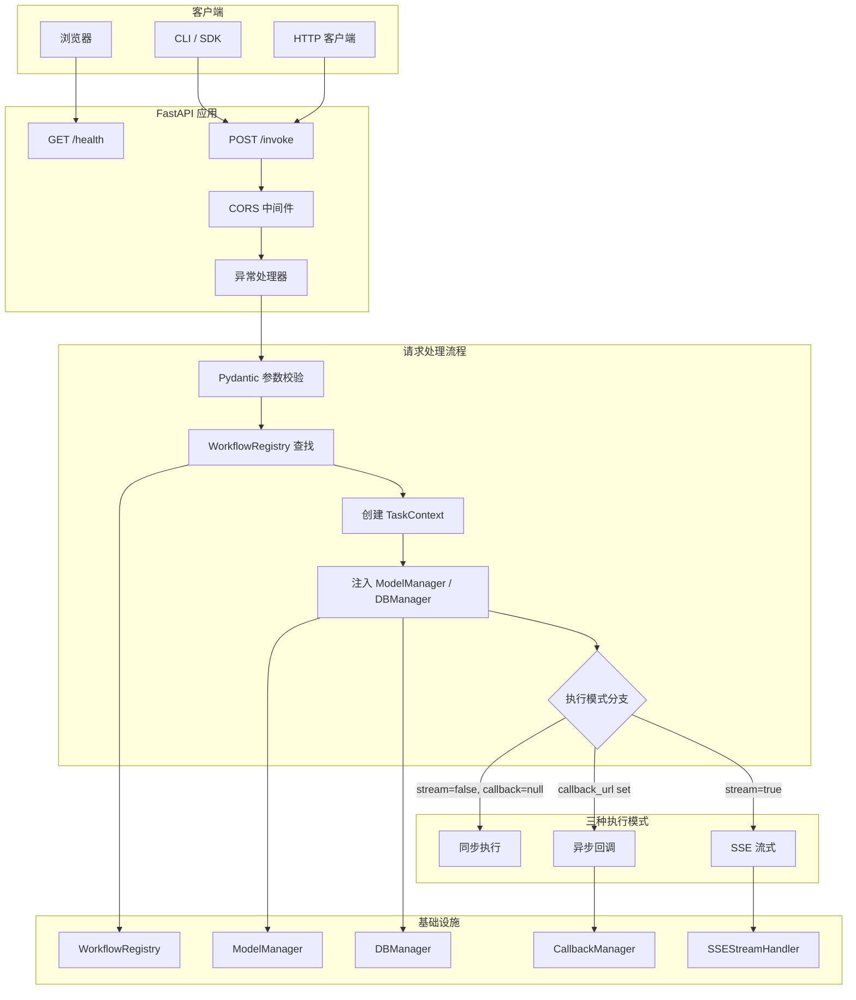
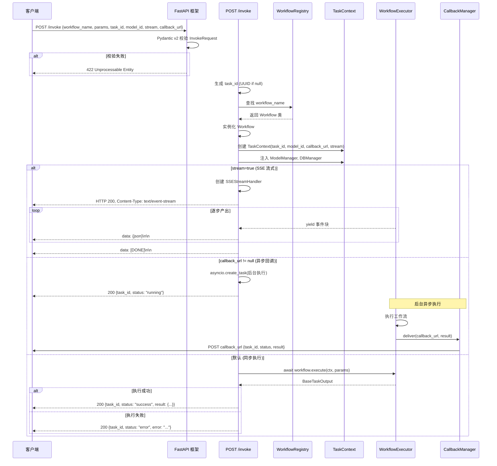
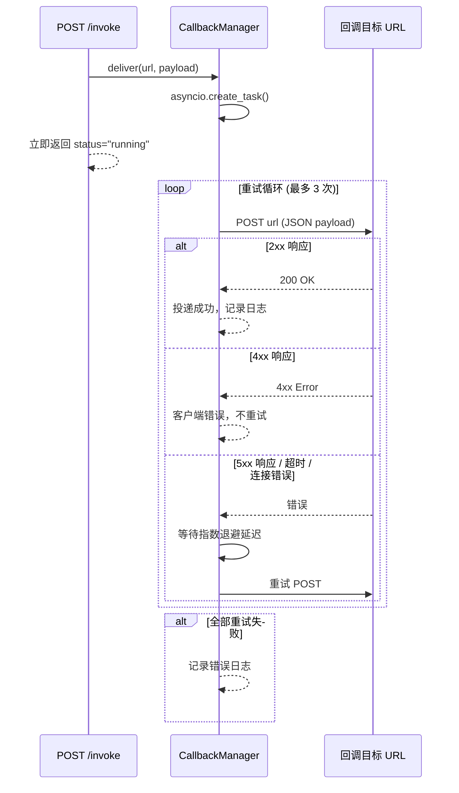

# icore API 接入层设计

> **文档编号：** 06  
> **项目：** icore - 企业级 LLM 工作流编排平台  
> **版本：** 1.0  
> **状态：** 核心设计文档  
> **依赖：** [01-architecture-overview.md](01-architecture-overview.md), [04-workflow-engine.md](04-workflow-engine.md), [05-model-management.md](05-model-management.md)

---

## 目录

1. [设计目标与概述](#1-设计目标与概述)
2. [双端点设计理念](#2-双端点设计理念)
3. [API 架构图](#3-api-架构图)
4. [请求/响应 Schema 设计](#4-请求响应-schema-设计)
5. [请求生命周期](#5-请求生命周期)
6. [SSE 流式响应](#6-sse-流式响应)
7. [回调机制](#7-回调机制)
8. [错误处理](#8-错误处理)
9. [Swagger 自动文档](#9-swagger-自动文档)
10. [与底层模块的集成](#10-与底层模块的集成)
11. [安全与配置](#11-安全与配置)

---

## 1. 设计目标与概述

### 1.1 设计目标

icore API 接入层是平台与外部调用方之间的唯一交互界面。其设计目标：

- **极简接口**：整个平台仅暴露两个 HTTP 端点，降低学习成本和集成复杂度
- **统一入口**：所有工作流调用通过同一个 `POST /invoke` 接口，通过 `workflow_name` 区分不同工作流
- **多模式支持**：同一接口支持同步返回、SSE 流式返回、异步回调三种执行模式
- **强类型校验**：基于 Pydantic v2 的请求/响应模型，自动参数校验和 OpenAPI 文档生成
- **优雅容错**：结构化错误响应，异常不泄漏堆栈信息

### 1.2 技术选型

| 层面 | 技术 | 选型理由 |
|------|------|---------|
| Web 框架 | FastAPI | 原生异步、自动 Swagger/OpenAPI、Pydantic 原生集成 |
| ASGI 服务器 | Uvicorn | 高性能、多 worker 支持 |
| 请求校验 | Pydantic v2 | Rust 核心、类型安全、与 FastAPI 无缝集成 |
| HTTP 客户端 | httpx | 异步、连接池、用于回调投递 |
| 流式传输 | SSE (Server-Sent Events) | 单向流、HTTP 原生、浏览器友好 |

---

## 2. 双端点设计理念

### 2.1 为什么只有两个端点

icore 采用**极简 API** 设计哲学。传统微服务通常为每个资源暴露 CRUD 端点（如 `/workflows`、`/tasks`、`/models` 等），导致：

- 接口数量膨胀，维护成本高
- 调用方需要了解多个端点的用途和参数
- 认证/限流/日志等横切逻辑需要在多处配置

icore 通过**高度抽象**将所有工作流调用收敛到一个主接口：

| 端点 | 方法 | 参数 | 用途 |
|------|------|------|------|
| `/health` | GET | 无 | 系统健康检查 |
| `/invoke` | POST | InvokeRequest (JSON body) | 工作流调用主接口 |

### 2.2 端点职责

**GET /health** — 健康检查端点：
- 纯 GET 调用，无参数、无认证
- 返回 `HealthResponse`：系统状态、版本号、时间戳
- 用于负载均衡健康探测、Kubernetes liveness/readiness 探针

**POST /invoke** — 主调用接口：
- 接收 `InvokeRequest` JSON body
- 通过 `workflow_name` 指定要执行的工作流
- 通过 `params` 传入工作流参数（由工作流自身的输入 Schema 校验）
- 通过 `task_id` 标识任务实例（未提供则自动生成 UUID）
- 通过 `callback_url` 指定异步回调地址
- 通过 `model_id` 指定 LLM 模型（None 则自动路由）
- 通过 `stream` 控制是否 SSE 流式返回

---

## 3. API 架构图

### 3.1 系统架构图



### 3.2 分层说明

API 层内部结构清晰分为三层：

1. **入口层**：FastAPI 框架处理 HTTP 请求路由、CORS、异常拦截
2. **校验层**：Pydantic v2 模型自动校验入参，生成 422 错误响应
3. **业务层**：`invoke` 端点内部逻辑——查找工作流、创建上下文、分支执行模式

---

## 4. 请求/响应 Schema 设计

### 4.1 InvokeRequest — 主请求模型

```python
class InvokeRequest(BaseModel):
    model_config = ConfigDict(extra="allow", arbitrary_types_allowed=True, use_enum_values=True)

    workflow_name: str          # 必填：工作流名称
    params: dict[str, Any]      # 工作流参数（由工作流自身 Schema 校验）
    task_id: str | None          # 可选：任务实例 ID（自动生成 UUID）
    callback_url: str | None     # 可选：异步回调地址
    model_id: str | None         # 可选：指定 LLM 模型（None=自动路由）
    stream: bool                 # 是否 SSE 流式返回
    metadata: dict[str, Any]     # 自由元数据（trace_id, user_id 等）
```

**设计要点：**

- `workflow_name` 是唯一必填字段（除 `params` 有默认值外），调用方只需知道工作流名称
- `params` 是自由格式 dict——icore 平台不限制其结构，由具体工作流的输入 Schema（继承自 `BaseTaskInput`）在运行时校验。这是**高度抽象**的体现：平台不关心参数内容，只负责传递
- `task_id` 可选——调用方可传入自定义 ID 用于幂等去重；未提供时自动生成 UUID
- `extra="allow"` 确保未来扩展字段不破坏现有客户端

### 4.2 InvokeResponse — 响应模型

```python
class InvokeResponse(BaseModel):
    model_config = ConfigDict(extra="allow", arbitrary_types_allowed=True, use_enum_values=True)

    task_id: str                 # 任务实例 ID（回显或自动生成）
    status: str                  # "success" | "error" | "running"
    result: dict[str, Any] | None  # 工作流结果数据
    error: str | None            # 错误信息
```

**三种响应状态：**

| status | 触发条件 | result 字段 | error 字段 |
|--------|---------|-------------|-----------|
| `success` | 同步执行成功 | 工作流结果数据 | None |
| `error` | 执行失败 | None | 错误描述 |
| `running` | 异步模式（callback_url 已设） | None | None |

### 4.3 HealthResponse — 健康检查响应

```python
class HealthResponse(BaseModel):
    status: str      # "healthy" 或 "unhealthy"
    version: str     # icore 版本号
    timestamp: str    # ISO 8601 时间戳
```

---

## 5. 请求生命周期

### 5.1 完整请求流程

以下序列图展示了一个完整的 `POST /invoke` 请求从接收到响应的全过程：



### 5.2 三种执行模式

icore 的 `POST /invoke` 通过 `stream` 和 `callback_url` 参数组合，支持三种执行模式：

| 模式 | stream | callback_url | 行为 |
|------|--------|-------------|------|
| **同步** | false | null | 阻塞等待执行完成，返回 JSON 结果 |
| **流式** | true | 任意 | 立即返回 SSE 流，逐步推送执行事件 |
| **异步** | false | 非 null | 立即返回 `status="running"`，后台执行后回调 |

**同步模式**适用于短耗时工作流（如关键词生成、实体提取），调用方等待即时结果。

**流式模式**适用于 LLM 逐 token 生成的场景（如大文档摘要），客户端实时收到中间结果，用户体验更好。

**异步模式**适用于长耗时工作流（如周报生成），调用方不阻塞，完成后通过回调接收结果。

---

## 6. SSE 流式响应

### 6.1 SSEStreamHandler 设计

`SSEStreamHandler` 将工作流执行转换为 SSE 格式的异步生成器：

```
data: {"task_id":"...","status":"running","timestamp":"..."}\n\n
data: {"task_id":"...","status":"success","data":{...}}\n\n
data: [DONE]\n\n
```

**关键设计：**

- **错误隔离**：工作流执行异常被捕获，以 SSE error 事件发送，不中断流
- **始终收尾**：无论成功或失败，最终总是发送 `[DONE]` 标记，客户端可安全关闭连接
- **取消处理**：`asyncio.CancelledError` 被捕获，发送取消事件后优雅关闭
- **回调集成**：流式模式下也支持 callback_url，最终结果通过回调投递

### 6.2 SSE 事件格式

| 事件类型 | 格式 | 说明 |
|---------|------|------|
| 数据事件 | `data: {json}\n\n` | 正常数据传输 |
| 错误事件 | `event: error\ndata: {json}\n\n` | 执行异常通知 |
| 结束标记 | `data: [DONE]\n\n` | 流结束信号 |

### 6.3 HTTP 响应头

```http
Content-Type: text/event-stream
Cache-Control: no-cache
Connection: keep-alive
X-Accel-Buffering: no
```

`X-Accel-Buffering: no` 确保反向代理（如 Nginx）不缓冲 SSE 流，保证实时性。

---

## 7. 回调机制

### 7.1 CallbackManager 设计

`CallbackManager` 负责将工作流结果异步投递到外部系统：

```python
class CallbackManager:
    def __init__(self, timeout=30, max_retries=3, retry_delay=1.0): ...
    def deliver(self, url: str, payload: dict) -> asyncio.Task: ...
    async def deliver_and_wait(self, url: str, payload: dict) -> bool: ...
```

**设计要点：**

- **非阻塞投递**：`deliver()` 使用 `asyncio.create_task()` 创建后台任务，立即返回不阻塞主流程
- **指数退避重试**：最多重试 3 次，延迟为 `retry_delay * 2^(attempt-1)`，应对网络抖动
- **错误分类**：4xx 错误不重试（客户端错误），5xx 错误重试（服务端临时故障）
- **超时控制**：每次请求有独立超时（默认 30 秒），防止回调目标无响应时无限等待
- **安全投递**：使用 httpx 异步客户端，支持 HTTPS

### 7.2 回调投递流程



### 7.3 回调安全

- 回调地址应使用 HTTPS 协议，防止结果数据在传输中被截获
- 生产环境建议增加回调签名验证（HMAC），验证回调请求来源合法性
- 回调投递超时和重试策略可通过 `APISettings.request_timeout` 配置

---

## 8. 错误处理

### 8.1 三层错误处理架构

icore API 层采用三层错误处理策略：

| 层级 | 处理者 | 错误类型 | HTTP 状态码 | 说明 |
|------|--------|---------|------------|------|
| L1 | FastAPI / Pydantic | 参数校验错误 | 422 | 自动校验 InvokeRequest 字段 |
| L2 | 异常处理器 | KeyError / ValueError | 404 / 422 | 业务逻辑错误 |
| L3 | 异常处理器 | Exception | 500 | 兜底处理未捕获异常 |

### 8.2 结构化错误响应

所有错误响应使用统一的 JSON 格式：

```json
{
    "error": "Error Type",
    "detail": "Human-readable error message",
    "task_id": "task-xxx"
}
```

`task_id` 字段在请求处理早期设置（`raw_request.state.task_id`），确保即使执行失败，错误响应中也能携带任务标识，方便追踪。

### 8.3 异常处理器实现

```python
@app.exception_handler(KeyError)      # -> 404 (工作流未找到)
@app.exception_handler(ValueError)    # -> 422 (参数校验失败)
@app.exception_handler(Exception)     # -> 500 (未捕获异常)
```

- `KeyError`：通常由 `WorkflowRegistry.get()` 抛出（工作流名称未注册）
- `ValueError`：参数值不合法（如超出范围）
- `Exception`：兜底处理器，记录完整堆栈到日志，但不暴露给客户端

### 8.4 工作流执行错误

工作流执行阶段的错误有两种处理路径：

- **同步模式**：`InvokeResponse.status="error"`，错误信息在 `error` 字段返回，HTTP 200（请求本身成功，业务执行失败）
- **流式模式**：通过 SSE error 事件发送，然后发送 `[DONE]`
- **异步模式**：回调 payload 中 `status="error"`，`error` 字段包含错误描述

---

## 9. Swagger 自动文档

### 9.1 OpenAPI 自动生成

FastAPI 基于 Pydantic 模型和路由装饰器自动生成 OpenAPI 3.1 规范：

| 文档 URL | 用途 |
|---------|------|
| `/docs` | Swagger UI 交互式文档 |
| `/redoc` | ReDoc 文档（只读） |
| `/openapi.json` | OpenAPI JSON 规范 |

### 9.2 API 元数据

```python
app = FastAPI(
    title="icore",
    description="icore - 企业级 LLM 工作流编排平台\n\n## 端点说明\n- GET /health\n- POST /invoke",
    version=settings.version,
    docs_url="/docs",
    redoc_url="/redoc",
)
```

Swagger 页面展示：

- **端点列表**：GET /health（System 标签）、POST /invoke（Workflow 标签）
- **请求 Schema**：InvokeRequest 各字段、类型、描述、示例值
- **响应 Schema**：InvokeResponse、HealthResponse 结构
- **交互测试**：可直接在 Swagger 页面填入参数并调用

### 9.3 Schema 示例值

Pydantic Field 的 `examples` 参数自动出现在 Swagger 文档中：

```python
workflow_name: str = Field(..., examples=["document_summary"])
params: dict = Field(default_factory=dict, examples=[{"document": "..."}])
task_id: str | None = Field(default=None, examples=["task-550e8400-..."])
```

---

## 10. 与底层模块的集成

### 10.1 依赖注入流程

API 层通过 `app.state` 管理基础设施实例，在 `create_app()` 工厂函数中注入：

```python
def create_app(settings=None, model_manager=None, db_manager=None, 
               workflow_registry=None) -> FastAPI:
    app.state.model_manager = model_manager      # ModelManager 实例
    app.state.db_manager = db_manager             # DBManager 实例
    app.state.callback_manager = CallbackManager(...)
    app.state.workflow_registry = registry or WorkflowRegistry.default()
```

每次 `POST /invoke` 请求时：
1. 从 `app.state` 获取 `model_manager` 和 `db_manager`
2. 创建 `TaskContext` 并通过 `set_model_manager()` / `set_db_manager()` 注入
3. 工作流执行时，Task 通过 `ctx.get_model_adapter()` / `ctx.get_db()` 获取依赖

### 10.2 模块依赖关系

```
api ──> engine (WorkflowRegistry, BaseWorkflow)
api ──> core (TaskContext, BaseTaskOutput)
api ──> config (APISettings, Settings)
api ──> [httpx] (CallbackManager 的 HTTP 客户端)
```

API 层**不直接依赖** `db` 和 `models` 包——它通过 `app.state` 持有它们的实例，通过 `TaskContext` 传递给工作流。这确保了 API 层与基础设施实现解耦。

### 10.3 工厂函数模式

`create_app()` 采用工厂函数模式，而非模块级全局实例：

- **可测试**：测试时传入 mock 的 model_manager / db_manager
- **可配置**：不同部署环境可注入不同的基础设施实例
- **无全局状态**：app 实例由调用方持有，不污染模块命名空间

---

## 11. 安全与配置

### 11.1 CORS 配置

```python
app.add_middleware(
    CORSMiddleware,
    allow_origins=api_settings.cors_origins,  # 默认 ["*"]，生产环境应限制
    allow_credentials=True,
    allow_methods=["*"],
    allow_headers=["*"],
)
```

### 11.2 配置项

API 层的所有配置通过 `APISettings`（定义于 `icore/config.py`）管理：

| 配置项 | 环境变量 | 默认值 | 说明 |
|--------|---------|-------|------|
| host | `ICORE_API_HOST` | 0.0.0.0 | 监听地址 |
| port | `ICORE_API_PORT` | 8000 | 监听端口 |
| workers | `ICORE_API_WORKERS` | 1 | Uvicorn worker 数 |
| cors_origins | `ICORE_API_CORS_ORIGINS` | ["*"] | CORS 允许来源 |
| request_timeout | `ICORE_API_REQUEST_TIMEOUT` | 300 | 请求超时（秒） |

### 11.3 安全建议

- **生产环境**应将 `cors_origins` 限制为具体域名，而非 `["*"]`
- 模型 API 密钥通过环境变量注入，不在代码中硬编码
- 回调地址应使用 HTTPS
- 建议在反向代理层（Nginx）配置速率限制和认证

---

## 总结

icore API 接入层通过**双端点极简设计**实现了：

1. **统一入口**：所有工作流调用通过 `POST /invoke`，由 `workflow_name` 路由
2. **三种模式**：同步、SSE 流式、异步回调，覆盖不同场景需求
3. **强类型**：Pydantic v2 自动校验 + Swagger 自动文档
4. **优雅容错**：三层错误处理 + 结构化错误响应
5. **解耦设计**：通过 `app.state` + `TaskContext` 实现依赖注入，API 层不直接依赖基础设施实现

> **本文档定义了 icore 平台的 HTTP API 接口设计。后续服务暴露层（08-service-exposure.md）将基于此 API 层，提供 MCP、Tool、Streamlit 等多种协议适配器。**
