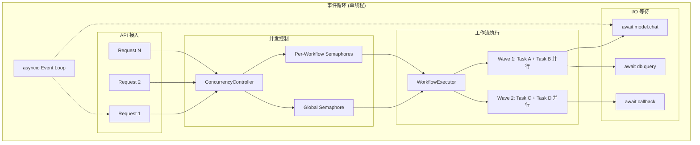
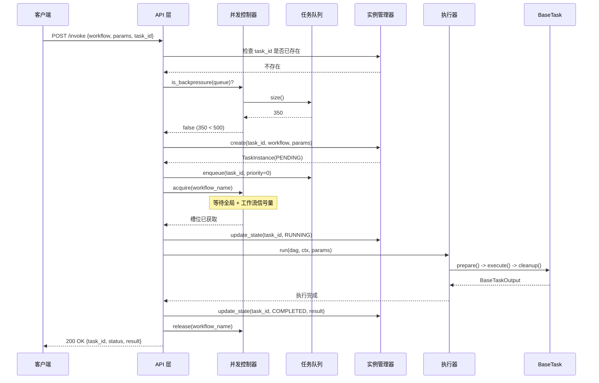
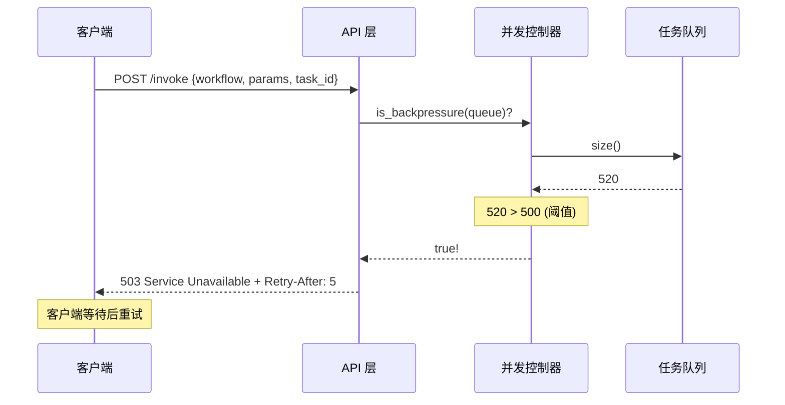
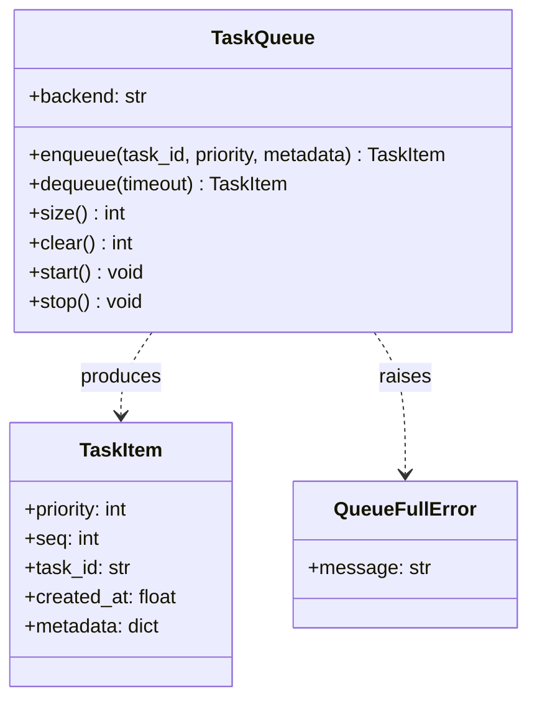
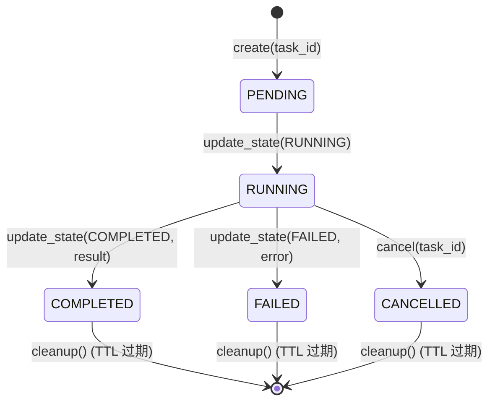
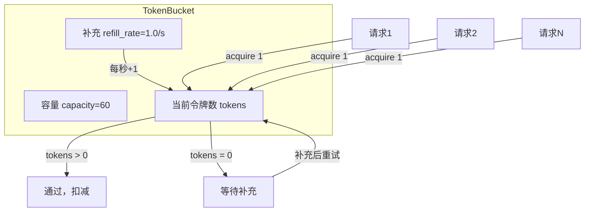
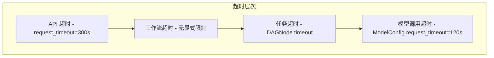

# icore 并发处理与高性能设计

> **文档编号：** 07  
> **项目：** icore - 企业级 LLM 工作流编排平台  
> **版本：** 1.0  
> **状态：** 并发控制层设计文档  
> **依赖：** 01-architecture-overview.md, 04-workflow-engine.md

---

## 目录

1. [设计目标与改进概述](#1-设计目标与改进概述)
2. [异步执行模型](#2-异步执行模型)
3. [并发架构总览](#3-并发架构总览)
4. [任务队列设计](#4-任务队列设计)
5. [任务实例生命周期管理](#5-任务实例生命周期管理)
6. [并发控制设计](#6-并发控制设计)
7. [背压机制](#7-背压机制)
8. [速率限制](#8-速率限制)
9. [资源池化策略](#9-资源池化策略)
10. [超时处理](#10-超时处理)
11. [内存管理](#11-内存管理)
12. [优雅降级](#12-优雅降级)
13. [与早期实现对比](#13-与早期实现对比)
14. [配置参考](#14-配置参考)

---

## 1. 设计目标与改进概述

### 1.1 早期实现的问题

本项目早期版本的并发处理实现较为基础，在高并发场景下存在明显不足。据此推断，早期实现可能存在以下问题：

- **无背压机制：** 高并发时任务无限堆积，内存持续增长直到 OOM
- **无工作流隔离：** 某个工作流突发流量会挤占全局资源，饿死其他工作流
- **无实例清理：** 完成的任务实例长期驻留内存，造成内存泄漏
- **无取消能力：** 无法中途取消正在执行的任务
- **无模型速率限制：** 高频调用 LLM API 触发供应商限流，导致批量失败
- **无优先级调度：** 所有任务 FIFO，紧急任务无法插队

### 1.2 新设计目标

本设计在早期实现基础上做了系统性改进，核心目标：

| 目标 | 实现方式 |
|------|---------|
| **工作流隔离** | 每个工作流独立的 asyncio.Semaphore，互不影响 |
| **全局容量保护** | 全局信号量限制总并发，防止资源耗尽 |
| **背压快速失败** | 队列深度超阈值时返回 HTTP 503，不无限排队 |
| **优先级调度** | asyncio.PriorityQueue，紧急任务优先处理 |
| **模型速率限制** | Token Bucket 令牌桶，按模型 ID 限流 |
| **实例自动清理** | TTL 清理终态实例，防止内存泄漏 |
| **任务取消** | asyncio.Event 传播取消信号 |
| **波次并行执行** | DAG 调度器将任务分组为并行波次，asyncio.gather 并发执行 |

---

## 2. 异步执行模型

### 2.1 为什么选择 asyncio

icore 的核心瓶颈是 **I/O 等待**：

- 等待 LLM API 响应（每次调用 1-30 秒）
- 等待数据库查询返回
- 等待回调投递

在同步模型中，每个请求占用一个线程，1000 并发需要 1000 线程，线程上下文切换开销巨大。asyncio 用单线程事件循环处理大量 I/O 等待：

- **内存：** 一个协程约 4KB 栈空间，1000 协程仅约 4MB；1000 线程约 8GB
- **切换：** 协程切换是用户态函数调用，纳秒级；线程切换涉及内核态，微秒级
- **吞吐：** 单事件循环可处理数万并发 I/O 等待

### 2.2 执行模型层次



### 2.3 并行波次执行

DAG 调度器（`DAG.get_execution_waves()`）将任务节点分组为并行波次。同一波次内的任务没有依赖关系，使用 `asyncio.gather()` 并发执行：

```
Wave 1: [Task A, Task B]  ──asyncio.gather──>  等待全部完成
    │
    ▼
Wave 2: [Task C, Task D]  ──asyncio.gather──>  等待全部完成
    │
    ▼
Wave 3: [Task E]          ──执行──>
```

这意味着一个工作流内部已经实现了任务级并行。并发控制器的粒度是**工作流实例级别**，不干预工作流内部的并行调度。

---

## 3. 并发架构总览

### 3.1 请求处理全链路



### 3.2 背压场景



### 3.3 组件职责

| 组件 | 文件 | 职责 |
|------|------|------|
| **TaskQueue** | `task_queue.py` | 任务入队/出队，优先级排序，内存/Redis 双后端 |
| **TaskInstanceManager** | `instance_manager.py` | 实例创建、状态追踪、取消、TTL 清理 |
| **ConcurrencyController** | `concurrency_control.py` | 全局/工作流信号量、背压检测、模型速率限制 |

三个组件**互相独立**，通过 API 层组合使用。执行器（WorkflowExecutor）本身不引用这些组件，保持无状态。

---

## 4. 任务队列设计

### 4.1 TaskQueue 架构



### 4.2 内存后端

默认使用 `asyncio.PriorityQueue`，基于最小堆实现：

- **入队：** `await queue.put(item)` — O(log N)
- **出队：** `await queue.get()` — O(log N)
- **优先级：** `priority` 值越小越先出队，同优先级按 `seq`（入队顺序）FIFO

`TaskItem` 是 `@dataclass(order=True)`，排序字段依次为 `priority`、`seq`，其余字段 `compare=False` 不参与排序。

### 4.3 Redis 后端（可选）

用于多进程/多节点分布式部署：

- **入队：** `ZADD icore:task_queue member score` — score = priority × 10¹⁰ + seq
- **出队：** `BZPOPMIN icore:task_queue timeout` — 原子获取最小 score 的成员
- **队列大小：** `ZCARD icore:task_queue`

Redis driver 在方法内部 **lazy import**，与 DB 适配器保持一致的模式。模块可在未安装 redis 包的情况下正常导入。

### 4.4 队列容量保护

配置 `max_size` 后，队列满时 `enqueue()` 抛出 `QueueFullError`（RuntimeError 子类）。API 层应捕获此异常并返回 503。

---

## 5. 任务实例生命周期管理

### 5.1 状态流转



### 5.2 TaskInstance 数据结构

每个实例记录：

| 字段 | 类型 | 说明 |
|------|------|------|
| `task_id` | `str` | 唯一标识（来自 API 请求） |
| `workflow_name` | `str` | 工作流名称 |
| `params` | `dict` | 输入参数 |
| `state` | `TaskState` | 当前状态枚举 |
| `created_at` | `float` | 创建时间戳 |
| `updated_at` | `float` | 最后更新时间戳 |
| `result` | `Any` | 最终结果（终态时设置） |
| `error` | `str \| None` | 错误信息 |
| `cancel_event` | `asyncio.Event` | 取消信号 |

### 5.3 去重与重复提交

- **非终态重复：** `create()` 抛出 `ValueError`，拒绝重复提交
- **终态重复：** 允许替换（重新执行），旧实例被覆盖
- **查询：** `get(task_id)` 返回实例或 None

### 5.4 取消机制

`cancel(task_id)` 执行两步操作：

1. 设置 `instance.cancel_event`（asyncio.Event）
2. 更新状态为 `CANCELLED`

执行器在执行过程中可检查 `cancel_event.is_set()` 来实现协作式取消。取消是**协作式**的——执行器需要主动检查取消信号，而非强制终止协程。

### 5.5 TTL 自动清理

`cleanup()` 方法扫描所有终态实例，移除 `updated_at` 距当前时间超过 TTL（默认 3600 秒）的记录。API 层应定期调用此方法（如每 5 分钟）防止内存泄漏。

---

## 6. 并发控制设计

### 6.1 双层信号量

```mermaid
graph LR
    subgraph "全局信号量"
        GS[Semaphore(max_concurrent_tasks=100)]
    end
    
    subgraph "工作流级信号量"
        WS1[Semaphore(20) - Workflow A]
        WS2[Semaphore(20) - Workflow B]
        WS3[Semaphore(20) - Workflow C]
    end
    
    subgraph "执行器"
        E1[Executor - Instance 1]
        E2[Executor - Instance 2]
        E3[Executor - Instance 3]
    end
    
    GS -->|限制总并发| E1
    GS -->|限制总并发| E2
    GS -->|限制总并发| E3
    
    WS1 -->|限制A并发| E1
    WS2 -->|限制B并发| E2
    WS3 -->|限制C并发| E3
```

**全局信号量**（`max_concurrent_tasks=100`）限制系统中同时执行的任务实例总数。当 100 个实例在运行时，第 101 个请求会等待。

**工作流级信号量**（`max_concurrent_per_workflow=20`）限制同一工作流类型的并发实例数。防止某个高频工作流（如 Kafka 消费打标签）独占全局资源。

### 6.2 获取/释放流程

`ConcurrencyController.acquire(workflow_name)` 返回一个异步上下文管理器：

```python
async with controller.acquire("document_summary"):
    result = await executor.run(dag, ctx, params)
# 退出上下文时自动释放两个信号量
```

获取顺序：**先全局，后工作流**。释放顺序：**先工作流，后全局**。这避免了先获取工作流信号量但等待全局信号量时造成的资源浪费。

### 6.3 工作流信号量懒创建

工作流级信号量在首次 `acquire(workflow_name)` 时按需创建，无需预注册所有工作流。创建操作在 `asyncio.Lock` 保护下进行，确保并发安全。

### 6.4 令牌桶速率限制器



Token Bucket 算法：

- **容量：** 最大突发请求数（如 60）
- **补充速率：** 持续速率（如 1.0 token/s = 60 RPM）
- **获取：** 如果令牌足够，扣减并返回；否则等待补充
- **补充：** 按时间比例线性补充，上限为容量

按 `model_id` 注册独立的令牌桶，每个 LLM 模型有自己的速率限制。未注册速率限制的模型调用是 no-op（不阻塞）。

---

## 7. 背压机制

### 7.1 触发条件

`ConcurrencyController.is_backpressure(queue)` 在以下任一条件满足时返回 True：

1. **活跃实例数** ≥ `max_concurrent_tasks`（全局饱和）
2. **队列深度** ≥ `backpressure_threshold`（排队过长）

### 7.2 响应策略

API 层检测到背压时：

```python
if await controller.is_backpressure(queue):
    raise BackpressureError(
        message="System overloaded, please retry later",
        retry_after=5
    )
```

API 层捕获 `BackpressureError` 并返回：

```
HTTP/1.1 503 Service Unavailable
Retry-After: 5
Content-Type: application/json

{"detail": "System overloaded, please retry later", "retry_after": 5}
```

### 7.3 为什么选择 503 而非无限排队

- **快速失败：** 客户端立即知道系统繁忙，可决定重试或降级
- **防止雪崩：** 无限排队导致内存持续增长，最终 OOM 全盘崩溃
- **客户端可重试：** 503 + Retry-After 是标准 HTTP 语义，客户端 SDK 可自动重试
- **保护已有任务：** 拒绝新请求保证正在执行的任务有足够资源完成

---

## 8. 速率限制

### 8.1 模型 API 速率限制

不同 LLM 供应商有不同的速率限制：

| 模型 | 限制 | Token Bucket 配置 |
|------|------|-------------------|
| GPT-4o | 500 RPM | capacity=500, refill_rate=8.33/s |
| GPT-3.5 | 3500 RPM | capacity=3500, refill_rate=58.3/s |
| 本地模型 | 无限制 | 不注册 |

### 8.2 使用方式

```python
controller.register_rate_limit("gpt-4o", capacity=500, refill_rate=8.33)

# 在 Task 执行前：
await controller.rate_limit("gpt-4o")  # 阻塞直到令牌可用
result = await model_adapter.chat(messages)
```

### 8.3 多模型路由场景

当 `model_id=None` 时，ModelRouter 自动路由到合适模型。速率限制应在路由后、实际调用前执行。Router 选择模型后，ConcurrencyController 的令牌桶确保不超过该模型的速率限制。

---

## 9. 资源池化策略

### 9.1 数据库连接池

| 参数 | 默认值 | 说明 |
|------|--------|------|
| `pool_size` | 10 | 每个数据源的基础连接数 |
| `max_overflow` | 20 | 超出基础连接后的临时连接数 |
| `pool_recycle` | 3600s | 连接回收周期，防止数据库断连 |

**容量计算：** 单数据源最大连接 = pool_size + max_overflow = 30。3 个数据源 = 90 连接。

**与全局并发的关系：** `max_concurrent_tasks=100`，但并非所有任务都查数据库。数据库连接池的 Semaphore 会在连接耗尽时阻塞请求，而非创建过多连接。

### 9.2 HTTP 客户端连接池

LLM API 调用通过 httpx AsyncClient，内置连接池：

- **连接复用：** 同一 API base URL 的请求复用 TCP 连接
- **连接限制：** `max_connections` 限制每个客户端的最大连接数
- **HTTP/2：** 多路复用，一个连接上并发多个请求

### 9.3 连接池大小建议

| 并发级别 | DB pool_size | DB max_overflow | HTTP max_connections |
|----------|-------------|-----------------|---------------------|
| 低（<50） | 5 | 10 | 20 |
| 中（50-200） | 10 | 20 | 50 |
| 高（200-1000） | 20 | 40 | 100 |

核心原则：连接池大小应略大于实际峰值并发数，留出余量应对突发。但不应过大——数据库连接是昂贵资源，过多连接反而降低数据库性能。

---

## 10. 超时处理

### 10.1 多层超时



| 层级 | 配置项 | 默认值 | 说明 |
|------|--------|--------|------|
| API 请求 | `APISettings.request_timeout` | 300s | 整个 HTTP 请求超时 |
| 全局任务 | `ConcurrencySettings.task_timeout` | 600s | 默认任务执行超时 |
| 节点级 | `DAGNode.timeout` | None | 单个 DAG 节点超时（覆盖全局） |
| 模型调用 | `ModelConfig.request_timeout` | 120s | 单次 LLM API 调用超时 |

### 10.2 超时处理流程

节点级超时由 `WorkflowExecutor._execute_task()` 使用 `asyncio.wait_for()` 实现：

1. 任务超时 → 捕获 `asyncio.TimeoutError`
2. 执行 `cleanup()`（即使超时也调用，清理资源）
3. 如果有重试次数（`node.retries`），重试
4. 重试耗尽 → 返回 `BaseTaskOutput.failure()`
5. 失败传播：下游节点被标记为 SKIPPED

### 10.3 超时 vs 取消

- **超时：** `asyncio.wait_for()` 在超时后取消协程，抛出 `TimeoutError`
- **取消：** 外部调用 `TaskInstanceManager.cancel()`，设置 `cancel_event`
- **区别：** 超时是自动的、基于时间的；取消是外部的、基于用户请求的

---

## 11. 内存管理

### 11.1 实例清理

`TaskInstanceManager.cleanup()` 定期移除终态实例：

- **TTL：** 终态实例在 `updated_at + TTL` 后被清理（默认 3600s = 1 小时）
- **清理频率：** API 层应每 5 分钟调用一次
- **清理范围：** 仅移除终态（COMPLETED / FAILED / CANCELLED / SKIPPED），活跃实例不受影响

### 11.2 队列清理

`TaskQueue.clear()` 清空所有排队任务。用于系统维护或测试。生产环境应谨慎使用——排队中的任务会被丢弃。

### 11.3 结果缓存

任务结果存储在 `TaskInstance.result` 中。对于大结果（如长文本摘要），建议：

- 结果仅保留在内存中 TTL 时间，之后清理
- 大结果（> 1MB）建议写入外部存储（如 Redis），内存仅保留引用
- API 响应中流式返回大结果，避免全量缓冲

### 11.4 协程栈

asyncio 协程的栈空间约 4KB，1000 并发协程仅约 4MB。这是异步模型相比线程模型的核心内存优势。无需额外的协程池管理。

---

## 12. 优雅降级

### 12.1 降级策略

| 场景 | 降级行为 |
|------|---------|
| **系统过载** | 返回 503 + Retry-After，拒绝新请求 |
| **模型不可用** | ModelRouter 切换到 fallback 模型 |
| **模型速率限制** | Token Bucket 阻塞等待令牌 |
| **数据库连接耗尽** | ConnectionPool 阻塞等待连接 |
| **任务超时** | 取消协程，执行 cleanup，返回 failure |
| **工作流失败** | 跳过下游节点，返回部分结果 |

### 12.2 部分成功

当工作流中部分任务失败时，`WorkflowExecutor` 不会让整个工作流崩溃：

- 失败节点的下游节点被标记为 SKIPPED（跳过执行）
- 独立分支继续执行
- 最终结果包含 `_partial_failures` 列表，标明哪些节点失败

### 12.3 故障隔离

- **工作流间隔离：** 每个工作流有独立信号量，一个工作流卡死不影响其他工作流
- **任务间隔离：** 单个 Task 异常被 try/except 捕获，不导致整个工作流崩溃
- **模型间隔离：** 一个模型 API 故障，Router 切换到备用模型

---

## 13. 与早期实现对比

### 13.1 改进对比表

| 维度 | 早期实现（推测） | 新设计 |
|------|---------------|--------|
| **并发模型** | 基础 asyncio | asyncio + 波次并行 + 双层信号量 |
| **工作流隔离** | 无或全局限制 | 每工作流独立信号量 |
| **背压** | 无（无限排队） | HTTP 503 + Retry-After 快速失败 |
| **优先级** | FIFO | asyncio.PriorityQueue 优先级调度 |
| **实例清理** | 无 | TTL 自动清理终态实例 |
| **取消** | 无 | asyncio.Event 协作式取消 |
| **速率限制** | 无 | Token Bucket 按模型限流 |
| **队列后端** | 仅内存 | 内存 + Redis 双后端 |
| **降级** | 全量失败 | 部分成功 + 故障隔离 |

### 13.2 设计原则

新设计遵循以下原则：

1. **关注点分离：** 执行器（WorkflowExecutor）无状态，并发控制由外层组件负责
2. **防御性设计：** 背压、超时、取消三层保护，确保系统不会因过载崩溃
3. **可观测性：** ConcurrencyStats 暴露活跃数、队列深度、背压状态
4. **渐进式增强：** 内存队列开箱即用，Redis 后端按需启用
5. **协作式取消：** 不强制终止协程，通过 Event 信号让执行器自行处理

---

## 14. 配置参考

### 14.1 ConcurrencySettings

```python
class ConcurrencySettings(BaseSettings):
    max_concurrent_tasks: int = 100        # 全局并发上限
    max_concurrent_per_workflow: int = 20   # 每工作流并发上限
    task_queue_backend: str = "memory"       # "memory" 或 "redis"
    redis_url: str | None = None            # Redis 连接 URL
    task_timeout: int = 600                  # 默认任务超时（秒）
    backpressure_threshold: int = 500        # 背压触发阈值
```

### 14.2 环境变量

```bash
# 并发控制
ICORE_CONCURRENCY_MAX_CONCURRENT_TASKS=100
ICORE_CONCURRENCY_MAX_CONCURRENT_PER_WORKFLOW=20
ICORE_CONCURRENCY_TASK_QUEUE_BACKEND=memory
ICORE_CONCURRENCY_REDIS_URL=redis://localhost:6379
ICORE_CONCURRENCY_TASK_TIMEOUT=600
ICORE_CONCURRENCY_BACKPRESSURE_THRESHOLD=500
```

### 14.3 推荐配置（按规模）

| 规模 | 并发任务 | 每工作流 | 队列阈值 | TTL | 队列后端 |
|------|---------|---------|---------|-----|---------|
| 开发 | 10 | 5 | 50 | 600s | memory |
| 小型生产 | 50 | 10 | 200 | 1800s | memory |
| 中型生产 | 100 | 20 | 500 | 3600s | memory |
| 大型生产 | 500 | 50 | 2000 | 3600s | redis |
| 超大规模 | 1000+ | 100 | 5000 | 1800s | redis 集群 |

---

## 附录：模块文件清单

| 文件 | 核心内容 |
|------|---------|
| `icore/engine/task_queue.py` | `TaskQueue`（内存/Redis 双后端）、`TaskItem`、`QueueFullError` |
| `icore/engine/instance_manager.py` | `TaskInstanceManager`、`TaskInstance`（生命周期、取消、清理） |
| `icore/engine/concurrency_control.py` | `ConcurrencyController`、`TokenBucket`、`ConcurrencyStats`、`BackpressureError` |
| `icore/engine/__init__.py` | 导出上述所有类 |

---

> **本文档定义了 icore 平台的并发处理与高性能设计，包括任务队列、实例生命周期管理、双层信号量并发控制、背压机制、速率限制和优雅降级。该设计在用户早期实现基础上做了系统性改进，确保系统在高并发下稳定运行。**
