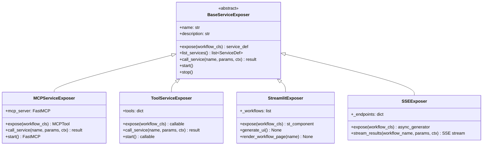
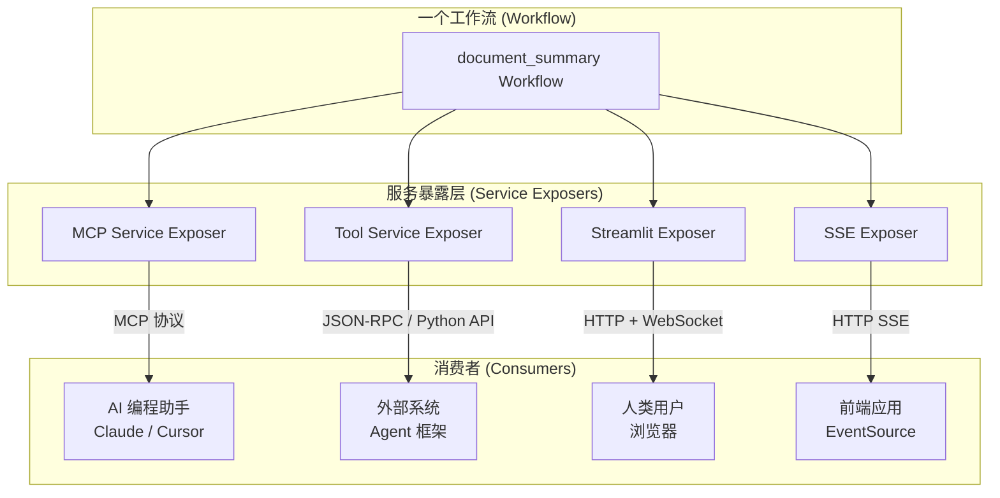

# icore 服务暴露层设计

> **文档编号：** 08  
> **项目：** icore — 企业级 LLM 工作流编排平台  
> **版本：** 1.0  
> **依赖：** [06-api-layer.md](06-api-layer.md) (API 层设计)

---

## 目录

1. [设计目标](#1-设计目标)
2. [适配器模式](#2-适配器模式)
3. [BaseServiceExposer 抽象基类](#3-baseserviceexposer-抽象基类)
4. [MCP 服务适配器](#4-mcp-服务适配器)
5. [Tool 工具服务适配器](#5-tool-工具服务适配器)
6. [Streamlit 适配器](#6-streamlit-适配器)
7. [SSE 适配器](#7-sse-适配器)
8. [架构图：一个工作流多种暴露方式](#8-架构图一个工作流多种暴露方式)
9. [注册与生命周期](#9-注册与生命周期)
10. [与 API 层的关系](#10-与-api-层的关系)

---

## 1. 设计目标

icore 的服务暴露层解决一个核心问题：**同一个工作流，如何被不同协议、不同场景的消费者调用？**

四种标准暴露方式覆盖了主流集成场景：

| 暴露方式 | 协议 | 典型消费者 | 适用场景 |
|---------|------|-----------|---------|
| **MCP 服务** | MCP (Model Context Protocol) | AI 编程助手（Claude、Cursor 等） | 将工作流注册为 AI 可调用的原生工具 |
| **Tool 工具服务** | HTTP JSON-RPC | 外部系统、Agent 框架 | 将工作流封装为标准化可调用函数 |
| **Streamlit UI** | HTTP + WebSocket | 人类用户（浏览器） | 为工作流生成交互式 Web 界面 |
| **SSE 端点** | HTTP SSE (Server-Sent Events) | 前端应用、流式消费者 | 实时流式推送工作流执行进度 |

### 核心设计原则

1. **适配器模式**：每个暴露方式是一个独立的适配器，实现相同的 `BaseServiceExposer` 接口。
2. **声明式注册**：工作流通过注册即可自动暴露，适配器自动发现已注册的工作流。
3. **零侵入**：工作流本身无需知道自己是 MCP 工具、Streamlit 组件还是 SSE 端点——适配器负责所有适配逻辑。
4. **可扩展**：新增一种暴露协议只需编写一个新的 Exposer 子类。

---

## 2. 适配器模式



### ServiceDef（服务定义）

每个暴露的服务都有一个标准化的 `ServiceDef` 描述：

```python
@dataclass
class ServiceDef:
    name: str                 # 服务名称（通常 = workflow_name）
    description: str          # 服务描述
    workflow_name: str         # 关联的工作流名称
    input_schema: dict         # 输入参数 JSON Schema (从 workflow params 推导)
    output_schema: dict        # 输出结果 JSON Schema
    protocol: str              # "mcp" | "tool" | "streamlit" | "sse"
    metadata: dict             # 额外元数据
```

---

## 3. BaseServiceExposer 抽象基类

所有服务暴露适配器的抽象基类定义：

```python
class BaseServiceExposer(abc.ABC):
    name: ClassVar[str] = ""
    protocol: ClassVar[str] = ""

    @abc.abstractmethod
    async def expose(self, workflow_cls: type[BaseWorkflow]) -> ServiceDef:
        """将工作流暴露为服务，返回服务定义"""
        ...

    @abc.abstractmethod
    async def list_services(self) -> list[ServiceDef]:
        """列出所有已暴露的服务"""
        ...

    @abc.abstractmethod
    async def call_service(
        self, name: str, params: dict, ctx: TaskContext
    ) -> dict:
        """调用已暴露的服务"""
        ...

    async def start(self) -> None:
        """启动服务（绑定端口、注册路由等）"""
        pass

    async def stop(self) -> None:
        """停止服务"""
        pass
```

---

## 4. MCP 服务适配器

### 4.1 设计概述

MCP（Model Context Protocol）是 Anthropic 提出的标准协议，允许 AI 模型通过结构化工具调用与外部系统交互。icore 的 MCP 适配器将注册的工作流转换为 MCP Tools。

### 4.2 实现策略

- 使用 `mcp` Python SDK（FastMCP）创建 MCP Server
- 每个注册的工作流自动成为一个 MCP Tool
- Tool 名称 = workflow_name（自动做 snake_case -> 合适命名转换）
- Tool 的 input schema 从工作流的 params 结构（Pydantic model）推导
- 调用时：创建 TaskContext → 实例化 Workflow → execute() → 返回结果

### 4.3 核心代码结构

```python
class MCPServiceExposer(BaseServiceExposer):
    name = "mcp"
    protocol = "mcp"

    def __init__(self):
        self._services: dict[str, ServiceDef] = {}
        self._mcp_server = FastMCP("icore-mcp-server")

    async def expose(self, workflow_cls):
        name = workflow_cls.name
        service = ServiceDef(
            name=name,
            description=workflow_cls.description,
            workflow_name=name,
            input_schema=build_input_schema(workflow_cls),
            output_schema=build_output_schema(),
            protocol="mcp",
            metadata={},
        )
        # 注册为 MCP tool
        tool = self._mcp_server.tool(name, description=workflow_cls.description)
        @tool(parameters=service.input_schema)
        async def tool_handler(**params):
            return await self.call_service(name, params, create_context(params))
        self._services[name] = service
        return service
```

### 4.4 Input Schema 推导

MCP Tool parameters 从工作流定义推导：

- 如果工作流定义了 `input_model`（Pydantic 类），直接转换为 JSON Schema
- 如果工作流未定义 input_model，params 为 `{"type": "object", "additionalProperties": true}`
- 支持从 workflow.execute() 签名推导参数

---

## 5. Tool 工具服务适配器

### 5.1 设计概述

Tool 服务适配器将工作流封装为可直接调用的 Python 函数/工具。适合：
- 被其他 Agent 框架作为工具注册
- 被 LangChain / LlamaIndex 作为 Tool 使用
- 通过 JSON-RPC 暴露给外部系统

### 5.2 Tool 表示

每个 Tool 是一个包含以下属性的对象：

```python
@dataclass
class ToolDef:
    name: str
    description: str
    callable: Callable[..., Awaitable[dict]]
    input_schema: dict   # JSON Schema
    tags: list[str]
```

### 5.3 实现

```python
class ToolServiceExposer(BaseServiceExposer):
    name = "tool"
    protocol = "tool"

    async def expose(self, workflow_cls):
        name = workflow_cls.name

        async def tool_callable(**params) -> dict:
            ctx = TaskContext(
                task_id=f"tool:{name}:{uuid4().hex[:8]}",
                workflow_id=name,
                metadata={"source": "tool_service"},
            )
            ctx._model_manager = self._model_manager
            ctx._db_manager = self._db_manager
            wf = workflow_cls()
            result = await wf.execute(ctx, params)
            return {"status": result.status, "data": result.data, "error": result.error}

        tool = ToolDef(
            name=name,
            description=workflow_cls.description,
            callable=tool_callable,
            input_schema=build_input_schema(workflow_cls),
            tags=[],
        )
        self._tools[name] = tool
        return ServiceDef(...)
```

---

## 6. Streamlit 适配器

### 6.1 设计概述

Streamlit 适配器为工作流生成交互式 Web UI。用户可以在浏览器中：
- 选择工作流
- 填写参数（根据 input schema 动态生成表单）
- 执行工作流并查看实时进度
- 查看结果

### 6.2 UI 结构

生成的 Streamlit 应用包含：

1. **侧边栏**：工作流列表（可搜索）
2. **主面板**：
   - 工作流名称和描述
   - 动态参数输入表单（根据工作流的 input_model 或 params schema 生成）
   - 提交按钮
   - 执行状态指示器（spinner + 实时状态）
   - 结果展示区（支持 JSON、Markdown、表格）

### 6.3 实现

```python
class StreamlitExposer(BaseServiceExposer):
    name = "streamlit"
    protocol = "streamlit"

    def generate_ui(self):
        """生成 Streamlit 界面"""
        import streamlit as st
        st.set_page_config(page_title="icore Workflows", layout="wide")

        # 侧边栏：工作流列表
        workflow_names = list(self._services.keys())
        selected = st.sidebar.selectbox("选择工作流", workflow_names)

        if selected:
            self._render_workflow_page(selected)

    def _render_workflow_page(self, name):
        """渲染单个工作流的交互页面"""
        service = self._services[name]
        st.title(service.description)

        # 动态生成参数表单
        params = {}
        for field_name, field_info in service.input_schema.get("properties", {}).items():
            # 根据类型生成对应的 Streamlit widget
            params[field_name] = self._widget_for_field(field_name, field_info)

        if st.button("执行"):
            with st.spinner("执行中..."):
                result = await self.call_service(name, params, ctx)
            st.json(result)
```

---

## 7. SSE 适配器

### 7.1 设计概述

SSE（Server-Sent Events）适配器将工作流包装为 SSE 流式端点。适合：
- 前端 AJAX + EventSource 消费
- 实时进度展示
- 长任务逐步反馈

### 7.2 流式事件类型

| 事件类型 | 说明 | 数据载荷 |
|---------|------|---------|
| `task_started` | 任务开始执行 | `{"task_id": "...", "workflow": "..."}` |
| `node_completed` | 单个 DAG 节点完成 | `{"node_id": "...", "status": "..."}` |
| `chunk` | 流式输出块 | `{"data": "partial output..."}` |
| `task_completed` | 任务完成 | `{"status": "success", "result": {...}}` |
| `task_error` | 任务失败 | `{"status": "error", "error": "..."}` |
| `heartbeat` | 心跳（保持连接） | `{"timestamp": "..."}` |

### 7.3 实现

```python
class SSEExposer(BaseServiceExposer):
    name = "sse"
    protocol = "sse"

    async def stream_results(
        self, workflow_name: str, params: dict, ctx: TaskContext
    ) -> AsyncGenerator[str, None]:
        """流式推送工作流执行进度"""
        yield self._format_sse("task_started", {...})

        workflow = self._get_workflow(workflow_name)
        wf = workflow()

        try:
            # 如果是流式任务，逐块推送
            if ctx.stream:
                async for chunk in wf.execute_stream(ctx, params):
                    yield self._format_sse("chunk", {"data": chunk})
            else:
                result = await wf.execute(ctx, params)
                yield self._format_sse("task_completed", {"status": result.status, "data": result.data})

        except Exception as e:
            yield self._format_sse("task_error", {"error": str(e)})

    def _format_sse(self, event: str, data: dict) -> str:
        """格式化 SSE 消息"""
        import json
        return f"event: {event}\ndata: {json.dumps(data, ensure_ascii=False)}\n\n"
```

---

## 8. 架构图：一个工作流多种暴露方式



**关键点**：同一个 `document_summary` 工作流无需任何修改，通过四个适配器暴露给四种完全不同的消费者。

---

## 9. 注册与生命周期

### 9.1 服务暴露流程

```
Workflow 注册 → Exposer 发现 → 自动暴露 → 消费者使用
```

1. **工作流注册**：开发者定义工作流并通过 `@register_workflow` 注册
2. **Exposer 发现**：Exposer 启动时扫描 `WorkflowRegistry`，自动暴露所有已注册的工作流
3. **消费者调用**：消费者通过对应的协议调用工作流

### 9.2 手动暴露（可选）

也可以通过代码显式暴露指定工作流：

```python
mcp_exposer = MCPServiceExposer()
mcp_exposer.expose(DocumentSummaryWorkflow)
mcp_exposer.expose(EntityExtractionWorkflow)
```

### 9.3 生命周期管理

```python
# 启动所有暴露服务
for exposer in exposers:
    await exposer.start()

# 停止所有暴露服务
for exposer in exposers:
    await exposer.stop()
```

启动时：
- MCP Exposer 启动 FastMCP Server
- Streamlit Exposer 启动 `streamlit run` 子进程
- Tool Exposer 注册 tool function
- SSE Exposer 注册 HTTP 路由

---

## 10. 与 API 层的关系

```
外部请求
    │
    ├── 通过 HTTP → FastAPI (/invoke) → 工作流直接执行 (06-api-layer)
    │
    ├── 通过 MCP → MCPServiceExposer → 工作流执行 (08-mcp)
    ├── 通过 Tool → ToolServiceExposer → 工作流执行 (08-tool)
    ├── 通过 Streamlit → StreamlitExposer → 工作流执行 (08-streamlit)
    └── 通过 SSE → SSEExposer → 工作流执行 (08-sse)
```

服务暴露层是**构建在引擎层之上的附加层**，不与 API 层耦合。Exposer 直接使用 `WorkflowRegistry` 和 `WorkflowExecutor`，不经过 API 层。

**底层统一**：无论消费者通过哪种协议调用，最终都走同一个路径：

```
消费者 → Exposer → WorkflowRegistry.get(name) → WorkflowExecutor.run(dag, ctx, params) → 结果
```

这保证了：
1. 所有协议共享相同的并发控制（ConcurrencyController）
2. 所有协议共享相同的模型路由（ModelRouter）
3. 所有协议共享相同的数据库连接池（DBManager）
4. 结果格式在所有协议中一致

---

> **本文档为 icore 服务暴露层的设计文档。四种适配器实现了统一的 BaseServiceExposer 接口，一个工作流可以通过配置自动暴露为 MCP 工具、Tool 服务、Streamlit 界面和 SSE 流式端点。**
