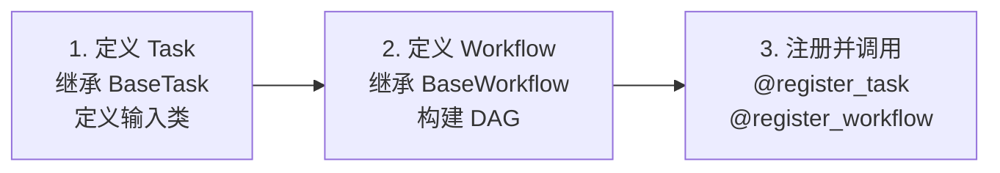
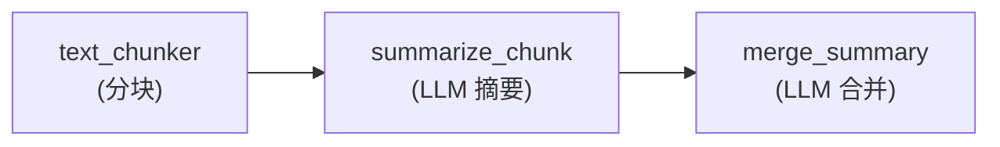
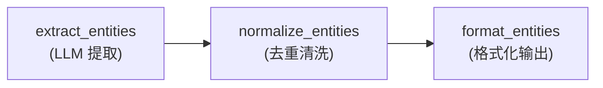
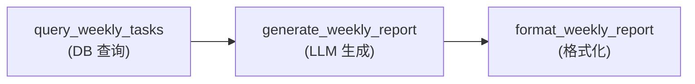
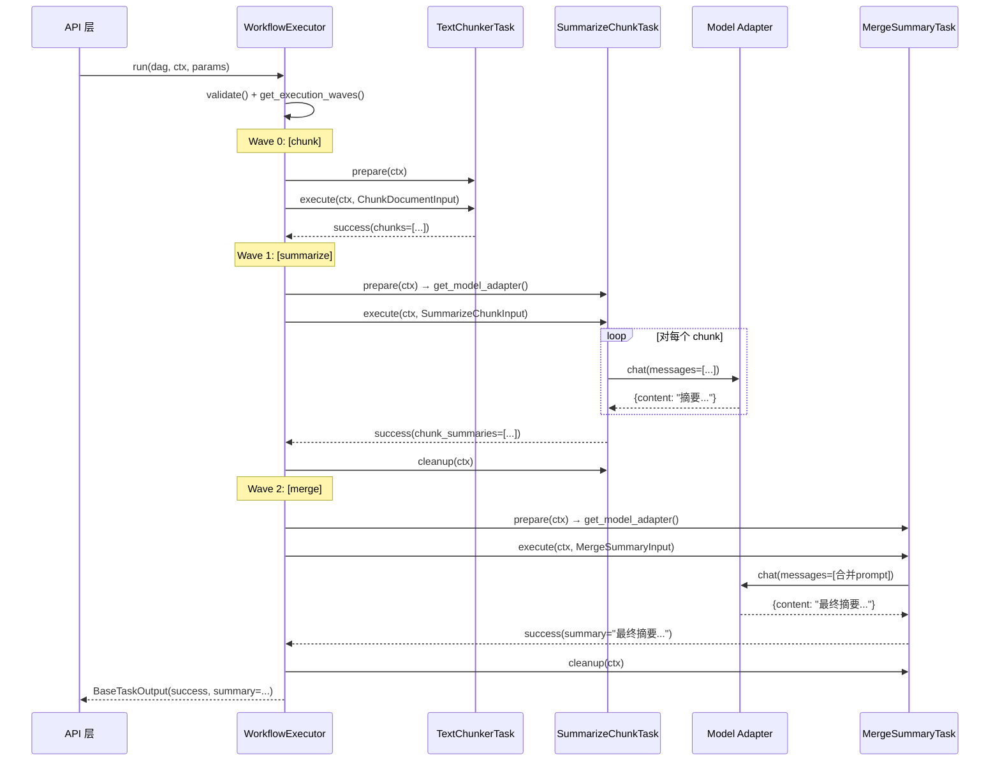

# icore 示例工作流实现

> **文档编号：** 09  
> **项目：** icore - 企业级 LLM 工作流编排平台  
> **依赖：** US-002（BaseTask 抽象层）、US-004（工作流引擎）

---

## 目录

1. [概述](#1-概述)
2. [开发模式总结](#2-开发模式总结)
3. [示例一：大文档摘要提取](#3-示例一大文档摘要提取)
4. [示例二：实体关系提取](#4-示例二实体关系提取)
5. [示例三：周报生成（DB + LLM）](#5-示例三周报生成db--llm)
6. [如何注册和调用工作流](#6-如何注册和调用工作流)
7. [代码走查：文档摘要工作流](#7-代码走查文档摘要工作流)

---

## 1. 概述

本文档展示如何使用 icore 平台开发具体的工作流。三个示例覆盖了平台的核心能力：

| 示例 | 文件 | 核心能力展示 |
|------|------|-------------|
| 大文档摘要提取 | `icore/workflows/examples/document_summary.py` | 多 Task DAG、LLM 调用、input_builder |
| 实体关系提取 | `icore/workflows/examples/entity_extraction.py` | LLM + JSON 解析、纯处理 Task、多种输出格式 |
| 周报生成 | `icore/workflows/examples/weekly_report.py` | **数据库集成**、LLM 生成、格式化 |

每个示例都包含：
- 自定义输入类（继承 `BaseTaskInput`）
- 具体 Task 类（继承 `BaseTask`）
- DAG 工作流定义（继承 `BaseWorkflow`）
- 通过 `@register_task` 和 `@register_workflow` 装饰器注册

---

## 2. 开发模式总结

在 icore 中开发一个工作流需要三步：



### 第一步：定义 Task

```python
from pydantic import Field
from icore.core.base_task import BaseTask
from icore.core.models import BaseTaskInput, BaseTaskOutput
from icore.core.registry import register_task
from icore.core.task_context import TaskContext

# 1a. 定义输入类（每个 Task 有自己的输入类）
class MyTaskInput(BaseTaskInput):
    text: str = Field(description="Text to process")
    max_length: int = Field(default=100)

# 1b. 定义 Task 类
@register_task("my_task")
class MyTask(BaseTask):
    name = "my_task"
    description = "Process text"
    input_model = MyTaskInput
    output_model = BaseTaskOutput

    async def prepare(self, ctx: TaskContext) -> None:
        # 获取模型适配器
        self._model = ctx.get_model_adapter()

    async def execute(self, ctx: TaskContext, inp: MyTaskInput) -> BaseTaskOutput:
        # 核心逻辑
        result = await self._model.chat(
            messages=[{"role": "user", "content": inp.text}]
        )
        return BaseTaskOutput.success(result=result["content"])

    async def cleanup(self, ctx: TaskContext) -> None:
        self._model = None
```

### 第二步：定义 Workflow

```python
from icore.engine.base_workflow import BaseWorkflow
from icore.engine.dag import DAG
from icore.engine.registry import register_workflow

@register_workflow("my_workflow")
class MyWorkflow(BaseWorkflow):
    name = "my_workflow"
    description = "My workflow"

    def define(self) -> DAG:
        dag = DAG()
        dag.add_node("step1", task_name="my_task")
        # 添加更多节点和边...
        return dag
```

### 第三步：注册并调用

```python
# 装饰器已自动注册。通过 API 调用：
# POST /invoke {"workflow_name": "my_workflow", "params": {"text": "..."}}
```

---

## 3. 示例一：大文档摘要提取

**文件：** `icore/workflows/examples/document_summary.py`

### 业务场景

对一篇超长文档（超出 LLM 单次上下文窗口），通过分块策略进行摘要：
1. 将文档切分为多个文本块
2. 对每个文本块单独生成摘要
3. 将各块摘要合并为最终摘要

### DAG 结构



### Task 清单

| Task | 类型 | 说明 |
|------|------|------|
| `TextChunkerTask` | 纯处理 | 按指定大小和重叠切分文档 |
| `SummarizeChunkTask` | LLM | 对每个块生成摘要 |
| `MergeSummaryTask` | LLM | 将多个摘要合并为一个 |

### 输入类

- `ChunkDocumentInput`: document, chunk_size, overlap
- `SummarizeChunkInput`: chunks, max_length_per_chunk
- `MergeSummaryInput`: chunk_summaries, final_max_length

### input_builder 使用

此示例展示了 `input_builder` 的关键用法——在 DAG 节点间传递数据：

```python
dag.add_node(
    node_id="summarize",
    task_name="summarize_chunk",
    input_builder=lambda params, upstream: SummarizeChunkInput(
        chunks=upstream["chunk"].data["chunks"],  # 从上游节点输出取数据
        max_length_per_chunk=params.get("max_length_per_chunk", 500),
    ),
)
```

`input_builder` 接收两个参数：
- `params`: 工作流级别的原始入参（来自 API 请求）
- `upstream`: 上游节点的输出字典（`{node_id: BaseTaskOutput}`）

---

## 4. 示例二：实体关系提取

**文件：** `icore/workflows/examples/entity_extraction.py`

### 业务场景

从文档中提取实体及其关系，构建知识图谱：
1. 通过 LLM 从文本中提取原始实体和关系（JSON 格式）
2. 对提取结果进行清洗、去重、标准化
3. 格式化为 JSON 或 Cytoscape.js 图可视化格式

### DAG 结构



### Task 清单

| Task | 类型 | 说明 |
|------|------|------|
| `ExtractEntitiesTask` | LLM | 发送结构化 prompt，解析 JSON 响应 |
| `NormalizeEntitiesTask` | 纯处理 | 去重、标准化类型、合并 mentions |
| `FormatEntitiesTask` | 纯处理 | 输出为 JSON 或 Cytoscape 格式 |

### 设计亮点

1. **JSON 解析容错**：`ExtractEntitiesTask._parse_json_response()` 尝试三种解析策略（直接解析、markdown 代码块提取、花括号匹配），应对 LLM 输出格式不稳定的问题

2. **非 LLM 处理 Task**：`NormalizeEntitiesTask` 和 `FormatEntitiesTask` 不使用 LLM，纯 Python 处理，展示平台支持非 LLM Task 的能力

3. **多输出格式**：`FormatEntitiesTask` 支持 `json` 和 `cytoscape` 两种格式，通过工作流参数 `output_format` 控制

---

## 5. 示例三：周报生成（DB + LLM）

**文件：** `icore/workflows/examples/weekly_report.py`

### 业务场景

从数据库查询过去一周的工作任务，用 LLM 生成周报：
1. 查询数据库获取一周内完成的任务
2. 将任务列表发送给 LLM 生成叙事性周报
3. 添加元数据头（日期范围、任务数、生成时间）

### DAG 结构



### Task 清单

| Task | 类型 | 说明 |
|------|------|------|
| `QueryWeeklyTasksTask` | **数据库** | 通过 `ctx.get_db()` 查询数据库 |
| `GenerateWeeklyReportTask` | LLM | 根据任务数据生成周报文本 |
| `FormatWeeklyReportTask` | 纯处理 | 添加报告头和元数据 |

### 数据库集成详解

此示例展示了 icore 的 DB 集成模式。`QueryWeeklyTasksTask.execute()` 中的关键代码：

```python
async def execute(self, ctx: TaskContext, inp: QueryWeeklyTasksInput) -> BaseTaskOutput:
    # 获取注入的 DBManager
    db_manager = ctx._db_manager
    if db_manager is None:
        return BaseTaskOutput.failure("No DBManager injected")

    # 通过 DBManager 执行参数化查询
    rows = await db_manager.query(
        inp.db_connection,  # 连接名称（如 "main_db"）
        sql,                 # 参数化 SQL
        params,              # (start_date, now, ...)
    )

    return BaseTaskOutput.success(tasks=rows, ...)
```

**要点：**
- Task 不直接创建数据库连接，而是通过 `TaskContext` 注入的 `DBManager`
- 使用参数化查询（`$1`, `$2` 占位符）防止 SQL 注入
- `db_connection` 参数指定使用哪个已注册的数据库连接
- 查询结果以 `list[dict]` 格式返回，方便后续处理

---

## 6. 如何注册和调用工作流

### 注册

注册通过装饰器自动完成，只需 import 模块即可触发：

```python
# 在应用启动时导入示例模块
import icore.workflows.examples.document_summary
import icore.workflows.examples.entity_extraction
import icore.workflows.examples.weekly_report

# 此时所有 @register_task 和 @register_workflow 已执行
# TaskRegistry 和 WorkflowRegistry 已填充
```

### 通过 API 调用

```bash
# 文档摘要
curl -X POST http://localhost:8000/invoke \
  -H "Content-Type: application/json" \
  -d '{
    "workflow_name": "document_summary",
    "params": {
      "document": "Very long document text...",
      "chunk_size": 2000,
      "final_max_length": 1000
    },
    "task_id": "task-001"
  }'

# 实体关系提取
curl -X POST http://localhost:8000/invoke \
  -H "Content-Type: application/json" \
  -d '{
    "workflow_name": "entity_extraction",
    "params": {
      "text": "Alice works at Acme Corp. Bob is the CEO of Acme Corp.",
      "output_format": "cytoscape"
    },
    "task_id": "task-002"
  }'

# 周报生成
curl -X POST http://localhost:8000/invoke \
  -H "Content-Type: application/json" \
  -d '{
    "workflow_name": "weekly_report",
    "params": {
      "db_connection": "main_db",
      "user_id": "u123",
      "days_back": 7
    },
    "task_id": "task-003"
  }'
```

### 通过代码调用

```python
import asyncio
from icore.core.task_context import TaskContext
from icore.workflows.examples.document_summary import DocumentSummaryWorkflow

async def main():
    wf = DocumentSummaryWorkflow()

    # 创建上下文（生产环境中由引擎自动注入 managers）
    ctx = TaskContext(
        task_id="t1",
        workflow_id="w1",
        model_id="gpt-4o",
        stream=False,
    )
    # 注入 managers（生产环境由 WorkflowExecutor 自动完成）
    # ctx.set_model_manager(model_mgr)
    # ctx.set_db_manager(db_mgr)

    # 验证 DAG 结构
    assert wf.validate()  # 检查无环、节点完整

    # 执行
    result = await wf.execute(ctx, {
        "document": "Long document text...",
        "chunk_size": 2000,
    })

    if result.is_success:
        print(result.data["summary"])
    else:
        print(f"Failed: {result.error}")

asyncio.run(main())
```

---

## 7. 代码走查：文档摘要工作流

以 `document_summary.py` 为例，详细走查从输入到输出的完整执行流程。

### 7.1 请求到达

API 层收到请求：
```json
{
  "workflow_name": "document_summary",
  "params": {
    "document": "这是一篇很长的文档...",
    "chunk_size": 2000,
    "final_max_length": 1000
  },
  "task_id": "task-001"
}
```

### 7.2 引擎启动

1. API 层查找 `WorkflowRegistry` 中的 `document_summary`，得到 `DocumentSummaryWorkflow` 类
2. 创建 `TaskContext`，注入 `ModelManager` 和 `DBManager`
3. 调用 `wf.execute(ctx, params)`

### 7.3 DAG 构建

`DocumentSummaryWorkflow.define()` 返回如下 DAG：

```
chunk (text_chunker) -> summarize (summarize_chunk) -> merge (merge_summary)
```

执行波次（`get_execution_waves()`）：
- Wave 0: `["chunk"]`
- Wave 1: `["summarize"]`
- Wave 2: `["merge"]`

由于是线性依赖，每波只有一个节点，无并行。

### 7.4 Wave 0: chunk 节点

1. **输入构建**：`chunk` 是起始节点，无上游。引擎将 `params` 直接传给 `ChunkDocumentInput`：
   ```python
   ChunkDocumentInput(document="这是一篇很长的文档...", chunk_size=2000, overlap=100)
   ```

2. **执行**：`TextChunkerTask.execute()` 将文档切分为多个块，返回：
   ```python
   BaseTaskOutput.success(
       chunks=["chunk1...", "chunk2...", "chunk3..."],
       chunk_count=3,
       original_length=5000,
   )
   ```

### 7.5 Wave 1: summarize 节点

1. **输入构建**：`summarize` 节点有 `input_builder`，引擎调用它：
   ```python
   input_builder(params, {"chunk": <上一节点输出>})
   # 返回:
   SummarizeChunkInput(
       chunks=["chunk1...", "chunk2...", "chunk3..."],
       max_length_per_chunk=500,
   )
   ```

2. **执行**：`SummarizeChunkTask` 在 `prepare()` 中获取模型适配器，在 `execute()` 中对每个块调用 `model.chat()`，收集摘要：
   ```python
   BaseTaskOutput.success(
       chunk_summaries=["摘要1...", "摘要2...", "摘要3..."],
       total_chunks=3,
   )
   ```

### 7.6 Wave 2: merge 节点

1. **输入构建**：
   ```python
   MergeSummaryInput(
       chunk_summaries=["摘要1...", "摘要2...", "摘要3..."],
       final_max_length=1000,
   )
   ```

2. **执行**：`MergeSummaryTask` 将所有摘要合并为一个 prompt 发送给 LLM，返回最终摘要：
   ```python
   BaseTaskOutput.success(
       summary="这是合并后的最终文档摘要...",
       merged_from=3,
   )
   ```

### 7.7 最终返回

`merge` 是终末节点（无后继），引擎提取其输出返回给 API 层：

```json
{
  "status": "success",
  "error": null,
  "data": {
    "summary": "这是合并后的最终文档摘要...",
    "merged_from": 3
  }
}
```

### 7.8 DAG 执行时序图



---

> **总结：** 三个示例展示了 icore 平台的核心开发模式——定义输入类 → 实现 Task → 构建 DAG → 注册调用。无论是纯 LLM 任务、纯处理任务，还是数据库集成任务，都通过统一的 `BaseTask` 抽象和 `TaskContext` 依赖注入机制实现，确保高内聚低耦合。
