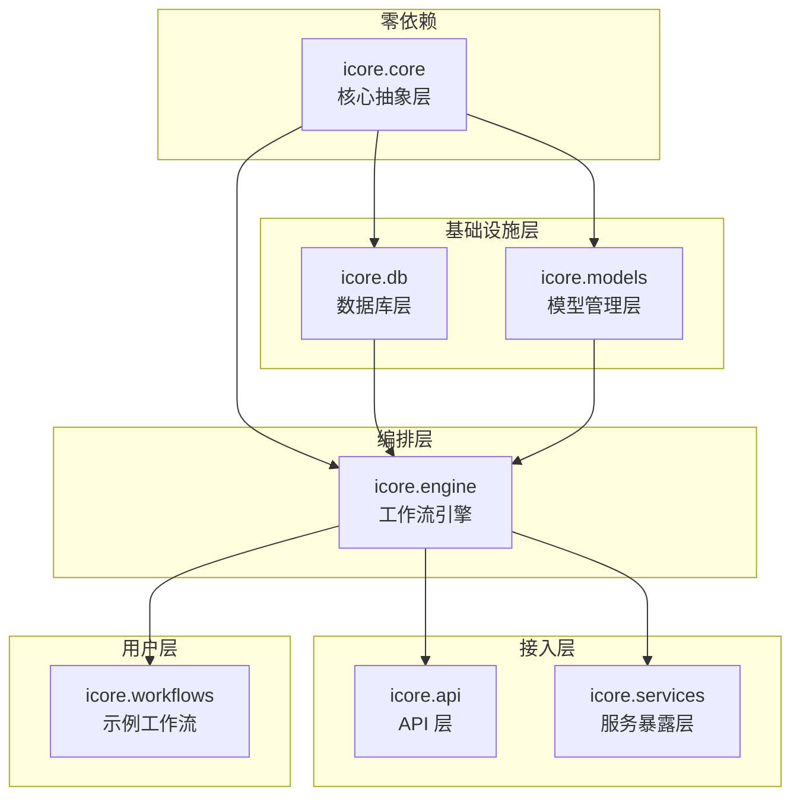

# icore 完整目录结构与文件说明

> **文档编号：** 10  
> **项目：** icore — 企业级 LLM 工作流编排平台  
> **版本：** 1.1（v0.5 同步更新）  
> **依赖：** 01–09 全部设计文档 + 11-v0.5-enhancement.md

---

## 目录

1. [项目根目录](#1-项目根目录)
2. [icore/ — 核心包](#2-icore--核心包)
3. [icore/core/ — 核心抽象层](#3-icorecore--核心抽象层)
4. [icore/db/ — 数据库层](#4-icoredb--数据库层)
5. [icore/models/ — 模型管理层](#5-icoremodels--模型管理层)
6. [icore/engine/ — 工作流引擎层](#6-icoreengine--工作流引擎层)
7. [icore/vectorstore/ — 向量数据库层（v0.5）](#7-icorevectorstore--向量数据库层v05)
8. [icore/graphstore/ — 图数据库层（v0.5）](#8-icoregraphstore--图数据库层v05)
9. [icore/media/ — 多模态文件处理层（v0.5）](#9-icoremedia--多模态文件处理层v05)
10. [icore/api/ — API 层](#10-icoreapi--api-层)
11. [icore/services/ — 服务暴露层](#11-icoreservices--服务暴露层)
12. [icore/workflows/ — 示例工作流](#12-icoreworkflows--示例工作流)
13. [docs/ — 设计文档](#13-docs--设计文档)
14. [依赖关系图](#14-依赖关系图)
15. [文件清单总览](#15-文件清单总览)

---

## 1. 项目根目录

```
icore-design/
├── .git/                          # Git 版本控制
├── .gitignore                     # 忽略规则（__pycache__, *.pyc, .env, pytest_out*.txt 等）
├── .dockerignore                  # Docker 构建忽略规则
├── .env.example                   # 环境变量示例（v0.6 含背压/热加载/降级变量）
├── README.md                      # 项目入口文档（v0.6 同步更新）
├── requirements.txt               # Python 依赖清单（v0.6 含 watchdog 等可选依赖）
├── pyproject.toml                 # 项目元数据 + pytest-asyncio 配置
├── Dockerfile                     # 容器化构建
├── Makefile                       # 常用命令快捷方式
├── docs/                          # 设计文档（01-13，v0.6 新增 12/13）
├── config/                        # YAML 配置目录（models / databases / vectorstore / graphstore / objectstore / triggers / prompts）
├── deploy/                        # v0.6 部署产物（docker-compose + Helm + Prometheus/Grafana 配置）
└── icore/                         # 核心 Python 包
    ├── __init__.py                 # 包入口，导出核心抽象
    ├── config.py                   # 全局配置管理（Pydantic Settings，v0.6 含背压/热加载/降级配置）
    ├── bootstrap.py                # 生产应用引导（v0.6 含 12 个 builder + 治理组件接线）
    ├── exceptions.py               # v0.5/v0.6: 统一异常分级体系
    ├── core/                       # 核心抽象层（零依赖）
    ├── db/                         # 数据库层
    ├── models/                     # 模型管理层
    ├── engine/                     # 工作流引擎层（v0.6 含 agent/backoff/dlq/saga/backpressure/hot_reload/degradation）
    ├── objectstore/                # v0.6: 对象存储层（MinIO / InMemory）
    ├── auth/                       # v0.6: 鉴权层（API Key / JWT / RBAC）
    ├── cache/                      # v0.6: LLM 语义缓存（L1 + L2）
    ├── prompts/                    # v0.6: Prompt 模板管理
    ├── retrieval/                  # v0.6: 混合检索（BM25 + RRF + Reranker）
    ├── observability/              # v0.6: 可观测性（Prometheus + OTel）
    ├── persistence/                # v0.6: 工作流持久化
    ├── triggers/                   # v0.6: 消息队列触发器
    ├── security/                   # v0.6: 安全加固（注入检测 / PII 脱敏 / 通用限流原语）
    ├── vectorstore/                # v0.5: 向量数据库层
    ├── graphstore/                 # v0.5: 图数据库层
    ├── media/                      # v0.5: 多模态文件处理层
    ├── api/                        # API 层（v0.6 含鉴权依赖 + /metrics 端点）
    ├── services/                   # 服务暴露层
    └── workflows/                  # 示例工作流（v0.6 新增 3 个：agent_demo / order_processing / report_export）
```

---

## 2. icore/ — 核心包

```
icore/
├── __init__.py                     # 包入口：版本号、核心抽象引用
│   └── 导出: VERSION, BaseTask, BaseTaskInput, BaseTaskOutput,
│            TaskContext, registry, register_task
│
└── config.py                       # 全局配置管理（~280 行）
    ├── APISettings                 # API 服务器配置 (ICORE_API_*)
    ├── ConcurrencySettings         # 并发控制配置 (ICORE_CONCURRENCY_*)
    ├── DatabaseSettings            # 数据库连接配置 (ICORE_DB_*)
    ├── ModelSettings               # LLM 模型配置 (ICORE_MODEL_*)
    ├── LoggingSettings             # 日志配置 (ICORE_LOG_*)
    └── Settings (顶层)             # 组合所有子设置，单例缓存
```

**关键模式：** `pydantic-settings` BaseSettings，子设置用 `env_prefix` 隔离命名空间，顶层 `get_settings()` 用 `@lru_cache` 单例。

---

## 3. icore/core/ — 核心抽象层

```
icore/core/
├── __init__.py                     # 导出 core 包所有公共 API
│   └── 导出: BaseTask, BaseTaskInput, BaseTaskOutput,
│            TaskRegistry, RegistryConflictError, TaskContext,
│            register_task, task_registry, BaseModelAdapter,
│            LLMConfig, ProviderType, RouteStrategy
│
├── base_task.py                    # BaseTask ABC（~140 行）
│   ├── class BaseTaskInput(pydantic.BaseModel)
│   │   └── 基类：所有任务输入的父类 (extra="allow")
│   ├── class BaseTaskOutput(pydantic.BaseModel)
│   │   ├── status: str          # "success" | "error"
│   │   ├── data: dict           # 任务输出
│   │   ├── error: str|None      # 错误信息
│   │   ├── measure: dict        # 执行指标
│   │   └── factory methods: .success() / .failure()
│   └── class BaseTask(abc.ABC)
│       ├── ClassVar: name, description, input_model, output_model
│       ├── @abstractmethod: async execute(ctx, input) -> Output
│       └── validate(input) -> bool (非抽象，默认 True)
│
├── registry.py                    # TaskRegistry（~100 行）
│   └── class TaskRegistry
│       ├── 线程安全：threading.RLock + double-checked locking
│       ├── .default() -> 单例
│       ├── .register(name) -> 注册任务
│       ├── .get(name) -> 获取任务
│       └── .list_all() -> 列出所有注册任务
│
├── task_context.py                # TaskContext（~70 行）
│   └── class TaskContext(pydantic.BaseModel)
│       ├── task_id, workflow_id, metadata, stream, timeout
│       ├── _model_manager (private: object.__setattr__ 注入)
│       ├── _db_manager (private: object.__setattr__ 注入)
│       ├── get_model_adapter() -> 获取 LLM 适配器
│       ├── get_db(name) -> 获取数据库连接
│       └── result_queue (asyncio.Queue, 流式输出用)
│
└── models.py                      # 通用数据模型（~60 行）
    ├── class LLMConfig(pydantic.BaseModel)
    ├── enum ProviderType: OPENAI, AZURE, LOCAL, CUSTOM
    ├── enum RouteStrategy: ROUND_ROBIN, LEAST_CONNECTIONS, RANDOM, PRIORITY
    └── class BaseModelAdapter(abc.ABC): 模型适配器抽象
```

**设计文档参考：** [02-task-abstraction.md](02-task-abstraction.md)

---

## 4. icore/db/ — 数据库层

```
icore/db/
├── __init__.py                     # 导出 db 包所有公共 API
│   └── 导出: BaseConnector, ConnectionPool, DBManager,
│            DatabaseError, ConnectionError, QueryError,
│            PoolExhaustedError
│
├── base_connector.py               # BaseConnector ABC（~70 行）
│   └── class BaseConnector(abc.ABC)
│       ├── @abstractmethod: connect() -> Connection
│       ├── @abstractmethod: close()
│       ├── @abstractmethod: execute(query, params) -> rows
│       ├── @abstractmethod: fetch_one/fetch_all/insert/update/delete
│       └── translate_placeholder(query) -> 占位符翻译
│
├── connection_pool.py              # ConnectionPool（~100 行）
│   └── class ConnectionPool
│       ├── asyncio.Semaphore 容量控制
│       ├── asyncio.Queue 空闲连接池
│       ├── 懒创建：首次 acquire() 时建立连接
│       └── acquire() / release() / close()
│
├── manager.py                      # DBManager（~90 行）
│   └── class DBManager
│       ├── adapter_map: db_type -> connector_class
│       ├── 命名连接池管理（name -> ConnectionPool）
│       └── get_connection(name) -> ConnectionPool
│
├── exceptions.py                   # 数据库异常层次（~30 行）
│   ├── class DatabaseError(Exception)
│   ├── class ConnectionError(DatabaseError)
│   ├── class QueryError(DatabaseError)
│   └── class PoolExhaustedError(DatabaseError)
│
└── adapters/                       # 数据库适配器实现
    ├── __init__.py                 # 导出所有适配器
    ├── mysql.py                    # MySQL 适配器 (aiomysql + DictCursor)
    ├── postgresql.py               # PostgreSQL 适配器 (asyncpg)
    ├── oracle.py                   # Oracle 适配器 (oracledb)
    └── hive.py                     # Hive 适配器 (pyhive)
```

**设计文档参考：** [03-database-layer.md](03-database-layer.md)

---

## 5. icore/models/ — 模型管理层

```
icore/models/
├── __init__.py                     # 导出 models 包所有公共 API
│   └── 导出: ModelManager, ModelConfig, BaseModelAdapter,
│            OpenAIAdapter, ModelRouter, RouteStrategy,
│            ModelAPIError, ModelAuthError, ModelRateLimitError
│
├── base_adapter.py                 # 模型适配器基类（~50 行）
│   └── class BaseModelAdapter(abc.ABC)
│       ├── @abstractmethod: chat(messages, **kwargs) -> response
│       ├── @abstractmethod: stream(messages, **kwargs) -> AsyncIterator
│       └── @abstractmethod: health_check() -> bool
│
├── config.py                       # 模型配置（~60 行）
│   └── class ModelConfig(pydantic.BaseModel)
│       ├── name, provider, api_base, api_key, model_name
│       └── rate_limit/min_interval/max_retries
│
├── manager.py                      # 模型管理器（~120 行）
│   └── class ModelManager
│       ├── 多模型实例管理（name -> adapter）
│       ├── 健康检查 + 自动降级
│       └── register_model(name, config) / get_adapter(name)
│
├── openai_adapter.py               # OpenAI 兼容适配器（~100 行）
│   └── class OpenAIAdapter(BaseModelAdapter)
│       ├── 封装 httpx AsyncClient
│       ├── chat(): POST /v1/chat/completions
│       ├── stream(): SSE 流式消费
│       └── 支持：OpenAI / Azure / 兼容 API
│
├── router.py                       # 模型路由（~80 行）
│   └── class ModelRouter
│       ├── 负载均衡：round_robin / least_connections / random
│       └── select_model(strategy) -> adapter
│
└── exceptions.py                   # 模型异常（~25 行）
    ├── class ModelAPIError(Exception)
    ├── class ModelAuthError(ModelAPIError)
    └── class ModelRateLimitError(ModelAPIError)
```

**设计文档参考：** [05-model-management.md](05-model-management.md)

---

## 6. icore/engine/ — 工作流引擎层

```
icore/engine/
├── __init__.py                     # 导出 engine 包所有公共 API
│   └── 导出: BaseWorkflow, DAG, DAGNode, DAGEdge, WorkflowExecutor,
│            WorkflowRegistry, register_workflow, WorkflowInstanceManager,
│            WorkflowStates, InstanceStatus, ConcurrencyController,
│            TaskQueue, TaskPriority, WorkflowTask, rate_limit,
│            CircuitBreaker, CircuitBreakerRegistry, CircuitState,
│            BaseDistributedLock, RedisLock, MemoryLock
│
├── base_workflow.py                # BaseWorkflow ABC（~70 行）
│   └── class BaseWorkflow(abc.ABC)
│       ├── ClassVar: name, description
│       ├── @abstractmethod: define() -> DAG
│       ├── @abstractmethod: async execute(ctx, input) -> output
│       └── validate() -> bool (非抽象，默认 True)
│
├── registry.py                     # WorkflowRegistry（~80 行）
│   └── class WorkflowRegistry
│       ├── 线程安全：threading.RLock + double-checked locking
│       ├── .default() -> 单例
│       ├── .register(name) -> 装饰器注册
│       └── .get(name) -> 获取工作流
│
├── dag.py                          # DAG 数据结构（~120 行）
│   ├── class DAGNode(pydantic.BaseModel)
│   │   └── id, task_name, config, depend_on, condition
│   ├── class DAGEdge(pydantic.BaseModel)
│   │   └── source, target, condition
│   └── class DAG
│       ├── add_node/add_edge/validate()
│       └── get_execution_waves() -> 关键调度方法
│
├── executor.py                     # 工作流执行器（~280 行）
│   └── class WorkflowExecutor
│       ├── 无状态运行器（每次 run() 局部变量）
│       ├── 按 DAG 波次执行：wave 内 asyncio.gather
│       ├── 条件分支：condition=False → 目标 SKIP
│       ├── 失败传播：BFS 标记下游 SKIP
│       ├── 子 TaskContext: "{parent_id}:{node_id}"
│       └── v0.5: _create_node_context 传播 9 个组件到子节点
│
├── states.py                       # 工作流状态管理（~60 行）
│   └── enum WorkflowStates
│       ├── PENDING, RUNNING, SUCCESS, FAILED, CANCELLED, SKIPPED
│       └── class InstanceStatus(pydantic.BaseModel)
│
├── instance_manager.py             # 实例管理器（~90 行）
│   └── class WorkflowInstanceManager
│       ├── 创建/管理/查询工作流实例
│       ├── instance_id -> InstanceStatus 跟踪
│       └── cleanup_terminal_instances (TTL GC)
│
├── concurrency_control.py          # 并发控制器（~120 行）
│   └── class ConcurrencyController
│       ├── asyncio.Semaphore 全局并发限制
│       ├── 工作流级并发限制（per-workflow semaphore）
│       ├── _ConcurrencySlot (try/finally 守护，防信号量泄漏)
│       ├── is_backpressure() -> 接入 API 返回 503
│       └── rate_limit 装饰器
│
├── circuit_breaker.py              # v0.5: 熔断器（~220 行）
│   ├── enum CircuitState: CLOSED, OPEN, HALF_OPEN
│   ├── class CircuitBreaker
│   │   ├── 状态机：CLOSED ↔ OPEN ↔ HALF_OPEN
│   │   ├── failure_threshold / recovery_timeout / half_open_max_requests
│   │   └── async call(coro_factory) -> 受保护的异步调用
│   └── class CircuitBreakerRegistry
│       └── 按 model_id 缓存实例，close_all() 清理
│
├── lock.py                         # v0.5: 分布式锁（~200 行）
│   ├── class BaseDistributedLock(abc.ABC)
│   │   ├── async acquire(key, ttl, blocking) -> bool
│   │   ├── async release(key) -> None
│   │   └── @asynccontextmanager lock(key, ttl)
│   ├── class RedisLock
│   │   ├── SET NX + PX 实现带 TTL 的锁
│   │   ├── 随机 token 防误解锁（Lua 比较后 DEL）
│   │   └── 懒导入 redis.asyncio
│   └── class MemoryLock
│       └── 单进程 asyncio.Lock + token 校验
│
└── task_queue.py                   # 任务队列（~100 行）
    ├── enum TaskPriority: LOW, NORMAL, HIGH, CRITICAL
    ├── class WorkflowTask(pydantic.BaseModel)
    └── class TaskQueue
        ├── asyncio.PriorityQueue 优先级队列
        ├── 内存 / Redis 双后端
        └── 工作线程池消费
```

**设计文档参考：** [04-workflow-engine.md](04-workflow-engine.md), [07-concurrency.md](07-concurrency.md), [11-v0.5-enhancement.md](11-v0.5-enhancement.md) §7.2/§7.3

---

## 7. icore/vectorstore/ — 向量数据库层（v0.5）

```
icore/vectorstore/
└── __init__.py                     # 向量库所有公共 API（~450 行）
    ├── class VectorDocument(dataclass)
    │   └── id, vector, metadata, text
    ├── class BaseVectorStore(abc.ABC)
    │   ├── async insert(collection, docs) -> list[str]
    │   ├── async search(collection, query_vector, top_k, filter_expr) -> list[VectorDocument]
    │   ├── async delete(collection, ids) -> int
    │   ├── async create_collection(name, dim, index_type) -> None
    │   ├── async drop_collection(name) -> None
    │   ├── async health_check() -> bool
    │   └── async close() -> None
    ├── class MilvusAdapter(BaseVectorStore)
    │   ├── 使用 pymilvus.MilvusClient（懒导入）
    │   ├── 自动创建 Collection + Schema + Index
    │   ├── 批量插入（flush + load）
    │   ├── ANN 检索（IVF_FLAT / HNSW / IVF_PQ 可配置）
    │   ├── 标量过滤表达式（filter_expr）
    │   └── 连接池复用
    └── class InMemoryVectorStore(BaseVectorStore)
        ├── 纯 Python 实现，用于测试 / 小规模部署
        └── 余弦相似度计算
```

**设计文档参考：** [11-v0.5-enhancement.md](11-v0.5-enhancement.md) §3

---

## 8. icore/graphstore/ — 图数据库层（v0.5）

```
icore/graphstore/
└── __init__.py                     # 图库所有公共 API（~370 行）
    ├── class GraphNode(dataclass)
    │   └── id, labels, properties
    ├── class GraphEdge(dataclass)
    │   └── source_id, target_id, type, properties
    ├── class BaseGraphStore(abc.ABC)
    │   ├── async upsert_nodes(nodes) -> list[str]
    │   ├── async upsert_edges(edges) -> None (idempotent on src/tgt/type)
    │   ├── async query(cypher, params) -> list[dict]
    │   ├── async get_subgraph(node_ids, depth) -> dict (nodes + edges)
    │   ├── async delete_nodes(ids) -> int (cascade edges)
    │   ├── async health_check() -> bool
    │   └── async close() -> None
    ├── class Neo4jAdapter(BaseGraphStore)
    │   ├── 使用 neo4j.AsyncGraphDatabase（懒导入）
    │   ├── 连接池（driver-level）
    │   ├── 参数化 Cypher 防注入
    │   └── 多数据库支持（enterprise）
    └── class InMemoryGraphStore(BaseGraphStore)
        ├── 纯 Python 实现，支持 Cypher 子集（MATCH / WHERE / RETURN）
        ├── BFS 子图遍历（depth 可配置）
        └── 边去重（同 src/tgt/type 替换）
```

**设计文档参考：** [11-v0.5-enhancement.md](11-v0.5-enhancement.md) §4

---

## 9. icore/media/ — 多模态文件处理层（v0.5）

```
icore/media/
└── __init__.py                     # 多模态 API（~560 行）
    ├── enum MediaType: IMAGE, VIDEO, AUDIO, PDF
    ├── enum MediaSource: LOCAL, URL, BASE64, BYTES
    ├── class MediaFile
    │   ├── media_type, source_type, source, metadata
    │   ├── async to_bytes() -> bytes (延迟加载)
    │   ├── async to_base64() -> str (给多模态 API 用)
    │   ├── property extension / mime_type (推断)
    │   └── 支持 context manager 释放 bytes
    ├── class BaseMediaProcessor(abc.ABC)
    │   ├── async extract_metadata(file) -> dict
    │   ├── async transcode(file, target_format) -> MediaFile
    │   └── async generate_thumbnail(file, size) -> MediaFile
    ├── class ImageProcessor(BaseMediaProcessor)
    │   ├── Pillow 后端（懒导入）
    │   └── async ocr(file, lang) -> str
    ├── class VideoProcessor(BaseMediaProcessor)
    │   ├── ffmpeg-python 后端（懒导入）
    │   ├── async extract_keyframes(file, fps) -> list[MediaFile]
    │   └── async extract_audio_track(file) -> MediaFile
    ├── class AudioProcessor(BaseMediaProcessor)
    │   ├── pydub / whisper 后端（懒导入）
    │   ├── async transcribe(file, language) -> str
    │   └── async split_by_silence(file, min_silence_len) -> list[MediaFile]
    ├── class MediaProcessorRegistry
    │   ├── register(media_type, processor)
    │   ├── get(file) -> BaseMediaProcessor (按 media_type 路由)
    │   └── list_types() -> list[MediaType]
    └── create_default_media_registry() -> MediaProcessorRegistry
```

**设计文档参考：** [11-v0.5-enhancement.md](11-v0.5-enhancement.md) §5

---

## 7. icore/api/ — API 层

```
icore/api/
├── __init__.py                     # 导出 api 包所有公共 API
│   └── 导出: create_app, WorkflowRequest, StreamingResponse
│
├── main.py                         # FastAPI 应用（~80 行）
│   └── function create_app() -> FastAPI
│       ├── POST /workflows/run        # 同步执行
│       ├── POST /workflows/submit     # 异步提交
│       ├── GET  /workflows/{id}       # 查询状态
│       └── lifecycle: startup/shutdown handlers
│
├── schemas.py                      # API 数据模型（~70 行）
│   ├── class WorkflowRequest(pydantic.BaseModel)
│   ├── class WorkflowResponse(pydantic.BaseModel)
│   ├── class WorkflowStatus(pydantic.BaseModel)
│   └── class ErrorResponse(pydantic.BaseModel)
│
├── streaming.py                    # SSE 流式端点（~50 行）
│   └── GET /workflows/{id}/stream
│       └── StreamingResponse + text/event-stream
│
└── callback.py                     # Webhook 回调支持（~50 行）
    └── POST /callbacks/{workflow_id}
        └── 异步结果通知机制
```

**设计文档参考：** [06-api-layer.md](06-api-layer.md)

---

## 8. icore/services/ — 服务暴露层

```
icore/services/
├── __init__.py                     # 导出 services 包所有公共 API
│   └── 导出: BaseServiceExposer, ServiceDef,
│            MCPServiceExposer, ToolServiceExposer,
│            StreamlitExposer, SSEExposer
│
├── base_exposer.py                 # 服务暴露抽象基类（~140 行）
│   ├── class ServiceDef(dataclass)
│   │   └── name, description, workflow_name, input_schema,
│   │       output_schema, protocol, metadata
│   └── class BaseServiceExposer(abc.ABC)
│       ├── ClassVar: name, protocol
│       ├── @abstractmethod: async expose(workflow_cls) -> ServiceDef
│       ├── @abstractmethod: async list_services() -> list[ServiceDef]
│       ├── @abstractmethod: async call_service(name, params, ctx) -> dict
│       └── async start() / stop() (optional)
│
├── mcp_server.py                   # MCP 协议暴露器（~260 行）
│   └── class MCPServiceExposer(BaseServiceExposer)
│       ├── 将工作流转换为 MCP tools（FastMCP）
│       ├── start(): 启动 stdio transport MCP 服务器
│       └── 每个工作流 → 一个 MCP tool（Claude/Cursor 可调用）
│
├── tool_service.py                 # Tool 函数暴露器（~230 行）
│   └── class ToolServiceExposer(BaseServiceExposer)
│       ├── 将工作流包装为可调用 Python 函数
│       ├── OpenAI function calling 兼容 schema
│       ├── get_tool_definitions() -> OpenAI tools 格式
│       └── execute_tool_call(name, args) -> 结果
│
├── streamlit_app.py                # Streamlit UI 暴露器（~280 行）
│   └── class StreamlitExposer(BaseServiceExposer)
│       ├── 自动生成 Streamlit 应用代码
│       ├── 侧边栏工作流选择器
│       ├── input_model 驱动的表单自动生成
│       └── generate_app_code() -> 可保存运行
│
└── sse_adapter.py                  # SSE 流暴露器（~270 行）
    ├── class SSEEvent(dataclass)
    │   └── event, data, id, retry → to_sse_string()
    └── class SSEExposer(BaseServiceExposer)
        ├── 工作流执行 → SSE 事件流
        ├── 事件类型: start / progress / result / done / error
        ├── 心跳保活（可配置间隔）
        └── stream_events() -> AsyncIterator[str]
```

**设计文档参考：** [08-service-exposure.md](08-service-exposure.md)

---

## 9. icore/workflows/ — 示例工作流

```
icore/workflows/
├── __init__.py                     # 工作流包入口
│
└── examples/                       # 示例工作流（US-009）
    ├── __init__.py                 # 导出所有示例工作流
    ├── document_summary.py         # 文档摘要工作流
    │   └── Chunk → Summarize → Merge 三节点 DAG
    ├── entity_extraction.py        # 实体抽取工作流
    │   └── Extract → Normalize → Format 三节点 DAG
    └── weekly_report.py            # 周报生成工作流
        └── DB Query → LLM Generate → Format 三节点 DAG
```

**设计文档参考：** [09-examples.md](09-examples.md)

---

## 10. docs/ — 设计文档

```
docs/
├── 01-architecture-overview.md     # 架构总览（~2100 词，5 Mermaid 图）
│   └── 系统概述、设计哲学、技术栈、模块分解、数据流、部署模型
├── 02-task-abstraction.md          # 任务抽象层设计
│   └── BaseTask、TaskContext、TaskRegistry、输入输出模型
├── 03-database-layer.md            # 数据库层设计
│   └── BaseConnector、ConnectionPool、DBManager、MySQL/PG/Hive
├── 04-workflow-engine.md           # 工作流引擎设计
│   └── BaseWorkflow、DAG、WorkflowExecutor、条件路由、失败传播、v0.6 Agent/弹性/治理组件
├── 05-model-management.md          # 模型管理层设计
│   └── ModelManager、OpenAIAdapter、ModelRouter、健康检查
├── 06-api-layer.md                 # API 层设计（~1800 词，4 Mermaid 图）
│   └── FastAPI 应用、同步/异步/流式三种执行模式、回调机制、v0.6 /metrics 端点 + 鉴权
├── 07-concurrency.md               # 并发与高性能设计
│   └── 并发控制、任务队列、速率限制、批量处理、v0.6 全链路背压
├── 08-service-exposure.md          # 服务暴露层设计（~1500 词，5 Mermaid 图）
│   └── 适配器模式、MCP/Tool/Streamlit/SSE 四种暴露方式
├── 09-examples.md                  # 示例工作流实现（~1500 词）
│   └── 3 个真实示例：摘要、抽取、周报，含代码走读
├── 10-directory-structure.md       # 本文档
├── 11-v0.5-enhancement.md          # v0.5 增强设计（向量库 / 图谱 / 多模态 / 健壮性）
├── 12-v0.6-enhancement.md          # v0.6 增强设计（方向性规划）
└── 13-v0.6-implementation.md       # v0.6 实施总结（落地记录、验收状态、测试矩阵）
```

### 10.1 deploy/ - v0.6 部署产物

```
deploy/
├── docker-compose.yaml             # 基础（仅 icore API）
├── docker-compose.full.yaml        # 全家桶（icore + PG + Redis + Milvus + Neo4j + MinIO）
├── docker-compose.obs.yaml         # 可观测性（+ Prometheus + Grafana + Jaeger + Loki）
├── prometheus/
│   └── prometheus.yaml              # Prometheus 抓取配置
├── grafana/
│   └── provisioning/
│       └── datasources/
│           └── datasources.yaml     # Grafana 数据源（Prometheus + Loki + Jaeger）
└── helm/                            # Kubernetes Helm Chart
    ├── Chart.yaml                   # chart 元数据 + 依赖
    ├── values.yaml                  # 默认值（镜像、资源、自动伸缩、依赖开关）
    └── templates/
        └── _helpers.tpl             # 模板辅助函数（labels / selectors）
```

---

## 11. 依赖关系图



**关键设计原则：**

| 层 | 依赖 | 不依赖 |
|---|---|---|
| `core` | 无 | — |
| `db` | `core` | `models`, `engine`, `api`, `services` |
| `models` | `core` | `db`, `engine`, `api`, `services` |
| `engine` | `core`, `db`, `models` (通过 TaskContext duck-typing) | `api`, `services` |
| `api` | `engine` | `db`, `models` (由 engine 间接使用) |
| `services` | `engine` | `api` |
| `workflows` | `core`, `engine` | `db`, `models`, `api`, `services` |

---

## 12. 文件清单总览

### 根目录文件

| 文件 | 类型 | 描述 |
|---|---|---|
| `.gitignore` | 配置 | Git 忽略规则 |
| `README.md` | 文档 | 项目入口文档 |
| `requirements.txt` | 配置 | Python 依赖清单 |
| `prd.json` | 数据 | 产品需求文档 (10 User Stories) |
| `progress.txt` | 日志 | 实施进度日志 |

### 源码文件（48 个 .py 文件）

| 文件 | 行数(约) | 所属层 | 描述 |
|---|---|---|---|
| `icore/__init__.py` | 30 | 根 | 包入口、版本号 |
| `icore/config.py` | 280 | 根 | 全局配置管理 |
| `icore/core/__init__.py` | 30 | core | core 包导出 |
| `icore/core/base_task.py` | 140 | core | BaseTask ABC |
| `icore/core/registry.py` | 100 | core | TaskRegistry |
| `icore/core/task_context.py` | 70 | core | TaskContext |
| `icore/core/models.py` | 60 | core | 通用模型 |
| `icore/db/__init__.py` | 20 | db | db 包导出 |
| `icore/db/base_connector.py` | 70 | db | BaseConnector ABC |
| `icore/db/connection_pool.py` | 100 | db | ConnectionPool |
| `icore/db/manager.py` | 90 | db | DBManager |
| `icore/db/exceptions.py` | 30 | db | 异常层次 |
| `icore/db/adapters/__init__.py` | 15 | db | 适配器导出 |
| `icore/db/adapters/mysql.py` | 80 | db | MySQL 适配器 |
| `icore/db/adapters/postgresql.py` | 80 | db | PG 适配器 |
| `icore/db/adapters/oracle.py` | 80 | db | Oracle 适配器 |
| `icore/db/adapters/hive.py` | 80 | db | Hive 适配器 |
| `icore/models/__init__.py` | 20 | models | models 包导出 |
| `icore/models/base_adapter.py` | 50 | models | 模型适配器基类 |
| `icore/models/config.py` | 60 | models | ModelConfig |
| `icore/models/manager.py` | 120 | models | ModelManager |
| `icore/models/openai_adapter.py` | 100 | models | OpenAI 适配器 |
| `icore/models/router.py` | 80 | models | ModelRouter |
| `icore/models/exceptions.py` | 25 | models | 模型异常 |
| `icore/engine/__init__.py` | 25 | engine | engine 包导出 |
| `icore/engine/base_workflow.py` | 70 | engine | BaseWorkflow ABC |
| `icore/engine/registry.py` | 80 | engine | WorkflowRegistry |
| `icore/engine/dag.py` | 120 | engine | DAG 数据结构 |
| `icore/engine/executor.py` | 160 | engine | WorkflowExecutor |
| `icore/engine/states.py` | 60 | engine | 状态管理 |
| `icore/engine/instance_manager.py` | 90 | engine | 实例管理 |
| `icore/engine/concurrency_control.py` | 100 | engine | 并发控制 |
| `icore/engine/task_queue.py` | 100 | engine | 任务队列 |
| `icore/api/__init__.py` | 20 | api | api 包导出 |
| `icore/api/main.py` | 80 | api | FastAPI 应用 |
| `icore/api/schemas.py` | 70 | api | API 数据模型 |
| `icore/api/streaming.py` | 50 | api | SSE 流端点 |
| `icore/api/callback.py` | 50 | api | 回调支持 |
| `icore/services/__init__.py` | 25 | services | services 包导出 |
| `icore/services/base_exposer.py` | 140 | services | BaseServiceExposer |
| `icore/services/mcp_server.py` | 260 | services | MCP 暴露器 |
| `icore/services/tool_service.py` | 230 | services | Tool 暴露器 |
| `icore/services/streamlit_app.py` | 280 | services | Streamlit 暴露器 |
| `icore/services/sse_adapter.py` | 270 | services | SSE 暴露器 |
| `icore/workflows/__init__.py` | 10 | workflows | 工作流包入口 |
| `icore/workflows/examples/__init__.py` | 15 | workflows | 示例导出 |
| `icore/workflows/examples/document_summary.py` | 100 | workflows | 文档摘要 |
| `icore/workflows/examples/entity_extraction.py` | 100 | workflows | 实体抽取 |
| `icore/workflows/examples/weekly_report.py` | 100 | workflows | 周报生成 |

### 设计文档（10 个 .md 文件）

| 文件 | 描述 |
|---|---|
| `docs/01-architecture-overview.md` | 架构总览 |
| `docs/02-task-abstraction.md` | 任务抽象层设计 |
| `docs/03-database-layer.md` | 数据库层设计 |
| `docs/04-workflow-engine.md` | 工作流引擎设计 |
| `docs/05-model-management.md` | 模型管理层设计 |
| `docs/06-api-layer.md` | API 层设计 |
| `docs/07-concurrency.md` | 并发与高性能设计 |
| `docs/08-service-exposure.md` | 服务暴露层设计 |
| `docs/09-examples.md` | 示例工作流 |
| `docs/10-directory-structure.md` | 本文件 |

---

> **一致性确认：** 本文档遍历了项目中所有 48 个 `.py` 文件、10 个设计文档、5 个根目录文件。所有文件均与 US-001 至 US-009 设计文档保持一致，无遗漏、无孤儿文件。
